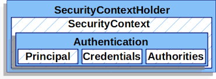

# Spring | JWT - Access & Refresh Token 2

<br>

### 목차

> 1. JWT Filter 적용
> 2. @AuthenticationPrincipal
> 3. 401 & 403 

<br>

프로젝트에서 **소셜 로그인**을 적용하면서 토큰 기반의 인증 방식을 사용하고 있다. 

예를 들어 **OAuth**를 활용한 카카오 API를 사용하면 카카오에서 생성된 Access Token과 Refresh Token을 받아올 수 있지만, 보안상의 이슈로 우리 서비스의 백엔드 서버 자체에서 토큰을 생성하기로 결정하였다.

<br>

## 1. JWT Filter 적용

<br>

### AuthenticationFilter Class

##### 1. **GenericFilterBean** 클래스를 확장한 AuthenticationFilter 클래스를 생성

```java
@RequiredArgsConstructor
public class AuthenticationFilter extends GenericFilterBean {
		
    // 토큰 관련 클래스 TokenProvider 주입
    private final TokenProvider tokenProvider;
  
}
```

<br>

##### 2. doFilter 메소드

```java
@Override
public void doFilter(ServletRequest request, ServletResponse response, FilterChain chain) throws IOException, ServletException {
  
  // 헤더에서 JWT Access Token을 받아온다.
  String token = tokenProvider.resolveAccessToken((HttpServletRequest) request);
  
  // 유효한 토큰인지 확인합니다.
  if (token != null && tokenProvider.isTokenValid(token.substring(7))) {
    
    // 토큰이 유효하면 토큰으로부터 유저 정보를 받아온다.
    Authentication authentication = tokenProvider.getAuthentication(token.substring(7));
    
    // SecurityContext 에 Authentication 객체를 저장한다.
    SecurityContextHolder.getContext().setAuthentication(authentication);
  }

  chain.doFilter(request, response);
}
```

- **String token**
  - `tokenProvider` 클래스의 resolveAccessToken() 메소드를 통해서 클라이언트 Request로부터 JWT Access Token을 뽑아낸다.

- 토큰 유효성 검증
  - 토큰이 비어 있지 않거나 (`token != null`)
  - `tokenProvider` 클래스의 `.isTokenValid()` 메소드 확인
    - 클라이언트 헤더의 JWT 값 : **Bearer asdflwkejrakle.zxccvnnkwer.xcvcxvkjksjdf** 와 같이 `Bearer` 가 Prefix로 붙기 때문에 자바의 `.substring()`  메소드로 토큰 값만 떼어낸다.

- **.getAuthentication()**
  - `tokenProvider` 클래스의 메소드를 활용하여 토큰으로부터 유저 정보를 받아오고 이를 **Authentication** 객체로 생성한다.
  - 유효성 검증 때와 마찬가지로 `Bearer` Prefix를 떼고 Access Token만 활용한다.

- **SecurityContextHolder**
  - Authentication 객체 저장

- 

<br>

#### Spring Security - Authentication



- **스프링 시큐리티 (Spring Security)** 는 `servlet filter` 를 기반으로 인증 기능을 지원함
- `servlet container` 안에 있는 다른 **application**과 맞물려 동작한다.
- Spring Boot의 기본설정에는 `springSecurityFilterChain` 필터가 자동으로 등록됨
- Spring Security의 **Authentication**
  - `SecurityContextHolder` - 누가 인증했는지에 대한 정보를 저장
  - `SecurityContext` - 현재 인증한 user에 관한 정보 저장
  - `Authentication` - SecurityContext의 user 인증 정보를 가지고 있고, `AuthenticationManager`에 의해 제공됨
  - `GrantedAuthority` - 인증 주체에게 부여된 권한
  - `AuthenticationManager` - 스프링 시큐리티의 필터에서 인증을 수행하는 방법을 정의한 API
  - `ProviderManager` - AuthenticationManager의 구현체
  - `AuthenticationProvider` - 인증 수행을 위해 ProviderManager에 의해 사용됨
  - `AbstractAuthenticationProcessingFilter` - 인증에 사용되는 기본 Filter

<br>

## 2. @AuthenticationPrincipal

<br>

스프링에서 **Principal** 객체를 사용하면 로그인한 사용자의 정보를 확인할 수 있다. 이 객체는 JAVA의 표준 Principal 객체이며, 사용자 정보는 `name` 정보 밖에 없다.

<br>

**@AuthenticationPrincipal** 어노테이션을 사용하면, **CustomUserDetailsService**에서 반환한 객체를 파라미터로 받아 사용가능 하다.

<br>

### CustomUserDetailsService Class

```java
@RequiredArgsConstructor
@Service("customUserDetailService")
public class CustomUserDetailsService implements UserDetailsService {

    @Autowired
    private UserRepository userRepository;

    @Override
    public CustomUserDetails loadUserByUsername(String kakaoNum) throws UsernameNotFoundException {
      
        User user = userRepository.findByKakaoUserNumber(kakaoNum).orElse(null);
      
        if(user != null){
            CustomUserDetails userDetails = new CustomUserDetails(user);
            return userDetails;
        }
      
        return null;
    }
}
```

- **User**
  - 프로젝트 내에서 서비스 사용자를 식별할 수 있는 식별정보가 **카카오 회원번호(kakaoUserNumber**) 뿐이다.
    - 아이디, 이메일 등의 정보를 받지 않기 때문
  - 이 정보를 활용하여 `user` 객체를 찾아온다.
  - 객체가 존재하면 `if` 문을 실행한다.
- **CustomUserDetails**
  - `UserDetails` 객체를 확장한 커스텀 클래스를 생성하고 리턴한다.


<br>

### CustomUserDetails 클래스

```java
public class CustomUserDetails implements UserDetails {

    @Autowired
    private User user;

    boolean accountNonExpired = true;

    boolean accountNonLocked = true;

    boolean credentialNonExpired = true;

    boolean enabled = true;

    private Collection<? extends GrantedAuthority> authorities;

    public CustomUserDetails (User user){

        super();
        this.user=user;

        List<GrantedAuthority> authorities = new ArrayList<>();
        authorities.add(new SimpleGrantedAuthority(user.getRoles().toString()));

    }

    @Override
    public Collection<? extends GrantedAuthority> getAuthorities() {

        Collection<GrantedAuthority> authorities = new ArrayList<>();
        user.getRoleList().forEach(r-> {
            authorities.add(() -> r);
        });

        return authorities;

    }

    public User getUser(){
        return this.user;
    }

    @Override
    public String getPassword() {
        return user.getKakaoUserNumber();
    }

    @Override
    public String getUsername() {
        return user.getKakaoUserNumber();
    }

    @Override
    public boolean isAccountNonExpired() {
        return this.accountNonExpired;
    }

    @Override
    public boolean isAccountNonLocked() {
        return this.accountNonLocked;
    }

    @Override
    public boolean isCredentialsNonExpired() {
        return this.credentialNonExpired;
    }

    @Override
    public boolean isEnabled() {
        return this.enabled;
    }

}
```

- `UserDetails`를 확장하기 때문에 기존의 메소드를 Override 해야 한다.
  - username, password 등에 사용자를 식별할 수 있는 정보를 담는다.
    - 우리 서비스의 경우 → 카카오 회원번호


<br>

## 3. 401 & 403

<br>

### 401

- 유효한 자격증명을 제공하지 않고 접근하려 할 때
- 일반적으로 **로그인**하지 않은 사용자에게 반환되는 에러

<br>

#### JwtAuthenticationEntryPoint

```java
@Component
public class JwtAuthenticationEntryPoint implements AuthenticationEntryPoint {

    @Override
    public void commence(HttpServletRequest request, HttpServletResponse response, AuthenticationException authException) throws IOException {

        response.sendError(HttpServletResponse.SC_UNAUTHORIZED, "로그인 후 이용 가능합니다.");
    }

}
```

<br>

### 403

- 필요한 권한이 없어 접근하려 할 때
- 로그인은 하였으나, **사용자 / 관리자** 등 접근 권한이 없을 때 반환되는 에러

<br>

#### JwtAccessDeniedHandler

```java
@Component
public class JwtAccessDeniedHandler implements AccessDeniedHandler {

    @Override
    public void handle(HttpServletRequest request, HttpServletResponse response, AccessDeniedException accessDeniedException) throws IOException {

        response.sendError(HttpServletResponse.SC_FORBIDDEN, "접근 권한이 없습니다.");
    }

}
```

<br>

### Security 클래스

`401` / `403` 에러를 리턴하는 클래스를 생성하면 **Security** 설정 클래스에 추가해주어야 한다.

```java
// 생성자 메소드 생성

private final JwtAccessDeniedHandler jwtAccessDeniedHandler;

private final JwtAuthenticationEntryPoint jwtAuthenticationEntryPoint;

public SecurityConfig(JwtAccessDeniedHandler jwtAccessDeniedHandler, JwtAuthenticationEntryPoint jwtAuthenticationEntryPoint) {

  this.jwtAccessDeniedHandler = jwtAccessDeniedHandler;
  this.jwtAuthenticationEntryPoint = jwtAuthenticationEntryPoint;

}
```

```java
@Override
protected void configure(HttpSecurity http) throws Exception {
  http
    
    ...
    
    .and()
    	.exceptionHandling()
    	.authenticationEntryPoint(jwtAuthenticationEntryPoint)
      .accessDeniedHandler(jwtAccessDeniedHandler)
    
    ...
    
}
```
