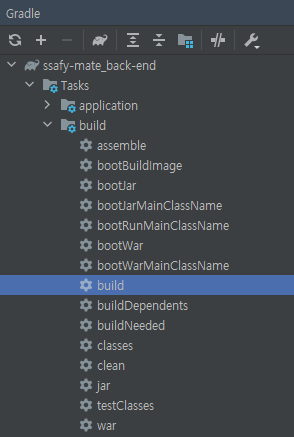
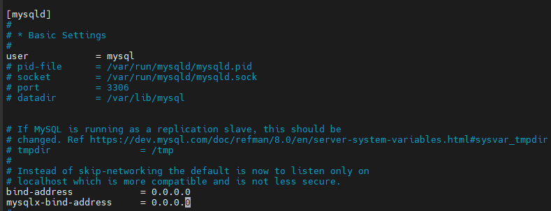

# Spring | Spring Boot 프로젝트 배포하기

본 글은 로컬에서 작성한 스프링 부트 프로젝트를 AWS의 EC2 서비스 프리티어 계정으로 배포하는 방법에 대해 작성한 글이다. 매 과정에서 오류를 겪을 수 밖에 없었고, 오류 해결을 하면서 정상적으로 배포를 성공하는 것이 첫번째 목표였다. 또한, 일련의 과정을 한번 겪고 나서 이후 EC2 유료 계정받고 나면 수월하고 프로젝트 빌드 & 배포할 수 있을 것이라 생각한다.


## 1. 과정

- Spring Boot 프로젝트 생성
  - Build - gradle
  - DB - MySQL, Redis
  - Github Repository에 소스코드 업로드
- EC2 인스턴스 생성
  - Ubuntu
  - 보안 그룹 설정
  - PuTTY or MobaXterm사용
- 소스코드 배포
  - Github Repo에서 저장소 Clone
  - Java & Tomcat 설치 | Nginx (?)
  - filezilla 설치
  - DB 설정
    - MySQL
    - Redis
  - `application.yml` 작성
  - 빌드 및 실행


#### Linux 기본 명령어

- 파일 편집 환경에서
  - 내용 저장 : `Ctrl + O`
  - 파일 끄기 : `Ctrl + C`


#### apt-get 업데이트

```bash
$ sudo apt-get update
$ sudo apt-get upgrade
```


#### net-tools 설치

```bash
$ sudo apt-get install net-tools
```


***


## Spring Boot 프로젝트 생성

### Build - gradle

- Gradle - Tasks - build - build로 프로젝트 빌드



- Project 폴더 > build > libs > ~SNAPSHOT.jar 파일
  - EC2 > `/home/ubuntu/` 경로에 옮기기 (나중에)

***


## 소스코드 배포

### Java / Tomcat 설치

#### Java - Open JDK 설치

- 8버전 JDK 설치

```bash
$ sudo apt-get install openjdk-8-jdk
```

***


#### Tomcat 설치 및 실행

- 스프링 부트 내장 Tomcat을 사용할 경우, 별도의 Tomcat 설치를 하지 않아도 됨
- 설치 필요시 아래 명령어로 설치할 수 있음. 두 가지 버전 다 사용 가능

```bash
## Ver 1
$ sudo apt-get install tomcat9
```

```bash
## Ver 2
# Tomcat 9 버전 다운로드
$ wget http://www-eu.apache.org/dist/tomcat/tomcat-9/v9.0.27/bin/apache-tomcat-9.0.27.tar.gz -P /tmp

# Tomcat 아카이브 추출 후 /opt/tomcat 디렉토리로 이동
$ sudo tar xf /tmp/apache-tomcat-9*.tar.gz -C /opt/tomcat

# Tomcat 버전 및 업데이트 제어 - Tomcat 설치 디렉토리를 기리키는 최신 심볼링크 생성
$ sudo ln -s /opt/tomcat/apache-tomcat-9.0.27 /opt/tomcat/latest

# 디렉토리 소유권을 사용자 및 Tomcat 그룹으로 변경
$ sudo chown -RH tomcat: /opt/tomcat/latest

# bin 디렉토리 내의 스크립트에는 실행 플래그가 있어야 함
$ sudo sh -c 'chmod +x /opt/tomcat/latest/bin/*.sh'
```

***


### Filezilla 설치

#### 파일 설치

```bash
$ sudo apt-get install filezilla
```


#### filezilla 실행

```bash
$ filezilla
```

***


### MySQL DB 설정

#### MySQL 설치

```bash
$ sudo apt-get install mysql-server
```


#### MySQL 관련 명령어

```bash
# 외부 접속 기능 설정 (포트 3306 오픈)
$ sudo ufw allow mysql

# mysql 실행
$ sudo systemctl start mysql

# ubuntu 서버 재시작시 mysql 자동 시작
$ sudo systemctl enable mysql
```


#### 원격 접속 IP 설정

```bash
# 설정 파일 열기
$ sudo vi /etc/mysql/mysql.conf.d/mysqld.cnf
```

- `bind-address` 와 `mysqlx-bind-address` 부분 변경



- IP 변경 후 mysql 재시작

```bash
$ sudo service mysql restart
```


#### 유저 생성

```bash
$ sudo mysql -u root -p
```

```mysql
create user '{유저이름}'@'localhost' identified by '{유저비밀번호}';

grant all privileges on *.* to '{유저이름}'@'localhost';

flush privileges;
```


#### DB 생성

```sql
create database {DB이름} default character set utf8 collate utf8_general_ci;
```

***


### Redis DB 설정

#### Redis 설치

```bash
$ sudo apt-get install redis-server
```


#### Redis 버전 확인

```bash
$ redis-server --version
```


#### Redis 설정 변경

- 최대 사용 메모리양 설정
- 최대 사용 메모리 초과시 데이터 삭제 방법 설정

```bash
# 설정파일 열기
$ sudo nano /etc/redis/redis.conf

# 최대 사용 메모리양 설정 및 데이터 삭제방법 설정
maxmemory 1g
maxmemory-policy allkeys-lru
```

- 외부 접속 허용 설정 (MySQL과 같은 논리)

```bash
# redis.conf 파일
bind 0.0.0.0
```


#### Redis 재시작

```bash
$ sudo systemctl restart redis-server.service
```

***


### application.yml

- `/src/main/resources` 하위 경로에 `application.yml` 파일 생성 후 내용 작성

```bash
$ vim application.yml
```

- `vim`
  - 텍스트 에디터
  - 기존 터미널 환경의 `vi` 에디터에서 기능 개선 및 확장이 되었음
  - `vim [File_name]` 명령어로 실행한다.
  - 사용모드
    - `o` : 포커스 잡힌 커서 아래 라인으로 이동 후 편집모드 시작
    - `O` : 포커스 잡힌 커서 윗 라인으로 이동 후 편집모드 시작
    - `i` : 포커스 잡힌 커서 위치에서 편집모드 시작
    - `I` : 포커스 잡힌 커서의 라인 제일 앞으로 이동 후 편집모드 시작
    - `a` : 포커스 잡힌 커서의 다음 문자열에서 편집모드 시작
    - `A` : 포커스 잡힌 커서의 라인 제일 뒤로 이동 후 편집모드 시작
    - `esc` 키를 눌러서 편집모드를 빠져나올 수 있음
  - 저장, 열기, 종료
    - `:q` - 종료
    - `:w` - 저장
    - `:wq` - 저장 후 종료
    - `:e [filename]` - 열기

***


### 빌드 및 실행

```bash
// 빌드 진행
$ sudo chmod 777 ./gradlew
$ sudo ./gradlew build
```

- 정상적으로 빌드가 진행되면 `/build/libs` 경로에 `.jar` 파일이 생성됨


#### .jar 파일 실행

```bash
$ nohup java -jar ${해당 .jar 파일} &
```

- putty 접속이 끊겨도 백그라운드에서 프로젝트가 실행되는 명령어
  - 실행 후, `ctrl + z` 로 백그라운드 실행 가능 (접속 끊겨도 실행되는지..?)