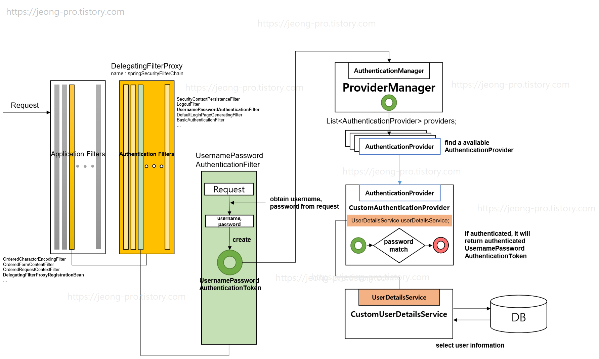

# Spring | Security

## 1. Spring Security

### Spring Security 란

- Spring 기반의 애플리케이션 보안(인증, 권한, 인가 등)을 담당하는 스프링의 하위 프레임워크
- 유저에 대한 인증 및 권한에 대한 부분을 Filter 흐름에 따라 처리함
- 보안과 관련한 많은 옵션을 제공하기 때문에 개발자 입장에서 일일이 보안 관련 로직을 작성하지 않아도 된다는 장점이 있음

<br>

#### 용어 정리

- ##### Principal (접근 주체) 

  - 접근하는 대상 (User)

- ##### Authentication (인증) 

  - 리소스에 접근한 User가 누구인지 식별. 'A'라고 주장하는 접근 주체가 'A'가 맞는지 확인하는 것

- ##### Authorization (인가, 권한) 

  - 접근한 User가 리소스에 대한 접근 권한이 있는지 검사
  - 프로세스 상 **먼저 신분 인증(Authentication)**을 거치고, 서버 자원에 **접근할 권한이 있는지를 확인**한다.

- ##### Credential (증명서)

  - 인증 과정 중, 접근 주체가 본인임을 인증하기 위해 서버에 제공하는 것 (ID, PW 등)

<br>



<br>

#### 기본 구조 - Filter Chain

스프링 시큐리티의 기본 구조는 **Filter Chain** 구조이다. 사용자의 정보가 여러개로 연결(Chaining)된 Filter를 거친다. 

예를 들어, OAuth 2.0 인증을 시도하려고 할때는 `UsernamePasswordAuthenticationFilter` 는 OAuth 2.0 인증을 실시할 수 없으므로 이 필터는 건너뛰고 다음 필터로 넘어가게 된다. 이후, `OAuth2ClientAuthenticationProcessingFilter` 에서 OAuth 2.0을 이용한 인증을 진행한다. 

여러개의 Filter 들을(**AuthenticationFilter**) 거치면서 인증을 진행하고 앞선 Filter에서 인증이 완료되면 '인증된 사용자' 즉, **인증된 요청으로 처리**된다. 모든 Filter를 거치고도 인증이 완료되지 않으면 User의 요청은 인증되지 않은 요청이 된다.

<br>

#### AuthenticationFilter

- 스프링 시큐리티는 보안과 관련된 여러개의 필터 리스트를 가지고 있음

- `springSecurityFilterChain` → 필터 리스트를 가지고 있는 객체

- **AuthenticationFilter** 리스트

  1. `WebAsyncManagerIntegrationFilter`
     - SpringsecurityContextHolder는 **ThreadLocal**(하나의 쓰레드에서 SecurityContext를 공유하는 방식) 기반으로 동작함. 비동기(Async) 관련 기능을 쓸 때에도 Securitycontext를 사용할 수 있도록 만들어주는 필터

  2. `SecurityContextPersistenceFilter`
     - SecurityContext가 없으면 만들어주는 필터이다.
     - SecurityContext : Authentication 객체를 보관하는 보관 인터페이스
  3. `HeaderWriterFilter`
     - 응답(Response)에 security와 관련된 헤더 값을 설정하는 필터
  4. `CsrfFilter`
     - CSRF 공격을 방어하는 필터
     - CSRF : Cross-Site Request Forgery. 사이트 간 요청 위조. 사용자가 자신의 의지와 무관하게 공격자가 의도한 행동을 해서 특정 웹페이지를 보완에 취약하게 하거나 수정, 삭제하는 작업을 하게 만드는 공격 기법
  5. `LogoutFilter`
     - 로그아웃 요청을 처리하는 필터
     - DefaultLogoutPageGeneratingFilter가 로그아웃 기본페이지를 생성
  6. `UsernamePasswordAuthenticationFilter`
     - username, password를 사용하는 form 기반 인증 처리 필터
     - AuthenticationManager를 통해 인증 실행
       - 성공하면, Authentication 객체를 SecurityContext에 저장하고 AuthenticationSuccessHandler 실행
       - 실패하면, AuthenticationFailureHandler 실행
  7. `RequestCacheAwareFilter`
     - 인증 후, 원래의 Request 정보로 재구성하는 필터
  8. `SecurityContextHolderAwareRequestFilter`
  9. `AnonymousAthenticationFilter`
     - 이 필터 순서에 올때까지 앞에서 사용자 정보의 인증이 완료되지 않으면, 해당 요청은 익명의 사용자가 보낸 것으로 판단하고 처리함
     - Authentication 객체를 새로 생성한다(AnonymousAuthenticationToken)
  10. `SessionManagementFilter`
      - 세션 변조 공격 방지 (Session ID를 계속 다르게 바꿔서 클라이언트에 보내줌)
      - 유효하지 않은 세션으로 접근하면 URL 핸들링
      - 하나의 Session ID로 접속하는 최대 세션 수 설정
      - 세션 생성 전략 설정
  11. `ExceptionTranslationFilter`
      - 앞선 필터 처리 과정에서 인증 예외(AuthenticationException) 또는 인가 예외(AccessDeniedException)가 발생한 경우, 해당 예외를 캐치해서 처리하는 필터
      - 모든 예외를 처리하는 것은 아님
  12. `FilterSecurityInterceptor`
      - 인가(Authorization)을 결정하는 AccessDecisionManager에게 접근 권한이 있는지 확인하고 처리하는 필터

<br>

## 2. JWT & Spring Security 실습

[인프런 - Spring Boot JWT Tutorial](https://www.inflearn.com/course/%EC%8A%A4%ED%94%84%EB%A7%81%EB%B6%80%ED%8A%B8-jwt/dashboard) 강의를 기반으로 Spring Security 프레임워크와 JWT 토큰 사용에 대한 실습을 진행해보자

### 실습 순서

- 스프링 프로젝트 생성
- Security 설정 & Data 설정
- JWT 코드, Security 설정 추가
- DTO, Repository, 로그인
- 회원가입, 권한 검증

<br>

***

### 스프링 프로젝트 생성

https://start.spring.io/ 사이트에서 Spring 프로젝트에 관한 설정 추가 후 프로젝트를 생성한다

- Project
  - Gradle Project
- Language
  - Java
- Spring Boot
  - 2.6.2
- Project Metadata
  - Group : com.example
  - Artifact : jwttutorial
  - Name : jwttutorial
  - Packaging : Jar
  - Java : 8
- Dependencies
  - Spring Web
  - Spring Security
  - Spring Data JPA
  - H2 Database
  - Lombok
  - Validation

<br>

- Controller 생성
  - 기본적으로 Spring 프로젝트가 동작하는지 확인하기 위해 간단한 Controller를 생성한다
  - 서버 실행 이후, Postman에서 http://localhost:8080/api/hello 경로로 GET 요청을 보낸다
    - 401 UnAuthorized 오류가 뜸

```java
package com.example.jwttutorial.controller;

import org.springframework.http.ResponseEntity;
import org.springframework.web.bind.annotation.GetMapping;
import org.springframework.web.bind.annotation.RequestMapping;
import org.springframework.web.bind.annotation.RestController;

@RestController
@RequestMapping("/api")
public class HelloController {
	
	@GetMapping("/hello")
	public ResponseEntity<String> hello() {
		return ResponseEntity.ok("hello");
	}
}
```

<br>

***

### Security 설정 & Data 설정

- config 패키지 > `SecurityConfig` 클래스 생성

```java
@EnableWebSecurity
public class SecurityConfig extends WebSecurityConfigurerAdapter{
	
    @Override
	public void configure(WebSecurity web) throws Exception {
		web
				.ignoring() // h2 db와 favicon에 관해서는 인증이 필요없음을 설정
				.antMatchers(
						"/h2-console/**"
						,"/favicon.ico"
				);
	}
    
    
	@Override
	protected void configure(HttpSecurity http) throws Exception {
		http
				.authorizeRequests() // HttpServletRequest를 사용하는 요청들에 대한 접근제한을 설정
				.antMatchers("/api/hello").permitAll() // api/hello에 대한 인증없이 접근 허용
				.anyRequest().authenticated(); // 나머지 요청에 대해서 전부 허용
		
	}
}
```

<br>

- application.properties > application.yml 리팩토링
  - db 설정에서 시간이 많이 소요되었다. H2 DB는 메모리 기반의 데이터베이스로 서버 실행시 데이터를 저장했다가 서버를 끌 때 데이터가 없어지도록 할 수 있는 개발단계에서 활용도가 높은 DB이다.
  - https://blog.advenoh.pe.kr/spring/H2-%EB%8D%B0%EC%9D%B4%ED%84%B0%EB%B2%A0%EC%9D%B4%EC%8A%A4-%EC%82%AC%EC%9A%A9%EB%B2%95-%EB%B0%8F-Intellij%EC%97%90%EC%84%9C-Database-%EC%97%B0%EB%8F%99/
  - 위 블로그를 참고하여, yml 파일의 `datasource:url` 경로를 제대로 명시한다.
  - `defer-datasource-initialization: true` 는 https://www.inflearn.com/questions/219978 글을 참고하여 추가하였다. 스프링 부트 버전이 업데이트되면서 Hibernate 초기화 과정보다 data.sql 파일의 SQL문 실행이 먼저 되어서 오류가 발생한다. 이 오류를 방지하기 위해 해당 코드를 작성하면 오류가 발생하지 않는다.

```yaml
spring:
  h2:
    console:
      enabled: true

  datasource:
    url: jdbc:h2:mem:jwt
    driver-class-name: org.h2.Driver
    username: sa
    password:

  jpa:
    database-platform: org.hibernate.dialect.H2Dialect
    hibernate:
      ddl-auto: create-drop
    properties:
      hibernate:
        format_sql: true
        show_sql: true
    defer-datasource-initialization: true
    
logging:
  level:
    me.silvernine: DEBUG
```

- 부트 서버 실행될 때마다 Mock Data를 넣어주는 SQL 파일 생성

```sql
# resources > data.sql
INSERT INTO USER (USER_ID, USERNAME, PASSWORD, NICKNAME, ACTIVATED) VALUES (1, 'admin', '$2a$08$lDnHPz7eUkSi6ao14Twuau08mzhWrL4kyZGGU5xfiGALO/Vxd5DOi', 'admin', 1);
INSERT INTO USER (USER_ID, USERNAME, PASSWORD, NICKNAME, ACTIVATED) VALUES (2, 'user', '$2a$08$UkVvwpULis18S19S5pZFn.YHPZt3oaqHZnDwqbCW9pft6uFtkXKDC', 'user', 1);

INSERT INTO AUTHORITY (AUTHORITY_NAME) values ('ROLE_USER');
INSERT INTO AUTHORITY (AUTHORITY_NAME) values ('ROLE_ADMIN');

INSERT INTO USER_AUTHORITY (USER_ID, AUTHORITY_NAME) values (1, 'ROLE_USER');
INSERT INTO USER_AUTHORITY (USER_ID, AUTHORITY_NAME) values (1, 'ROLE_ADMIN');
INSERT INTO USER_AUTHORITY (USER_ID, AUTHORITY_NAME) values (2, 'ROLE_USER');
```

<br>

- Entity 생성

```java
// User Entity
package com.example.jwttutorial.entity;

@Entity
@Table(name = "user")
@Getter
@Setter
@Builder
@AllArgsConstructor
@NoArgsConstructor
public class User {

   @Id
   @Column(name = "user_id")
   @GeneratedValue(strategy = GenerationType.IDENTITY)
   private Long userId;

   @Column(name = "username", length = 50, unique = true)
   private String username;

   @Column(name = "password", length = 100)
   private String password;

   @Column(name = "nickname", length = 50)
   private String nickname;

   @Column(name = "activated")
   private boolean activated;

   @ManyToMany // 다대다 테이블을 연결하기 위한 어노테이션
   @JoinTable(
      name = "user_authority",
      joinColumns = {@JoinColumn(name = "user_id", referencedColumnName = "user_id")},
      inverseJoinColumns = {@JoinColumn(name = "authority_name", referencedColumnName = "authority_name")})
   private Set<Authority> authorities;
}
```

```java
// Authority Entity
package com.example.jwttutorial.entity;

@Entity
@Table(name = "authority")
@Getter
@Setter
@Builder
@AllArgsConstructor
@NoArgsConstructor
public class Authority {

   @Id
   @Column(name = "authority_name", length = 50)
   private String authorityName;
}
```

<br>

- H2 Console 확인
  - 스프링 부트 실행시 Entity에 해당하는 테이블이 자동 생성되고, `data.sql` 파일이 실행되어 목데이터가 테이블에 삽입됨


<br>

***

### JWT 코드, Security 설정 추가

#### JWT 코드

- application.yml 설정 추가
  - `secret` : HS512 알고리즘을 사용하기 때문에 Secret Key는 64Byte 이상이 되어야 함
    - 알고리즘 종류 참고 : [네이버 블로그](https://m.blog.naver.com/PostView.naver?isHttpsRedirect=true&blogId=ithink3366&logNo=221371733904)


- build.gradle → JWT 관련 라이브러리 추가

```java
dependencies {
    ...
        
    implementation group: 'io.jsonwebtoken', name: 'jjwt-api', version: '0.11.2'
	runtimeOnly group: 'io.jsonwebtoken', name: 'jjwt-impl', version: '0.11.2'
	runtimeOnly group: 'io.jsonwebtoken', name: 'jjwt-jackson', version: '0.11.2'    
    
}
```

<br>

##### TokenProvider

- 토큰을 생성하고 유효성 검증을 담당하는 클래스

```java
import io.jsonwebtoken.*;
import io.jsonwebtoken.io.Decoders;
import io.jsonwebtoken.security.Keys;

import org.slf4j.Logger;
import org.slf4j.LoggerFactory;
import org.springframework.beans.factory.InitializingBean;
import org.springframework.beans.factory.annotation.Value;
import org.springframework.security.authentication.UsernamePasswordAuthenticationToken;
import org.springframework.security.core.Authentication;
import org.springframework.security.core.GrantedAuthority;
import org.springframework.security.core.authority.SimpleGrantedAuthority;
import org.springframework.security.core.userdetails.User;
import org.springframework.stereotype.Component;

import java.security.Key;
import java.util.Arrays;
import java.util.Collection;
import java.util.Date;
import java.util.stream.Collectors;

// 토큰 생성, 유효성 검증을 담당
@Component
public class TokenProvider implements InitializingBean {

    private final Logger logger = LoggerFactory.getLogger(TokenProvider.class);

    private static final String AUTHORITIES_KEY = "auth";

    private final String secret;
    private final long tokenValidityInMilliseconds;

    private Key key;

    public TokenProvider(
            @Value("${jwt.secret}") String secret,
            @Value("${jwt.token-validity-in-seconds}") long tokenValidityInSeconds) {
        this.secret = secret;
        this.tokenValidityInMilliseconds = tokenValidityInSeconds * 1000;
    }

    // 빈 생성 후 의존성 주입받은 후에 sercret 값을 Base64 Decode해서 key 변수에 할당
    @Override
    public void afterPropertiesSet() {
        byte[] keyBytes = Decoders.BASE64.decode(secret);
        this.key = Keys.hmacShaKeyFor(keyBytes);
    }

    // Authentication 객체의 권한정보를 이용해서 토큰을 생성하는 메소드
    public String createToken(Authentication authentication) {
        String authorities = authentication.getAuthorities().stream()
                .map(GrantedAuthority::getAuthority)
                .collect(Collectors.joining(","));

        long now = (new Date()).getTime();
        Date validity = new Date(now + this.tokenValidityInMilliseconds);

        return Jwts.builder()
                .setSubject(authentication.getName())
                .claim(AUTHORITIES_KEY, authorities)
                .signWith(key, SignatureAlgorithm.HS512)
                .setExpiration(validity)
                .compact();
    }
    
    // Token에 담겨있는 정보를 이용해서 Authentication 객체를 리턴하는 메소드
    public Authentication getAuthentication(String token) {
        Claims claims = Jwts
                .parserBuilder()
                .setSigningKey(key)
                .build()
                .parseClaimsJws(token)
                .getBody();

        Collection<? extends GrantedAuthority> authorities =
                Arrays.stream(claims.get(AUTHORITIES_KEY).toString().split(","))
                        .map(SimpleGrantedAuthority::new)
                        .collect(Collectors.toList());

        User principal = new User(claims.getSubject(), "", authorities);

        return new UsernamePasswordAuthenticationToken(principal, token, authorities);
    }

    // 토큰의 유효성 검증을 수행하는 validateToken 메소드
    public boolean validateToken(String token) {
        try {
            Jwts.parserBuilder().setSigningKey(key).build().parseClaimsJws(token);
            return true;
        } catch (io.jsonwebtoken.security.SecurityException | MalformedJwtException e) {
            logger.info("잘못된 JWT 서명입니다.");
        } catch (ExpiredJwtException e) {
            logger.info("만료된 JWT 토큰입니다.");
        } catch (UnsupportedJwtException e) {
            logger.info("지원되지 않는 JWT 토큰입니다.");
        } catch (IllegalArgumentException e) {
            logger.info("JWT 토큰이 잘못되었습니다.");
        }
        return false;
    }

}
```

<br>

##### JwtFilter

- JWT를 위한 커스텀 필터

```java
import org.slf4j.Logger;
import org.slf4j.LoggerFactory;
import org.springframework.security.core.Authentication;
import org.springframework.security.core.context.SecurityContextHolder;
import org.springframework.util.StringUtils;
import org.springframework.web.filter.GenericFilterBean;

import javax.servlet.FilterChain;
import javax.servlet.ServletException;
import javax.servlet.ServletRequest;
import javax.servlet.ServletResponse;
import javax.servlet.http.HttpServletRequest;
import java.io.IOException;

// JWT를 위한 커스텀 필터
public class JwtFilter extends GenericFilterBean {

    private static final Logger logger = LoggerFactory.getLogger(JwtFilter.class);

    public static final String AUTHORIZATION_HEADER = "Authorization";

    private TokenProvider tokenProvider;

    public JwtFilter(TokenProvider tokenProvider) {
        this.tokenProvider = tokenProvider;
    }    
    
    // JWT 토큰 인증정보를 SecurityContext에 저장하는 역할 수행
    @Override
    public void doFilter(ServletRequest servletRequest, ServletResponse servletResponse, FilterChain filterChain)
            throws IOException, ServletException {
        HttpServletRequest httpServletRequest = (HttpServletRequest) servletRequest;
        String jwt = resolveToken(httpServletRequest);
        String requestURI = httpServletRequest.getRequestURI();

        if (StringUtils.hasText(jwt) && tokenProvider.validateToken(jwt)) {
            Authentication authentication = tokenProvider.getAuthentication(jwt);
            SecurityContextHolder.getContext().setAuthentication(authentication);
            logger.debug("Security Context에 '{}' 인증 정보를 저장했습니다, uri: {}", authentication.getName(), requestURI);
        } else {
            logger.debug("유효한 JWT 토큰이 없습니다, uri: {}", requestURI);
        }

        filterChain.doFilter(servletRequest, servletResponse);
    }

    // Request Header에서 토큰 정보를 꺼내오기 위한 메소드
    private String resolveToken(HttpServletRequest request) {
        String bearerToken = request.getHeader(AUTHORIZATION_HEADER);
        if (StringUtils.hasText(bearerToken) && bearerToken.startsWith("Bearer ")) {
            return bearerToken.substring(7);
        }
        return null;
    }

}
```

<br>

##### JwtSecurityConfig

- TokenProvider 와 JwtFilter를 SecurityConfig에 적용할 때 사용할 클래스 생성

```java
import org.springframework.security.config.annotation.SecurityConfigurerAdapter;
import org.springframework.security.config.annotation.web.builders.HttpSecurity;
import org.springframework.security.web.DefaultSecurityFilterChain;
import org.springframework.security.web.authentication.UsernamePasswordAuthenticationFilter;

// TokenProvider, JwtFilter를 SecurityConfig에 적용할 때 사용하는 클래스
public class JwtSecurityConfig extends SecurityConfigurerAdapter<DefaultSecurityFilterChain, HttpSecurity> {

    private TokenProvider tokenProvider;

    public JwtSecurityConfig(TokenProvider tokenProvider) {
        this.tokenProvider = tokenProvider;
    }

    @Override
    public void configure(HttpSecurity http) {
        JwtFilter customFilter = new JwtFilter(tokenProvider);
        http.addFilterBefore(customFilter, UsernamePasswordAuthenticationFilter.class);
    }
}
```

<br>

##### JwtAuthenticationEntryPoint

- 유효한 자격증명을 제공하지 않고 접근하려 할 때 401 Unauthorized 에러 리턴

```java
import org.springframework.security.core.AuthenticationException;
import org.springframework.security.web.AuthenticationEntryPoint;
import org.springframework.stereotype.Component;

import javax.servlet.http.HttpServletRequest;
import javax.servlet.http.HttpServletResponse;
import java.io.IOException;

// 유효한 자격증명을 제공하지 않고 접근하려 할 때 401 Unauthorized 에러를 리턴하는 클래스
@Component
public class JwtAuthenticationEntryPoint implements AuthenticationEntryPoint {

    @Override
    public void commence(HttpServletRequest request,
                         HttpServletResponse response,
                         AuthenticationException authException) throws IOException {
        // 유효한 자격증명을 제공하지 않고 접근하려 할때 401
        response.sendError(HttpServletResponse.SC_UNAUTHORIZED);
    }
}
```

<br>

##### JwtAccessDeniedHandler

- 필요한 권한이 존재하지 않는 경우 403 Forbidden 에러를 리턴

```java
import org.springframework.security.access.AccessDeniedException;
import org.springframework.security.web.access.AccessDeniedHandler;
import org.springframework.stereotype.Component;

import javax.servlet.http.HttpServletRequest;
import javax.servlet.http.HttpServletResponse;
import java.io.IOException;

// 필요한 권한이 존재하지 않는 경우 403 Forbidden 에러를 리턴하는 클래스
@Component
public class JwtAccessDeniedHandler implements AccessDeniedHandler {

    @Override
    public void handle(HttpServletRequest request, HttpServletResponse response, AccessDeniedException accessDeniedException) throws IOException {
        //필요한 권한이 없이 접근하려 할때 403
        response.sendError(HttpServletResponse.SC_FORBIDDEN);
    }
}
```

<br>

이제 `jwt` 패키지에 만든 5개의 클래스를 **SecurityConfig** 클래스에 적용한다.

```java
// SecurityConfig
import com.example.jwttutorial.jwt.JwtSecurityConfig;
import com.example.jwttutorial.jwt.JwtAccessDeniedHandler;
import com.example.jwttutorial.jwt.JwtAuthenticationEntryPoint;
import com.example.jwttutorial.jwt.TokenProvider;
import org.springframework.context.annotation.Bean;
import org.springframework.security.config.annotation.method.configuration.EnableGlobalMethodSecurity;
import org.springframework.security.config.annotation.web.builders.HttpSecurity;
import org.springframework.security.config.annotation.web.builders.WebSecurity;
import org.springframework.security.config.annotation.web.configuration.EnableWebSecurity;
import org.springframework.security.config.annotation.web.configuration.WebSecurityConfigurerAdapter;
import org.springframework.security.config.http.SessionCreationPolicy;
import org.springframework.security.crypto.bcrypt.BCryptPasswordEncoder;
import org.springframework.security.crypto.password.PasswordEncoder;
import org.springframework.security.web.authentication.UsernamePasswordAuthenticationFilter;
import org.springframework.web.filter.CorsFilter;

// 기본적인 웹 보완 활성화 어노테이션
@EnableWebSecurity
@EnableGlobalMethodSecurity(prePostEnabled = true) // @PreAuthorize 어노테이션을 메소드 단위로 추가하기 위한 어노테이션
public class SecurityConfig extends WebSecurityConfigurerAdapter {
	private final TokenProvider tokenProvider;
	private final JwtAuthenticationEntryPoint jwtAuthenticationEntryPoint;
	private final JwtAccessDeniedHandler jwtAccessDeniedHandler;

	// TokenProvider, JwtAuthenticationEntryPoint, JwtAccessDeniedHandler 주입
	public SecurityConfig(
			TokenProvider tokenProvider,
			JwtAuthenticationEntryPoint jwtAuthenticationEntryPoint,
			JwtAccessDeniedHandler jwtAccessDeniedHandler
	) {
		this.tokenProvider = tokenProvider;
		this.jwtAuthenticationEntryPoint = jwtAuthenticationEntryPoint;
		this.jwtAccessDeniedHandler = jwtAccessDeniedHandler;
	}

	@Bean
	public PasswordEncoder passwordEncoder() {
		return new BCryptPasswordEncoder();
	}

	@Override
	public void configure(WebSecurity web) {
		web.ignoring()
				.antMatchers(
						"/h2-console/**"
						,"/favicon.ico"
						,"/error"
				);
	}

	@Override
	protected void configure(HttpSecurity httpSecurity) throws Exception {
		httpSecurity
				// token을 사용하는 방식이기 때문에 csrf를 disable 한다
				.csrf().disable()

				// Exception 핸들링 할 때 미리 만들어두었던 401, 403 관련 클래스 추가
				.exceptionHandling()
				.authenticationEntryPoint(jwtAuthenticationEntryPoint)
				.accessDeniedHandler(jwtAccessDeniedHandler)

				// enable h2-console
				.and()
				.headers()
				.frameOptions()
				.sameOrigin()

				// 세션을 사용하지 않기 때문에 STATELESS로 설정
				.and()
				.sessionManagement()
				.sessionCreationPolicy(SessionCreationPolicy.STATELESS)
				
				// 로그인, 회원가입 API는 토큰이 없는 상태에서 요청이 들어오므로 permitAll 설정
				.and()
				.authorizeRequests()
				.antMatchers("/api/hello").permitAll()
				.antMatchers("/api/authenticate").permitAll()
				.antMatchers("/api/signup").permitAll()

				// 나머지는 모든 권한이 있는것으로 처리리
				.anyRequest().authenticated()

				// JwtSecurityConfig 클래스 적용(JwtFilter를 addFilterBefore로 등록한 클래스)
				.and()
				.apply(new JwtSecurityConfig(tokenProvider));
	}
}
```

<br>

***

### DTO, Repository, 로그인

#### DTO

- 클라이언트와의 통신에 사용할 DTO(Data Transfer Object) 클래스를 생성한다.

##### 로그인 DTO

- 로그인할 때 ID와 비밀번호를 입력받는 DTO

```java
import lombok.*;

import javax.validation.constraints.NotNull;
import javax.validation.constraints.Size;

@Getter
@Setter
@Builder
@AllArgsConstructor
@NoArgsConstructor
public class LoginDto {

    @NotNull
    @Size(min = 3, max = 50)
    private String username;

    @NotNull
    @Size(min = 3, max = 100)
    private String password;
}
```

##### Token DTO

- Token 정보를 Response할 때 사용

```java
import lombok.*;

@Getter
@Setter
@Builder
@AllArgsConstructor
@NoArgsConstructor
public class TokenDto {

    private String token;
}
```

##### 유저 DTO

- 회원가입 시 사용

```java
import com.fasterxml.jackson.annotation.JsonProperty;
import lombok.*;

import javax.validation.constraints.NotNull;
import javax.validation.constraints.Size;

@Getter
@Setter
@Builder
@AllArgsConstructor
@NoArgsConstructor
public class UserDto {

    @NotNull
    @Size(min = 3, max = 50)
    private String username;

    @JsonProperty(access = JsonProperty.Access.WRITE_ONLY)
    @NotNull
    @Size(min = 3, max = 100)
    private String password;

    @NotNull
    @Size(min = 3, max = 50)
    private String nickname;

}
```

<br>

### Repository

##### UserRepository

- User 엔티티에 매핑되는 인터페이스

```java
import com.example.jwttutorial.entity.User;
import org.springframework.data.jpa.repository.EntityGraph;
import org.springframework.data.jpa.repository.JpaRepository;

import java.util.Optional;

public interface UserRepository extends JpaRepository<User, Long> {
    // username을 기준으로 User 정보를 가져올때 권한 정보를 같이 가져오는 메소드
    // 쿼리가 수행될 때 Lazy 조회가 아닌 Eager 조회로 authorities 정보를 같이 가져오는 어노테이션
    @EntityGraph(attributePaths = "authorities")
    Optional<User> findOneWithAuthoritiesByUsername(String username);
}
```

##### Fetch Type

- JPA에서 테이블간 연관 관계는 객체의 참조를 통해 이루어진다. 서비스가 점점 더 커질수록, 참조하는 객체가 많아지고 객체의 데이터 양이 많아진다. 이처럼 객체가 커질수록 DB로부터 참조하는 객체들의 데이터까지 한꺼번에 가져오는 것은 부담이 커질수밖에 없다. JPA는 **참조하는 객체들의 데이터를 가져오는 시점**을 정할 수 있는데, 이것을 Fetch Type 이라고 한다.
  - EAGER
    - 성실한, 열심인
    - 하나의 객체를 DB로부터 읽어올 때 참조 객체들의 데이터까지 전부 읽어오는 방식
    - 한 번의 쿼리로 모든 정보를 가져옴
    - But, 하나의 Select 요청에 대한 Select 문이 여러개 추가되는 현상이 발생할 수 있음
      - N+1 Select Problem
  - LAZY 
    - 게으른
    - 참조 객체들의 데이터는 무시하고 해당 엔티티의 데이터만 가져옴
    - 참조 객체의 데이터를 사용하기 위해서 여러 번 쿼리를 수행해야 함
  - 항상 참조 객체와 함께 로드되어야 하는 엔티티는 LAZY 방식보다 EAGER 방식이 좋다. 하지만 단순한 조회 쿼리를 수행해야 하는데 EAGER 방식으로 인해 지나치게 많은 쿼리를 수행하여 성능 저하를 유발할 수 있음
  - 참고
    - https://velog.io/@bread_dd/JPA%EB%8A%94-%EC%99%9C-%EC%A7%80%EC%97%B0-%EB%A1%9C%EB%94%A9%EC%9D%84-%EC%82%AC%EC%9A%A9%ED%95%A0%EA%B9%8C
    - https://jaime-note.tistory.com/54

<br>

#### CustomUserDetailsService

- 로그인시 DB에서 유저정보와 권한정보를 가져오는 서비스 클래스

```java
import com.example.jwttutorial.entity.User;
import com.example.jwttutorial.repository.UserRepository;
import org.springframework.security.core.GrantedAuthority;
import org.springframework.security.core.authority.SimpleGrantedAuthority;
import org.springframework.security.core.userdetails.UserDetails;
import org.springframework.security.core.userdetails.UserDetailsService;
import org.springframework.security.core.userdetails.UsernameNotFoundException;
import org.springframework.stereotype.Component;
import org.springframework.transaction.annotation.Transactional;

import java.util.List;
import java.util.stream.Collectors;

@Component("userDetailsService")
public class CustomUserDetailsService implements UserDetailsService {
    private final UserRepository userRepository;

    public CustomUserDetailsService(UserRepository userRepository) {
        this.userRepository = userRepository;
    }
    
    // 로그인시 DB에서 유저정보와 권한정보를 가져오고, 이 정보들을 기반으로 userdetails.User 객체를 생성하고 리턴
    @Override
    @Transactional
    public UserDetails loadUserByUsername(final String username) {
        return userRepository.findOneWithAuthoritiesByUsername(username)
                .map(user -> createUser(username, user))
                .orElseThrow(() -> new UsernameNotFoundException(username + " -> 데이터베이스에서 찾을 수 없습니다."));
    }

    private org.springframework.security.core.userdetails.User createUser(String username, User user) {
        if (!user.isActivated()) {
            throw new RuntimeException(username + " -> 활성화되어 있지 않습니다.");
        }
        List<GrantedAuthority> grantedAuthorities = user.getAuthorities().stream()
                .map(authority -> new SimpleGrantedAuthority(authority.getAuthorityName()))
                .collect(Collectors.toList());
        return new org.springframework.security.core.userdetails.User(user.getUsername(),
                user.getPassword(),
                grantedAuthorities);
    }
}
```

<br>

#### AuthController

- 로그인 API를 추가

```java
import com.example.jwttutorial.dto.LoginDto;
import com.example.jwttutorial.dto.TokenDto;
import com.example.jwttutorial.jwt.JwtFilter;
import com.example.jwttutorial.jwt.TokenProvider;
import org.springframework.http.HttpHeaders;
import org.springframework.http.HttpStatus;
import org.springframework.http.ResponseEntity;
import org.springframework.security.authentication.UsernamePasswordAuthenticationToken;
import org.springframework.security.config.annotation.authentication.builders.AuthenticationManagerBuilder;
import org.springframework.security.core.Authentication;
import org.springframework.security.core.context.SecurityContextHolder;
import org.springframework.web.bind.annotation.PostMapping;
import org.springframework.web.bind.annotation.RequestBody;
import org.springframework.web.bind.annotation.RequestMapping;
import org.springframework.web.bind.annotation.RestController;

import javax.validation.Valid;

@RestController
@RequestMapping("/api")
public class AuthController {
    private final TokenProvider tokenProvider;
    private final AuthenticationManagerBuilder authenticationManagerBuilder;

    public AuthController(TokenProvider tokenProvider, AuthenticationManagerBuilder authenticationManagerBuilder) {
        this.tokenProvider = tokenProvider;
        this.authenticationManagerBuilder = authenticationManagerBuilder;
    }

    @PostMapping("/authenticate")
    public ResponseEntity<TokenDto> authorize(@Valid @RequestBody LoginDto loginDto) {

        UsernamePasswordAuthenticationToken authenticationToken =
                new UsernamePasswordAuthenticationToken(loginDto.getUsername(), loginDto.getPassword());

        Authentication authentication = authenticationManagerBuilder.getObject().authenticate(authenticationToken);
        SecurityContextHolder.getContext().setAuthentication(authentication);

        String jwt = tokenProvider.createToken(authentication);

        HttpHeaders httpHeaders = new HttpHeaders();
        httpHeaders.add(JwtFilter.AUTHORIZATION_HEADER, "Bearer " + jwt);

        return new ResponseEntity<>(new TokenDto(jwt), httpHeaders, HttpStatus.OK);
    }
}
```

<br>

***

### 회원가입, 권한 검증

#### SecurityUtil

- 간단한 유틸리티 메소드를 만들기 위한 클래스 생성

```java
```


#### 권한검증 확인


### 참고 자료

https://pozafly.github.io/tripllo/(4)spring-security-jwt/

https://jeong-pro.tistory.com/205

https://www.bottlehs.com/springboot/%EC%8A%A4%ED%94%84%EB%A7%81-%EB%B6%80%ED%8A%B8-spring-security%EB%A5%BC-%ED%99%9C%EC%9A%A9%ED%95%9C-%EC%9D%B8%EC%A6%9D-%EB%B0%8F-%EA%B6%8C%ED%95%9C%EB%B6%80%EC%97%AC/

https://bcp0109.tistory.com/301

https://mia-dahae.tistory.com/121