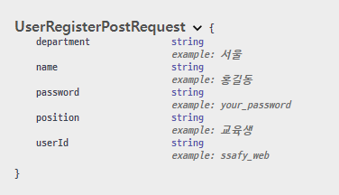
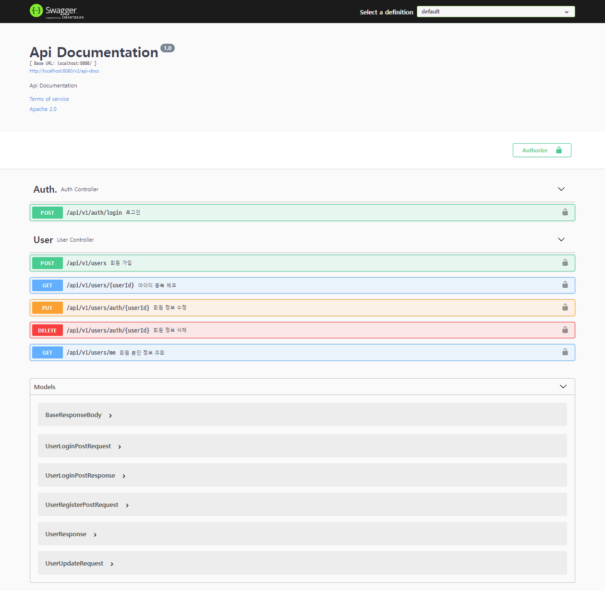

# Spring | 공부하면서 정리하기


## DataBase

### Sub PJT 1 - ERD


<br>

***

### JPA

### Entity 구현

- User
- Conference
- UserConference
- ConferenceCategory
- ConferenceHistory

<br>

##### @Setter 와 @Builder

Lombok 라이브러리를 활용하면 `@Getter`, `@Setter`, `@Builder` 등의 Annotation을 사용해서 쉽게 만들 수 있다. 또한 매개변수가 없는 기본 생성자나 선언된 모든 필드를 매개변수로 갖는 생성자를 쉽게 만들 수 있다(`@NoArgsConstructor`, `@AllArgsConstructor`).

이 중에서 `@Setter` 를 무분별하게 사용하면 여러 곳에서 객체의 값을 변경할 수 있기 때문에 객체의 일관성을 보장할 수 없다. 유지보수성을 높이기 위해 Setter의 사용을 지양할 필요가 있다.

대신 `@Builder` 어노테이션을 사용하여 개발 편의성을 높일 수 있다.

```java
// @Builder 패턴 사용 예시
User user = User.builder()
    	.userId(userRegisterInfo.getUserId())
    	.password(passwordEncoder.encode(userRegisterInfo.getPassword()))
    	.position(userRegisterInfo.getPosition())
    	.department(userRegisterInfo.getDepartment())
    	.name(userRegisterInfo.getName())
    	.build();
...
```

<br>

##### @ManyToOne

- 테이블 간 1:N 설정을 하기 위한 어노테이션이다. M(다) 에 해당하는 객체(Entity)에 작성해야 한다. 
- `@JoinColumn=(name="컬럼명")` 으로 연결되는 테이블의 FK 컬럼 이름을 설정할 수 있다.
- `@OnDelete(action=OnDeleteAction.CASCADE)`
  - 1:N 관계에서 1에 해당하는 테이블의 특정 레코드가 삭제되면, 해당 레코드와 관련있는 모든 M 테이블의 레코드가 삭제되도록 설정하는 어노테이션
  - ex. 유저(1) - 컨퍼런스(N)
    - 유저 한 명은 여러 개의 컨퍼런스를 생성할 수 있다.
    - 만약 유저 레코드가 삭제되면, 해당 유저가 만든 모든 컨퍼런스 레코드가 자동으로 DB에서 삭제된다.
- 참고
  - https://yonguri.tistory.com/69
  - https://cheese10yun.github.io/lombok/
  - https://github.com/cheese10yun/spring-jpa-best-practices/blob/master/doc/step-06.md
  - https://tomining.tistory.com/180
  - https://ppomelo.tistory.com/155
  - https://blog.jiniworld.me/139
  - https://velog.io/@aidenshin/%EB%82%B4%EA%B0%80-%EC%83%9D%EA%B0%81%ED%95%98%EB%8A%94-JPA-%EC%97%94%ED%8B%B0%ED%8B%B0-%EC%9E%91%EC%84%B1-%EC%9B%90%EC%B9%99
  - https://kukekyakya.tistory.com/m/546
  - https://velog.io/@devsh/JPA-CASCADE-%EC%98%81%EC%86%8D%EC%84%B1-%EC%A0%84%EC%9D%B4
  - https://velog.io/@max9106/JPA%EC%97%94%ED%8B%B0%ED%8B%B0-%EC%83%81%ED%83%9C-Cascade
  - https://minkukjo.github.io/framework/2020/04/28/Spring-107/
  - https://data-make.tistory.com/614
  - https://velog.io/@ohzzi/Entity-DAO-DTO%EA%B0%80-%EB%AC%B4%EC%97%87%EC%9D%B4%EB%A9%B0-%EC%99%9C-%EC%82%AC%EC%9A%A9%ED%95%A0%EA%B9%8C

<br>

### Repository 구현

- Entity(객체)에 관련하여 만들어진 데이터베이스에 접근하는 여러 메스드를 사용하기 위한 인터페이스
- 데이터를 불러오거나 저장, 수정, 삭제 등 CRUD 에 대해서 정의하는 계층이다.
- `JpaRepository` 를 상속받아서 간단하고 쉽게 데이터 조작을 할 수 있다.
  - JpaRepository는 인터페이스로, 미리 데이터 검색에 관한 메소드가 정의되어 있다.
  - `JpaRepository<대상 엔티티, 해당 엔티티의 PK타입>`
  - `@Repository` 어노테이션을 붙여서 JpaRepository임을 명시한다.
  - *JPA 에 대해서는 공부할 양이 상당히 많기 때문에 계속해서 심화 학습이 필요하다.*

```java
// UserRepository
@Repository
public interface UserRepository extends JpaRepository<User, Long> {
    // User 정보 Update
    @Modifying(clearAutomatically = true)
    @Transactional
    @Query(value = "update user set department = :department, position = :position, name = :name where user_id = :userId", nativeQuery=true)    
    int updateUserInfo(@Param("department") String department, @Param("position") String position, @Param("name") String name, @Param("userId") String userId);
    
    // User 정보 삭제
    @Modifying(clearAutomatically = true)
    @Transactional
    @Query(value = "delete from user where user_id = :userId", nativeQuery=true)    
    int deleteUserInfo(@Param("userId") String userId);
 	
    ...
}
```

- `@Query` 
  - JpaRepository에서 제공하는 기본 메서드나, 메서드 네이밍을 통해서 원하는 쿼리를 실행할 수 있다.
  - 하지만 좀 더 복잡한 쿼리가 필요하다면 쿼리를 직접 작성해야 하는데, 이 때 붙이는 어노테이션이 @Query이다.
  - 기본적으로 JPQL 문법으로 작성할 수 있고, `nativeQuery=true` 옵션을 사용하면 일반적인 SQL 형식으로 작성할 수 있다.
- `@Modifying`
  - 데이터에 변경이 일어나는 INSERT, UPDATE, DELETE, DDL 등에 관련된 퀴리를 작성할 때 사용한다.
  - @Query에 벌크 연산 쿼리(다건의 수정, 삭제 연산을 하나의 쿼리로 작성하는 것)을 작성하고 `@Modifying`을 붙이지 않으면, **InvaidDataAccessApiUsage Exception** 이 발생한다.
  - JPA Entity LifeCycle을 무시하고 쿼리가 실행되므로 영속성 관리에 주의해야 한다.
    - `clearAutomatically=true` 속성이 붙어있으면, 쿼리 메서드 실행 직후, **영속성 컨텍스트**를 clear한다.

##### 영속성 컨텍스트

- JPA에서 데이터를 조회하면 1차 캐시를 확인하고, 해당 엔티티가 1차 캐시에 존재하면 DB에 접근하지 않고 1차 캐시에 있는 엔티티를 반환한다. **1차 캐시를 활용**하면 DB에 접근하는 횟수를 줄일 수 있기 때문에 **성능을 개선**할 수 있다는 장점이 있다.
- 하지만 **벌크 연산 쿼리**를 실행할 경우 1차 캐시로 인해 오히려 예측하지 못한 결과가 나올 수 있다. 벌크 연산은 1차 캐시와 같은 **영속성 컨텍스트를 무시하고 쿼리를 실행**하기 때문에 쿼리 실행 후 데이터가 변경되면 1차 캐시와 DB의 데이터 싱크가 맞지 않을 수 있다. `@Modifying` 어노테이션의 `clearAutomatically` 속성을 `true` 로 적용하여 쿼리 실행 후 영속성 컨텍스트를 clear해서 **데이터 동기화 문제를 방지**할 수 있다.

<br>

- `@Transactional`
  - 트랜잭션이란, DB의 상태를 변경하는 작업 or 한번에 수행되어야 하는 연산들을 말한다.
  - 스프링에서는 메소드, 클래스, 인터페이스 위에 간단하게 @Transactional 어노테이션을 붙여서 트랜잭션임을 명시할 수 있다.
- 참고
  - https://whitepro.tistory.com/265
  - https://velog.io/@kdhyo/JavaTransactional-Annotation-%EC%95%8C%EA%B3%A0-%EC%93%B0%EC%9E%90-26her30h
  - https://araikuma.tistory.com/329
  - https://devhyogeon.tistory.com/4

<br>

***

## API

### 공통

- API Model
  - Request
  - Response
- Service & Service Implementation
- Controller
- Swagger

<br>

#### API Model

##### Request

- 클라이언트로부터 요청을 밭을 때의 리퀘스트 바디(RequestBody)를 정의
- 각 API에 맞게끔 하나의 클래스로 작성한다

```java
// 로그인 API 관련 RequestBody 정의
@Getter
@Setter
@ApiModel("UserLoginPostRequest")
public class UserLoginPostReq {
	@ApiModelProperty(name="유저 ID", example="ssafy_web")
	String id;
	@ApiModelProperty(name="유저 Password", example="your_password")
	String password;
}
```

```java
// 회원가입 API 관련 RequestBody 정의
@Getter
@Setter
@ApiModel("UserRegisterPostRequest")
public class UserRegisterPostReq {
	@ApiModelProperty(name="유저 ID", example="ssafy_web")
	String userId;
	@ApiModelProperty(name="유저 Password", example="your_password")
	String password;

	@ApiModelProperty(name = "유저 지역", example = "서울")
	String department;
	@ApiModelProperty(name = "유저 구분", example = "교육생")
	String position;
	@ApiModelProperty(name = "유저 이름", example = "홍길동")
	String name;
}
```

- `@ApiModel` : Swagger - Models에서 보여지는 이름을 명시할 수 있다.
- `@ApiModelProperty` : ApiModel 각 속성에 대한 내용을 작성할 수 있다.
  - name - 이름
  - example - 예시 표현



<br>

##### Response

- 클라이언트의 요청을 Controller - Service - Repository 를 통해서 데이터를 조작하고, 그 결과에 대한 응답값을 정의
- Request와 마찬가지로 각 API에 대해서 하나의 클래스로 정의한다.

```java
// 요청에 대한 공통적인 기본 응답값 정의
@Getter
@Setter
@ApiModel("BaseResponseBody")
public class BaseResponseBody {
	@ApiModelProperty(name="응답 메시지", example = "정상")
	String message = null;
	@ApiModelProperty(name="응답 코드", example = "200")
	Integer statusCode = null;
	
	public BaseResponseBody() {}
	
	public BaseResponseBody(Integer statusCode){
		this.statusCode = statusCode;
	}
	
	public BaseResponseBody(Integer statusCode, String message){
		this.statusCode = statusCode;
		this.message = message;
	}
	
	public static BaseResponseBody of(Integer statusCode, String message) {
		BaseResponseBody body = new BaseResponseBody();
		body.message = message;
		body.statusCode = statusCode;
		return body;
	}

}
```

```java
// 로그인 API 요청에 대한 응답값 정의
@Getter
@Setter
@ApiModel("UserLoginPostResponse")
public class UserLoginPostRes extends BaseResponseBody{
	@ApiModelProperty(name="JWT 인증 토큰", example="eyJ0eXAiOiJKV1QiLCJhbGciOiJIUzUxMiJ9.eyJzdWIiOiJ0ZXN...")
	String accessToken;
	
	public static UserLoginPostRes of(Integer statusCode, String message, String accessToken) {
		UserLoginPostRes res = new UserLoginPostRes();
		res.setStatusCode(statusCode);
		res.setMessage(message);
		res.setAccessToken(accessToken);
		return res;
	}
}
```

- `BaseResponseBody` 클래스를 확장해서 정의
- `of` 의 사용 이유 (~~잘 모르겠다. 찾아봐도 정보가 잘 나오지 않는다...~~)
  - NullPointException(NPE) 을 최대한 줄일 수 있는 **Optional** 클래스에서 `.of` 를 사용하기는 함
    - 저장하는 값이 Null 이면 NPE를 발생시킨다.

- 참고
  - https://ttubeoki.tistory.com/20
  - https://tosuccess.tistory.com/204

<br>

#### Service & Service Implementation

MVC 패턴에서 비즈니스 로직을 담당하는 Service는 인터페이스로, Service Implementation은 Service 인터페이스를 확장한 클래스로 작성한다.

Controller에서는 클라이언트에서 받은 요청(request)을 통해서 Request 관련 객체를 매개변수로 받고, 이를 이용하여 Service와 Service를 확장한 ServiceImpl의 메서드를 호출한다. 이 메서드를 통해 DB 데이터에 접근 가능한 Repository를 호출하고 이에 따른 응답(response)을 담아 View에 전달한다.

비즈니스 로직을 담당하는 모델은 상황에 따라서 언제든지 변할 수 있기 때문에 이러한 변화에 대응하기 위해서 확장을 염두에 둔 인터페이스 형태로 **Service**를 구성한다. **인터페이스**는 타입에 **어떤 구현 객체를 넣는지에 따라서 실행결과가 달라질** 수 있도록 하는 기술이다. 구현 객체를 하나 만들고(ServiceImpl), 비즈니스 로직이 다른 기능을 또 추가해야 할 경우 객체를 하나 더 만들어(ServiceImpl2) 사용하면 된다. 코드의 확장성과 재사용성이 커지고 유지보수를 쉽게할 수 있는 것이다.

```java
// User Service 인터페이스
public interface UserService {
	User createUser(UserRegisterPostReq userRegisterInfo);
	User getUserByUserId(String userId);
	
	int updateUserInformation(String department, String position, String name, String userId);
	int deleteUserInformation(String userId);
}

// User Service Implementation 클래스
@Service("userService")
public class UserServiceImpl implements UserService {
	@Autowired
	UserRepository userRepository;
	
	@Autowired
	UserRepositorySupport userRepositorySupport;
	
	@Autowired
	PasswordEncoder passwordEncoder;
	
	@Override
	public User createUser(UserRegisterPostReq userRegisterInfo) {
		User user = User.builder()
				.userId(userRegisterInfo.getUserId())
				.password(passwordEncoder.encode(userRegisterInfo.getPassword()))
				.position(userRegisterInfo.getPosition())
				.department(userRegisterInfo.getDepartment())
				.name(userRegisterInfo.getName())
				.build();
		return userRepository.save(user);
	}

	@Override
	public User getUserByUserId(String userId) {
		User user = userRepositorySupport.findUserByUserId(userId).orElse(null);
		return user;
	}

	@Override
	public int updateUserInformation(String department, String position, String name, String userId) {
		return userRepository.updateUserInfo(department, position, name, userId);
	}

	@Override
	public int deleteUserInformation(String userId) {
		return userRepository.deleteUserInfo(userId);
	}
}
```

- `UserService` 인터페이스에는 메서드에 대한 정의를 하고, `UserServiceImpl` 클래스에서 이를 확장하여 메서드를 실제적으로 구현한다.
- `@Service`
  - 해당 클래스가 Service라는 것을 스프링에게 알리기 위한 어노테이션
- `@Override`
  - 인터페이스에 정의된 메서드를 오버라이드하여 메서드 본체를 작성할 수 있다.
- 아래 참고의 여러 블로그 글에도 언급되어 있듯이, Service 인터페이스와 이를 확장한 ServiceImpl 구현 클래스가 1:1의 구조일 때도 단지 다른 개발자들이 두 개를 관습적으로 분리하기 때문에 나눠 놓는다는 내용이 많이 쓰여 있다. 왜 그럴까? 에 대한 고민과 여러가지 해답에 대한 이해가 필요하다.

- 참고
  - https://wildeveloperetrain.tistory.com/49 → 가장 이해가 잘 되는 글
  - https://velog.io/@aquarius1997/Service%EC%99%80-ServiceImpl
  - https://elvis-note.tistory.com/entry/9-Spring-MVC-2-Service%EC%99%80-ServiceImpl
  - https://multifrontgarden.tistory.com/97
  - https://cheese10yun.github.io/spring-oop-04/
  - https://m.blog.naver.com/scw0531/220988401816

<br>

#### Controller

클라이언트의 요청(Request)이 진입하는 **Entry Point**이다. 각 요청에 따라서 어떤 처리를 해야할지 결정하고, 이에 대한 **처리를 Service에 넘겨**준다. Service - Repository를 거쳐 처리된 **데이터를 포함하는 응답을 리턴**한다.

```java
// User 관련 API 요청 처리 컨트롤러
@RestController
@RequestMapping("/api/v1/users")
public class UserController {
	@Autowired
	UserService userService;
	
	@PostMapping()
	@ApiOperation(value = "회원 가입", notes = "<strong>아이디와 패스워드</strong>를 통해 회원가입 한다.") 
    @ApiResponses({
        @ApiResponse(code = 200, message = "성공"),
        @ApiResponse(code = 401, message = "인증 실패"),
        @ApiResponse(code = 404, message = "사용자 없음"),
        @ApiResponse(code = 500, message = "서버 오류")
    })
	public ResponseEntity<? extends BaseResponseBody> register(
			@RequestBody @ApiParam(value="회원가입 정보", required = true) UserRegisterPostReq registerInfo) {
		
		userService.createUser(registerInfo);
		
		return ResponseEntity.status(200).body(BaseResponseBody.of(200, "Success"));
	}
    
    ...
 
}
```

- `@RestController`
  - 스프링 4.x 버전 이상부터 사용 가능한 어노테이션
  - `@Controller` 와 `@ResponseBody`가 결합된 어노테이션이다.
  - 컨트롤러 클래스에 `@RestController` 어노테이션을 붙이면, 하위 메서드에 별도로 `@ResponseBody`를 붙이지 않고도 문자열이나 JSON 형태의 객체를 응답할 수 있다.

- `@RequestMapping`
  - 클라이언트에서 받은 요청을 특정 메서드와 매핑하기 위해 사용한다.
  - 기본 사용법
    - `@RequestMapping(value = "/spring", method = RequestMethod.GET)`
    - `value` : 요청받을 URL을 설정
    - `method` : 어떤 요청으로 받을지를 결정 (GET, POST, PUT, DELETE 등)
  - 동일한 요청 URL에서 요청 방식이 다를 경우가 있기 때문에 클래스 전체에 `@RequestMapping`을 선언하고 요청방식에 따라 별도 작성
- `@PostMapping` , `@GetMapping`, `@PutMapping`, `@DeleteMapping`
  - CRUD 등 Request Method에 대한 어노테이션
  - 클래스 내의 메서드에만 붙일 수 있다(클래스에는 붙일 수 X)
  - 추가적으로 url을 붙일 수 있다
    - ex. `@GetMapping("/hello-spring")`

- `@RequestBody`
  - 클라이언트에서 받은 요청을 자바 객체로 Conversion 하는 어노테이션
  - 내부적으로 `HttpMessageConverter`가 사용된다.
  - GET 방식의 메소드는 클라이언트에서 별도의 데이터를 전송하지 않는다. 하지만 POST, PUT, DELETE 등의 방식은 데이터를 삽입하거나 수정/삭제하는 등 **데이터 조작과 관련된 메소드**이기 때문에 클라이언트에서 요청시 **특정 데이터를 함께 넘겨주어야** 한다. 이때 필요한 것이 `@RequestBody` 어노테이션인 것이다.

- 참고
  - https://doctorson0309.tistory.com/664
  - https://mungto.tistory.com/436
  - https://cheershennah.tistory.com/179
  - https://lifejusik1004.tistory.com/entry/Spring-%EC%8A%A4%ED%94%84%EB%A7%81-RequestBody-ResponseBody-%EC%82%AC%EC%9A%A9%ED%95%98%EA%B8%B0

<br>

#### Swagger

스프링으로 REST API를 개발하고 나면 API에 관련한 문서를 정리할 필요가 있다. 

문서에는 어떤 API들이 만들어졌는지에 대한 설명과 각 API의 요청-응답 결과 예시 등에 대한 상세한 내용이 들어갈 수 있다. 이 문서를 통해서 클라이언트 개발자와 서버 개발자간 커뮤니케이션할 수 있을 것이다.

이 때, **Swagger**를 사용하면 **API 문서 정리를 쉽고 빠르게**하게 할 수 있고, 기본적인 **UI가 제공되어 직접 API 테스트**를 진행할 수 있다. 

- 사용 방법

  - 프로젝트에 **Swagger 의존성을 추가**한다.

    - ```java
      dependencies {
          ...
          implementation("io.springfox:springfox-swagger2:3.0.0")
          implementation("io.springfox:springfox-swagger-ui:3.0.0")
          ...
      }
      ```

  - SwaggerConfig 클래스 파일을 작성하여 **Swagger 설정을 추가**한다.

    - ```java
      @Configuration
      @EnableSwagger2
      public class SwaggerConfig {
      
          @Bean
          public Docket api() {
              return new Docket(DocumentationType.SWAGGER_2).useDefaultResponseMessages(false)
                      .select()
                      .apis(RequestHandlerSelectors.any())
                      .paths(PathSelectors.ant("/api/**"))
                      .build()
                      .securityContexts(newArrayList(securityContext()))
                      .securitySchemes(newArrayList(apiKey()));
          }
      	...
      }
      ```

  - API Controller 클래스 파일에 API 문서 관련 내용을 작성할 수 있다

    - ```java
      @PostMapping()
      @ApiOperation(value = "회원 가입", notes = "<strong>아이디와 패스워드</strong>를 통해 회원가입 한다.") 
      @ApiResponses({
          @ApiResponse(code = 200, message = "성공"),
          @ApiResponse(code = 401, message = "인증 실패"),
          @ApiResponse(code = 404, message = "사용자 없음"),
          @ApiResponse(code = 500, message = "서버 오류")
      })
      public ResponseEntity<? extends BaseResponseBody> register(
          @RequestBody @ApiParam(value="회원가입 정보", required = true) UserRegisterPostReq registerInfo) {
      
          userService.createUser(registerInfo);
      
          return ResponseEntity.status(200).body(BaseResponseBody.of(200, "Success"));
      }
      ```

    - `@Api` : 해당 클래스를 Swagger의 리소스 대상으로 명시함

    - `@ApiOperation` : 해당 API에 대한 설명을 작성

    - `@ApiResponse` : 응답 Code별 Message 작성

    - `@ApiParam` : 매개변수에 대한 세부 정보 추가

      - `required = true` 로 설정하면, 해당 매개변수가 필수적으로 요구된다는 것을 설정한다.

    - `@ApiIgnore` : 보이길 원치 않는 API에 작성하면 Swagger에 보이지 않음

  - http://localhost:8080/swagger-ui/ 경로로 접속하여 이용 가능
  - 등록된 Controller와 Request, Models에 관련된 상세 내용 확인 및 테스트 실행



- 참고
  - https://castleone.tistory.com/2
  - https://kim-jong-hyun.tistory.com/49
  - https://velog.io/@gillog/Swagger-ApiResponse-response-Response.Class-%EC%84%A4%EC%A0%95%ED%95%B4%EB%8F%84-%EC%9D%91%EB%8B%B5-Class-%EC%A0%81%EC%9A%A9-%EC%95%88%EB%90%98%EB%8A%94-%EC%97%90%EB%9F%AC-%ED%95%B4%EA%B2%B0
  - https://velog.io/@changyeonyoo/Swagger-%ED%94%84%EB%A1%9C%EC%A0%9D%ED%8A%B8-%EC%A0%81%EC%9A%A9%EA%B3%BC-%EC%96%B4%EB%85%B8%ED%85%8C%EC%9D%B4%EC%85%98
  - https://leeys.tistory.com/29
  - https://soobindeveloper8.tistory.com/441

<br>

### 인증

#### 로그인

- `[POST] /auth/login`

- 로그인을 위한 ID, 비밀번호를 입력해서 인증 및 JWT 토큰을 발급받는 API

```java
// controller - AuthController

@Api(value = "인증 API", tags = {"Auth."})
@RestController
@RequestMapping("/api/v1/auth")
public class AuthController {
	@Autowired
	UserService userService;
	
	@Autowired
	PasswordEncoder passwordEncoder;
	
	@PostMapping("/login")
	@ApiOperation(value = "로그인", notes = "<strong>아이디와 패스워드</strong>를 통해 로그인 한다.") 
    @ApiResponses({
        @ApiResponse(code = 200, message = "성공", response = UserLoginPostRes.class),
        @ApiResponse(code = 401, message = "인증 실패", response = BaseResponseBody.class),
        @ApiResponse(code = 404, message = "사용자 없음", response = BaseResponseBody.class),
        @ApiResponse(code = 500, message = "서버 오류", response = BaseResponseBody.class)
    })
	public ResponseEntity<UserLoginPostRes> login(@RequestBody @ApiParam(value="로그인 정보", required = true) UserLoginPostReq loginInfo) {
		String userId = loginInfo.getId();
		String password = loginInfo.getPassword();
		
		User user = userService.getUserByUserId(userId);
        // 로그인 시도하려는 회원이 존재하지 않을 경우, 404 에러메시지로 응답
        if(user==null) {
            return ResponseEntity.ok(UserLoginPostRes.of(404, "No Such User", null));
        }

		if(passwordEncoder.matches(password, user.getPassword())) {
			return ResponseEntity.ok(UserLoginPostRes.of(200, "Success", JwtTokenUtil.getToken(userId)));
		}
		return ResponseEntity.status(401).body(UserLoginPostRes.of(401, "Invalid Password", null));
	}
}
```

##### 에러 처리 (404)

로그인을 시도하려는 회원이 데이터베이스 내에 존재하지 않을 경우 404 에러 메시지를 반환해주려고 한다.

```java
// UserServiceImpl 클래스 - 유저 정보 조회 메서드
public User getUserByUserId(String userId) {
    // 디비에 유저 정보 조회 (userId 를 통한 조회).
    
    //		User user = userRepositorySupport.findUserByUserId(userId).get();
    User user = userRepositorySupport.findUserByUserId(userId).orElse(null);
    
    return user;
}
```

- 기존 코드는 `.get()` 메서드를 사용하였다. 최종적으로 모든 연산이 종료된 후, 이 메서드가 실행될 때 객체가 비어있다면 아무것도 반환되지 않는다.  아무것도 반환되지 않는다면, `if` 조건문에서 비교 대상 자체가 없기때문에 `.get()` 메서드를 `.orElse()` 메서드로 변경하였다.
  - `.get()` : null이 아닌 객체를 반환. null이 넘어올 경우, NPE(NullPointException) 발생
  - **`.orElse()`** : 연산이 종료된 후, 객체가 비어있을 경우 기본값으로 제공할 객체를 지정 할 수 있음
  - 기본값을 'null' 로 지정하여, 로그인을 시도하려는 회원이 존재하지 않는 경우 null을 반환하도록 설정하였다. 이 설정을 통해서 요청받은 유저 ID와 DB 내에 일치하는 ID가 없으면 404 에러 메시지를 응답값으로 하여 반환한다.
- 참고
  - https://jdm.kr/blog/234

  - https://www.daleseo.com/java8-optional-after/#optional-%EA%B0%9D%EC%B2%B4-%EC%83%9D%EC%84%B1%ED%95%98%EA%B8%B0

<br>

### 유저

#### 회원가입

- `[POST] /users`
- 회원가입은 권한 제한없이 모두 사용 가능하도록 설정

```java
// UserController - @PostMapping 설정
@PostMapping()
@ApiOperation(value = "회원 가입", notes = "<strong>아이디와 패스워드</strong>를 통해 회원가입 한다.") 
@ApiResponses({
    @ApiResponse(code = 200, message = "성공"),
    @ApiResponse(code = 401, message = "인증 실패"),
    @ApiResponse(code = 404, message = "사용자 없음"),
    @ApiResponse(code = 500, message = "서버 오류")
})
public ResponseEntity<? extends BaseResponseBody> register(
    @RequestBody @ApiParam(value="회원가입 정보", required = true) UserRegisterPostReq registerInfo) {

    userService.createUser(registerInfo);

    return ResponseEntity.status(200).body(BaseResponseBody.of(200, "Success"));
}
```

- 회원가입은 `register` 메소드를 통해 수행된다. 클라이언트 요청의 Body에 포함되어 있는 UserRegisterPostReq 클래스 타입의 `registerInfo` 를 Service의 `.createUser()` 메소드의 인자로 전달해준다. Service의 `.createUser()` 에서는 전달받은 회원가입 관련 값들을 담아 Repository로 전달해준다. Repository에서 회원가입 관련 쿼리가 작성되면서 DB에 회원 데이터가 저장된다. 이와 같은 과정을 거친 후 BaseResponseBody를 확장한 ResponseEntity에 상태코드와 메세지를 담아서 클라이언트에 응답한다.

<br>

#### 내 프로필 보기

- `[GET] /users/me`
- 내 프로필은 로그인 한 사용자만 볼 수 있다

```java
@GetMapping("/me")
@ApiOperation(value = "회원 본인 정보 조회", notes = "로그인한 회원 본인의 정보를 응답한다.") 
@ApiResponses({
    @ApiResponse(code = 200, message = "성공"),
    @ApiResponse(code = 401, message = "인증 실패"),
    @ApiResponse(code = 404, message = "사용자 없음"),
    @ApiResponse(code = 500, message = "서버 오류")
})
public ResponseEntity<UserRes> getUserInfo(@ApiIgnore Authentication authentication) {

    SsafyUserDetails userDetails = (SsafyUserDetails)authentication.getDetails();
    String userId = userDetails.getUsername();
    User user = userService.getUserByUserId(userId);

    return ResponseEntity.status(200).body(UserRes.of(user));
}
```

- 로그인 시 발급받는 JWT 토큰을 통해서 1차적인 인증 과정을 거쳐야 한다. 이후 해당 토큰과 일치하는 유저 ID와 관련된 데이터를 Service - Repository를 거쳐서 DB로부터 불러온다. 정상적으로 DB에서 데이터 호출이 가능하다면 200 코드와 '성공' 메시지를 응답한다.

<br>

#### 유저 정보 (ID 중복 여부 확인)

- `[GET] /users/<string:userId>`
- 권한 제한 없이 모든 사용자가 사용할 수 있으며, ID 중복 여부를 확인할 수 있다. 회원가입 시 ID 중복여부를 체크하는 곳에서 사용할 수 있음

```java
@GetMapping("/{userId}")
@ApiOperation(value = "아이디 중복 체크", notes = "아이디의 존재 여부를 확인한다.") 
@ApiResponses({
    @ApiResponse(code = 200, message = "성공"),
    @ApiResponse(code = 409, message = "아이디 존재"),
    @ApiResponse(code = 500, message = "서버 오류")
})
public ResponseEntity<? extends BaseResponseBody> idCheck(@PathVariable String userId) {

    User user = userService.getUserByUserId(userId);
    if(user == null) {
        return ResponseEntity.status(200).body(BaseResponseBody.of(200, "Success"));
    }
    return ResponseEntity.status(409).body(BaseResponseBody.of(409, "이미 존재하는 사용자 ID입니다."));
}
```

- `@PathVariable`
  - Mapping 어노테이션에서 `{템플릿변수}` 를 사용하는데, 템플릿 변수와 동일한 이름을 가지는 매개변수를 넣어주는 어노테이션이다.
- 템플릿 변수로 입력받은 유저 ID를 `.getUserByUserId()` 메소드를 통해서 Service → Repository → DB순서로 일치하는 데이터를 찾는다. 해당하는 데이터가 없을 경우(null) 아이디가 중복되지 않는 것이고, 해당하는 데이터가 이미 존재한다면 아이디가 중복되는 것이므로, 조건문 결과에 따라서 200 or 409 코드를 응답해준다.

<br>

#### 유저 정보 수정

- `[PUT] /users/auth/<string:userId>`
- 로그인 한 사용자가 자기 자신에 대한 데이터를 수정할 수 있음

```java
@PutMapping("/auth/{userId}")
@ApiOperation(value = "회원 정보 수정", notes = "회원 정보를 수정한다.") 
@ApiResponses({
    @ApiResponse(code = 200, message = "성공"),
    @ApiResponse(code = 400, message = "수정 권한 없음"),
    @ApiResponse(code = 403, message = "접근 불가"),
    @ApiResponse(code = 500, message = "서버 오류")
})
public ResponseEntity<? extends BaseResponseBody> updateUser(@ApiIgnore Authentication authentication, @PathVariable String userId, @RequestBody UserUpdateReq urpr) {
    SsafyUserDetails userDetails = (SsafyUserDetails)authentication.getDetails();
    String uid = userDetails.getUsername();
    if(uid.equals(userId)) {
        String department = urpr.getDepartment();
        String position = urpr.getPosition();
        String name = urpr.getName();

        int temp = userService.updateUserInformation(department, position, name, userId);
        if(temp == 1) {
            return ResponseEntity.status(200).body(BaseResponseBody.of(200, "Success"));
        }			
    }
    return ResponseEntity.status(400).body(BaseResponseBody.of(400, "Fail"));
}
```

```java
// 유저 정보 수정과 관련된 Request Body 정의
@Getter
@Setter
@ApiModel("UserUpdateRequest")
public class UserUpdateReq {
	@ApiModelProperty(name = "유저 지역", example = "서울")
	String department;
	@ApiModelProperty(name = "유저 구분", example = "교육생")
	String position;
	@ApiModelProperty(name = "유저 이름", example = "홍길동")
	String name;
}
```

- `SsafyUserDetails` 를 통해서 로그인한 사용자 ID와 템플릿 변수로 입력받은 userId가 일치하는지 여부를 체크한다. `.equals()` 메소드 결과가 `true`라면 일치하는 것이므로, Request Body 내의 department, position, name과 userId를 함께 담아서 `.updateUserInformation()` 메소드를 실행한다.

  - ```java
    // Service > updateUserInformation 메소드
    @Override
    public int updateUserInformation(String department, String position, String name, String userId) {
        return userRepository.updateUserInfo(department, position, name, userId);
    }
    
    // Repository > updateUserInfo 쿼리
    @Modifying(clearAutomatically = true)
    @Transactional
    @Query(value = "update user set department = :department, position = :position, name = :name where user_id = :userId", nativeQuery=true)    
    int updateUserInfo(@Param("department") String department, @Param("position") String position, @Param("name") String name, @Param("userId") String userId);
    ```

  - Repository의 updateUserInfo 쿼리가 정상적으로 수행되면 `1` 을, 실패하면 `0` 을 반환한다. 리턴값이 `1`이면 데이터 수정이 정상적으로 이루어진 것이므로 200 코드와 "Success" 메시지를 반환한다.

- `.equals()` 메소드의 결과가 `false` 라면, 로그인한 사용자 ID와 데이터를 수정하려는 ID가 일치하지 않는 것이기 때문에, 400 코드와 "Fail" 메시지를 응답한다.

<br>

#### 유저 정보 삭제 (탈퇴)

- `[DELETE] /users/auth/<string:userId>`

- 로그인 한 사용자가 자기 자신의 정보를 삭제할 수 있음

  - 해당 유저가 생성한 방(Conference)를 모두 삭제한다.

    - ```java
      // Conference Entity
      @Entity
      @Getter
      @Builder
      @NoArgsConstructor
      @AllArgsConstructor
      @Table(name="conference")
      public class Conference {
      	
      	...
      	
      	@ManyToOne
      	@JoinColumn(name="owner_id")
      	@OnDelete(action=OnDeleteAction.CASCADE)
      	User user;
      	
      	...
      }
      ```

    - `@ManyToOne` 어노테이션으로 User Entity와 1:M 설정이 되어 있다. `@OnDelete(action=OnDeleteAction.CASCADE)` 어노테이션을 추가하면, User Entity의 레코드가 삭제될 때 연결되어 있는 Conference 레코드가 자동으로 같이 삭제된다.

  - 해당 유저의 지난 회의 이력을 모두 삭제한다.

    - ```java
      // ConferenceHistory Entity
      @Entity
      @Getter
      @Builder
      @NoArgsConstructor
      @AllArgsConstructor
      @Table(name="conference_history")
      public class ConferenceHistory {
      	
      	...
      	
      	@ManyToOne
      	@JoinColumn(name="user_id")
      	@OnDelete(action=OnDeleteAction.CASCADE)
      	User user;
      	
          ...
      }
      ```

    - Conference Entity와 마찬가지로 `@ManyToOne` 어노테이션으로 User와 1:M 설정되어 있다. `@OnDelete` 어노테이션으로 User Entity의 데이터 삭제시, 연결되어 있는 모든 Conference History 레코드가 삭제된다.

```java
@DeleteMapping("/auth/{userId}")
@ApiOperation(value = "회원 정보 삭제", notes = "회원 정보를 삭제한다.") 
@ApiResponses({
    @ApiResponse(code = 200, message = "성공"),
    @ApiResponse(code = 400, message = "삭제 권한 없음"),
    @ApiResponse(code = 403, message = "접근 불가"),
    @ApiResponse(code = 500, message = "서버 오류")
})
public ResponseEntity<? extends BaseResponseBody> deleteUser(@ApiIgnore Authentication authentication, @PathVariable String userId) {
    SsafyUserDetails userDetails = (SsafyUserDetails)authentication.getDetails();
    String uid = userDetails.getUsername();
    if(uid.equals(userId)) {
        int temp = userService.deleteUserInformation(userId);
        if(temp == 1) {
            return ResponseEntity.status(200).body(BaseResponseBody.of(200, "Success"));
        }
    }
    return ResponseEntity.status(400).body(BaseResponseBody.of(400, "Fail"));
}
```

- 유저 정보 삭제 API와 마찬가지로, 로그인 한 사용자와 데이터 수정을 원하는 User 간 ID가 일치하는지를 확인하는 인증 절차가 필요하다. 인증을 통해서 로그인한 사용자 ID = 수정하려는 ID가 일치하면 `.deleteUserInformation()` 메소드를 수행한다.

  - ```java
    // Service > deleteUserInformation 메소드
    @Override
    public int deleteUserInformation(String userId) {
        return userRepository.deleteUserInfo(userId);
    }
    
    // Repository > deleteUserInfo 쿼리
    @Modifying(clearAutomatically = true)
    @Transactional
    @Query(value = "delete from user where user_id = :userId", nativeQuery=true)    
    int deleteUserInfo(@Param("userId") String userId);
    }
    ```

  - 쿼리 수행 결과 `1`을 반환하면 200 코드와 "Success" 메시지를 응답한다.

- `.equals()` 결과 `false` 라면 400 코드와 "Fail" 메시지를 응답한다.

##### 유저 정보 수정 & 삭제 공통

유저 정보를 수정하거나 삭제하는 기능은 **권한이 제한되어야** 한다. 로그인한 사용자만 이 기능들을 사용할 수 있도록 제한해야 하고, 로그인한 사용자와 수정 & 삭제하려는 유저의 ID가 일치해야 한다. 이에 대한 설정을 `SecurityConfig` 파일에 작성해야 한다.

```java
// SecurityConfig 설정 파일 코드 수정
@Configuration
@EnableWebSecurity
@EnableGlobalMethodSecurity(prePostEnabled = true)
public class SecurityConfig extends WebSecurityConfigurerAdapter {
    ...
    @Override
    protected void configure(HttpSecurity http) throws Exception {
        http
                ...
                
            	.antMatchers("/api/v1/users/auth/*").authenticated()
                
            	...
    }
}
```

- 설정 파일에 `.antMatchers("/api/v1/users/auth/*">.authenticated()` 코드를 추가하고, UserController의 PUT, DELETE 관련 메소드 Mapping url에 `/auth/`를 추가한다. 설정이 완료되면 이후에는 해당 메소드 실행시 JWT 토큰 기반의 인증 절차 단계를 먼저 거치게 된다.
- (JWT, 스프링 시큐리티 관련 공부는 좀 더 해야 한다..)

<br>

##### ※ properties > yml convert

- properties 대신 yml 파일로 관리하기 위해 변환
  - 계층구조를 가독성 좋게 표현하고, 동일한 구성이 중복되는 것을 방지함
- http://mageddo.com/tools/yaml-converter 파일 변환 사이트 이용

```properties
#it will be set build date by gradle. if this value is @build.date@, front-end is development mode
build.date=@build.date@
server.port=8080
server.address=localhost
server.servlet.contextPath=/
# Charset of HTTP requests and responses. Added to the "Content-Type" header if not set explicitly.
server.servlet.encoding.charset=UTF-8
# Enable http encoding support.
server.servlet.encoding.enabled=true
# Force the encoding to the configured charset on HTTP requests and responses.
server.servlet.encoding.force=true

# for SPA
spring.resources.static-locations=classpath:/dist/
spa.default-file=/dist/index.html
spring.mvc.throw-exception-if-no-handler-found=true
spring.resources.add-mappings=false

# Swagger
springfox.documentation.swagger.use-model-v3=false

# database
spring.jpa.hibernate.naming.implicit-strategy=org.springframework.boot.orm.jpa.hibernate.SpringImplicitNamingStrategy
spring.jpa.hibernate.naming.physical-strategy=org.springframework.boot.orm.jpa.hibernate.SpringPhysicalNamingStrategy
spring.jpa.hibernate.ddl-auto=update
spring.jpa.properties.hibernate.dialect=org.hibernate.dialect.MySQL57Dialect
spring.data.web.pageable.one-indexed-parameters=true
spring.datasource.url=jdbc:mysql://localhost:3306/ssafy_web_db?useUnicode=true&characterEncoding=utf8&serverTimezone=Asia/Seoul&zeroDateTimeBehavior=convertToNull&rewriteBatchedStatements=true
spring.datasource.driver-class-name=com.mysql.cj.jdbc.Driver
spring.datasource.hikari.username=root
spring.datasource.hikari.password=root1234!

# sql 보기
spring.jpa.show_sql=true

# jwt
jwt.secret=dyAeHubOOc8KaOfYB6XEQoEj1QzRlVgtjNL8PYs1A1tymZvvqkcEU7L1imkKHeDa
# unit is ms. 15 * 24 * 60 * 60 * 1000 = 15days
jwt.expiration=1296000000

#logging
logging.file.name=./ssafy-web.log
logging.level.root=INFO
logging.level.com.samsung.security=DEBUG
logging.level.org.springframework.web=DEBUG
logging.level.org.apache.tiles=INFO
logging.level.org.sringframework.boot=DEBUG
logging.level.org.sringframework.security=DEBUG

spring.devtools.livereload.enabled=true

#gzip compression
server.compression.enabled=true
server.compression.mime-types=application/json,application/xml,text/html,text/xml,text/plain,application/javascript,text/css

#for health check
management.servlet.context-path=/manage
management.health.db.enabled=true
management.health.default.enabled=true
management.health.diskspace.enabled=true
```

```yaml
management:
  health:
    diskspace:
      enabled: 'true'
    default:
      enabled: 'true'
    db:
      enabled: 'true'
  servlet:
    context-path: /manage
spa:
  default-file: /dist/index.html
logging:
  level:
    org:
      sringframework:
        boot: DEBUG
        security: DEBUG
      apache:
        tiles: INFO
      springframework:
        web: DEBUG
    root: INFO
    com:
      samsung:
        security: DEBUG
  file:
    name: ./ssafy-web.log
server:
  servlet:
    encoding:
      enabled: 'true'
      force: 'true'
      charset: UTF-8
    contextPath: /
  address: localhost
  port: '8080'
  compression:
    enabled: 'true'
    mime-types: application/json,application/xml,text/html,text/xml,text/plain,application/javascript,text/css
spring:
  jpa:
    hibernate:
      naming:
        implicit-strategy: org.springframework.boot.orm.jpa.hibernate.SpringImplicitNamingStrategy
        physical-strategy: org.springframework.boot.orm.jpa.hibernate.SpringPhysicalNamingStrategy
      ddl-auto: update
    properties:
      hibernate:
        dialect: org.hibernate.dialect.MySQL57Dialect
    show_sql: 'true'
  datasource:
    driver-class-name: com.mysql.cj.jdbc.Driver
    hikari:
      password: *********
      username: root
    url: jdbc:mysql://localhost:3306/ssafy_web_db?useUnicode=true&characterEncoding=utf8&serverTimezone=Asia/Seoul&zeroDateTimeBehavior=convertToNull&rewriteBatchedStatements=true
  data:
    web:
      pageable:
        one-indexed-parameters: 'true'
  mvc:
    throw-exception-if-no-handler-found: 'true'
  devtools:
    livereload:
      enabled: 'true'
  resources:
    static-locations: classpath:/dist/
    add-mappings: 'false'
build:
  date: '@build.date@'
jwt:
  expiration: '1296000000'
  secret: dyAeHubOOc8KaOfYB6XEQoEj1QzRlVgtjNL8PYs1A1tymZvvqkcEU7L1imkKHeDa
springfox:
  documentation:
    swagger:
      use-model-v3: 'false'
```

