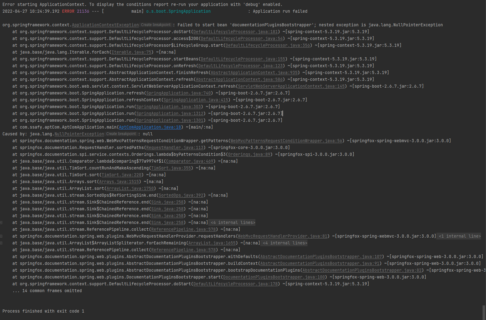

# Spring | Swagger 버전 호환 오류

 

REST API 개발시 프론트엔드와 원활한 소통 및 협업을 위해 **Swagger**를 많이 사용한다.

 

이번에 진행하는 프로젝트에서 `Swagger 3.0.0` 버전을 적용하려고 하는데 `SwaggerConfig.java` 클래스 파일 작성 후 스프링 부트 서버를 시작하면 아래와 같은 오류가 발생한다.

 

구글링을 통해 알게된 것은, `Spring Boot 2.6.X` 버전과 Swagger 간 버전 호환이 안되는 이슈가 있다고 한다.

 

참고한 블로그에서 **3가지 해결방법**을 제시하는데, 가장 간단하게 해결하려면 Spring Boot 버전을 낮추면 된다.

 

프로젝트에서 Spring Boot 버전에 따른 큰 이슈는 없을 것 같아서 기존 `Spring Boot 2.6.2` → `Spring Boot 2.4.2` 버전을 낮췄다.

 

하위 버전으로 다운그레이드한 후, 서버를 재시작하니 정상적으로 실행되는 것을 확인할 수 있었다.

 

***

#### 참고 자료

- https://velog.io/@mbsik6082/Spring-Boot-2.6.2%EC%97%90-Swagger-%EC%A0%81%EC%9A%A9-%EC%8B%9C-%EC%98%A4%EB%A5%98