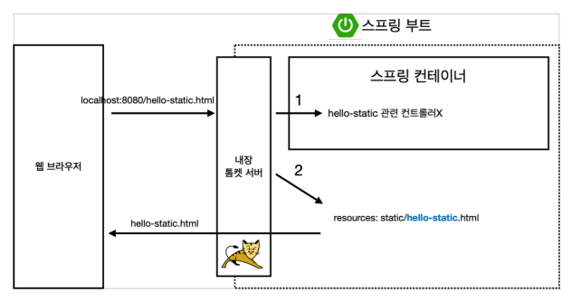
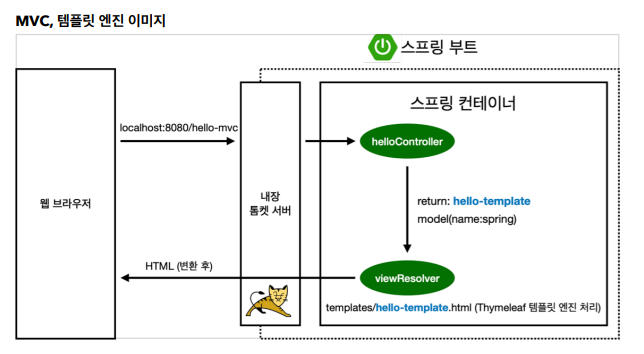
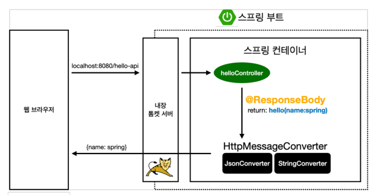
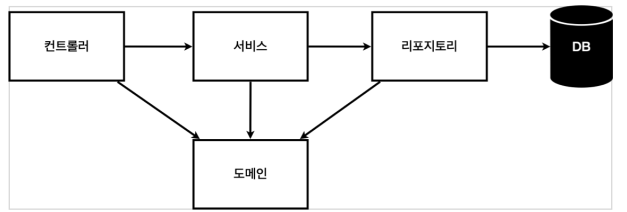
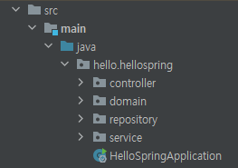
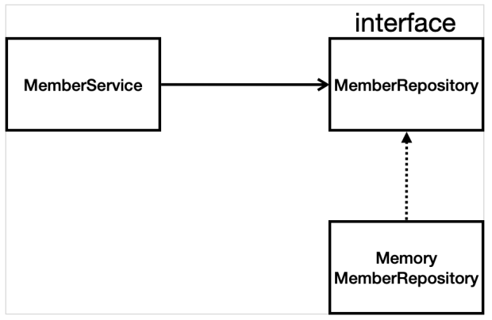

# Spring | 회원 관리 예제 MVC 개발

### 1. Spring 프로젝트 생성

- 프로젝트 환경
  - Project : Gradle
  - Spring Boot: 2.6.2
  - Language: Java
  - Packaging : Jar
  - Java : 11
- Dependencies : Spring Web, Thymeleaf

- https://start.spring.io/ 
  - 위 페이지에서 쉽고 빠르게 Spring 프로젝트를 생성할 수 있음

<br>

```java
// build.gradle

plugins {
	id 'org.springframework.boot' version '2.6.2'
	id 'io.spring.dependency-management' version '1.0.11.RELEASE'
	id 'java'
}

group = 'hello'
version = '0.0.1-SNAPSHOT'
sourceCompatibility = '11'

repositories {
	mavenCentral()
}

dependencies {
	implementation 'org.springframework.boot:spring-boot-starter-thymeleaf'
	implementation 'org.springframework.boot:spring-boot-starter-web'
	implementation 'org.springframework.boot:spring-boot-devtools'
	testImplementation 'org.springframework.boot:spring-boot-starter-test'
}

test {
	useJUnitPlatform()
}

```

<br>

#### 라이브러리 살펴보기

- ##### 스프링 부트 라이브러리

  - spring-boot-starter-web
    - spring-boot-starter-tomcat :  톰캣(웹서버)
    - spring-webmvc : 스프링 웹 MVC
  - spring-boot-starter-thymeleaf : 타임리프 템플릿 엔진 (View)
  - spring-boot-starter(공통) : 스프링 부트 + 스프링 코어 + 로깅
    - spring-boot
      - spring-core
    - spring-boot-starter-logging
      - logback, slf4j

- ##### 테스트 라이브러리

  - spring-boot-starter-test
    - junit : 테스트 프레임워크
    - mockito : 목 라이브러리
    - asssertj : 테스트 코드 작성을 편하게 도와주는 라이브러리
    - spring-test : 스프링 통합 테스트 지원

<br>

#### 빌드하고 실행하기

1. 콘솔로 이동
2. `./gradlew build`
3. `cd build/libs`
4. `java -jar hello-sprig-0.0.1-SNAPSHOT.jar`
5. 실행 확인

<br>

***

### 2. 스프링 웹 개발 기초

- 정적 컨텐츠
- MVC와 템플릿 엔진
- API

<br>

#### 정적 컨텐츠

- 웹 브라우저에서 서버에 요청을 보내면 `static/` 폴더 하위에 있는 html 페이지를 응답한다. 



<br>

<br>

#### MVC와 템플릿 엔진

- MVC 란?
  - Model
  - View
  - Controller

<br>

##### Controller

```java
@Controller
public class HelloController {
    
    @GetMapping("hello-mvc")
    public String helloMvc(@RequestParam("name") String name, Model model) {
       model.addAttribute("name", name);
       return "hello-template";
    }
}
```

##### View

- `resources/template/hello-template.html`

```html
<html xmlns:th="http://www.thymeleaf.org">
<body>
	<p th:text="'hello ' + ${name}">hello! empty</p>
</body>
</html>
```



- 웹 브라우저에서 `hello-mvc` 경로에 `name` 파라미터를 같이 전달하면 helloController라는 **Controller** 에서 `@GetMapping` 어노테이션으로 해당하는 요청과 일치하는 코드를 찾아 실행한다. 위 예시에서 `"hello-template"` 를 리턴하는데, 이는 **viewResolver**가  `resources/template/` 경로의 동일한 이름을 가진 html 파일을 찾아서 클라이언트에게 응답하는 구조를 보인다.

<br>

<br>

#### API

- 가장 많이 사용하는 개발 방식 (RESTful API, etc)
- `@ResponseBody` 문자 or 객체 반환
  - 문자 내용을 직접 반환
  - **Json 형태의 객체를 반환**

<br>

##### @ResponseBody 문자 반환

- viewResolver를 사용하지 않는다.
- HTTP Body에 문자 내용을 직접 반환함

```java
// 문자 반환
@Controller
public class HelloController {
    
    @GetMapping("hello-string")
    @ResponseBody
    public String helloString(@RequestParam("name") String name) {
        return "hello " + name;
    }
}
```

<br>

##### @ResponseBody 객체 반환

- 객체를 반환하면 Json으로 변환됨

```java
@Controller
public class HelloController {
    
    @GetMapping("hello-api")
    @ResponseBody
    public Hello helloApi(@RequestParam("name") String name) {
        Hello hello = new Hello();
        hello.setName(name);
        return hello;
    }
    
    static class Hello {
        private String name;
        
        public String getName() {
            return name;
        }
        
        public void setName(String name) {
            this.name = name;
        }
    }
}
```

<br>

##### @ResponseBody 사용 원리



- @ResponseBody를 사용
  - HTTP Body에 문자 내용을 반환
  - `viewResolver` 대신 `HttpMessageConverter`가 동작함
  - 문자 처리 : `StringHttpMessageConverter`
  - 객체 처리 : `MappingJackson2HttpMessageConverter`
  - byte 처리 등 기타 여러가지 HttpMessageConverter가 등록되어 있다.
  - 클라이언트의 HTTP Accept 헤더와 서버의 컨트롤러 반환 타입 정보, 2가지를 조합해서 `HttpMessageConverter`가 선택된다.

<br>

***

### 3. 회원 관리 예제 - 백엔드 개발하기

- 3-1. 비즈니스 요구사항 정리
- 3-2. 회원 도메인과 리포지토리 만들기
- 3-3. 회원 리포지토리 테스트 케이스 작성
- 3-4. 회원 서비스 개발
- 3-5. 회원 서비스 테스트

<br>

#### 3-1. 비즈니스 요구사항 정리

- 데이터
  - 회원 ID
  - 이름
- 기능
  - 회원 등록
  - 회원 조회
- 아직 데이터 저장소(DB)가 선정되지 않음

<br>

##### 일반적인 웹 애플리케이션 계층 구조



- 컨트롤러 : 웹 MVC의 C. Controller 역할
- 서비스 : 핵심 비즈니스 로직 구현
- 리포지토리 : DB에 접근, 도메일 객체를 DB에 저장하고 관리
- 도메인 : 비즈니스 도메인 객체
  - 예) 회원, 주문, 쿠폰 등 DB에 저장되고 관리됨



<br>

##### 회원 관리 예제 클래스 의존관계



- 아직 데이터 저장소가 선정되지 않았기 때문에, 인터페이스로 구현하고 구현 클래스를 변경할 수 있도록 설계
- 데이터 저장소(DB)는 RDB, NoSQL 등 다양한 저장소를 고려중인 상황으로 가정함
- 개발 진행을 위하여 초기 개발 단계에서는 **구현체로 가벼운 메모리 기반의 데이터 저장소** 사용

<br>

<br>

#### 3-2. 회원 도메인과 리포지토리 만들기

##### 회원 객체

```java
package hello.hellospring.domain;

public class Member {
    
    priavte Long id;
    private String name;
    
    public Long getId() {
        return id;
    }
    public void setId(Long id) {
        this.id = id;
    }
    
    public String getName() {
        return name;
    }
    public void setName(String name) {
        this.name = name;
    }
}
```

##### <br>

##### 회원 리포지토리 인터페이스

```java
package hello.hellospring.repository;

import hello.hellospring.domain.Member;

import java.util.List;
import java.util.Optional;

public interface MemberRepository {
    
    Member save(Member member);
    Optional<Member> findById(Long id);
    Optional<Member> findByName(String name);
    List<Member> findAll();
}
```

<br>

##### 회원 리포지토리 메모리 구현체

```java
package hello.hellospring.repository;

import hello.hellospring.domain.Member;

import java.util.*;

public class MemoryMemberRepository implements MemberRepository{

    private static Map<Long, Member> store = new HashMap<>();
    private static long sequence = 0L;

    @Override
    public Member save(Member member) {
        member.setId(++sequence);
        store.put(member.getId(), member);
        return member;
    }

    @Override
    public Optional<Member> findById(Long id) {
        return Optional.ofNullable(store.get(id));
    }

    @Override
    public Optional<Member> findByName(String name) {
        return store.values().stream()
                .filter(member -> member.getName().equals(name))
                .findAny();
    }

    @Override
    public List<Member> findAll() {
        return new ArrayList<>(store.values());
    }
    
    public void clearStore() {
        store.clear();
    }
}
```

<br>

<br>

#### 3-3. 회원 리포지토리 테스트 케이스 작성

- 일반적으로 자바 main 메서드나 웹 애플리케이션 컨트롤러를 통해서 개발한 기능을 테스트하기도 한다.
- 하지만 이러한 방법은 준비 및 실행 시간이 오래 걸리고, 반복 실행이 어려우며 여러 테스트를 한번에 실행하기 어렵다는 단점이 있다.
- **JUnit** 프레임워크를 사용하면 테스트를 한번에 실행할 수 있다.

<br>

##### 회원 리포지토리 메모리 구현체 테스트

- `src/test/java` 하위 폴더에 생성한다.

```java
package hello.hellospring.repository;

import hello.hellospring.domain.Member;
import org.junit.jupiter.api.AfterEach;
import org.junit.jupiter.api.Test;

import java.util.List;

import static org.assertj.core.api.Assertions.assertThat;

class MemoryMemberRepositoryTest {

    MemoryMemberRepository repository = new MemoryMemberRepository();

    @AfterEach
    public void afterEach() {
        repository.clearStore();
    }

    @Test
    public void save() {
        Member member = new Member();
        member.setName("spring");

        repository.save(member);

        Member result = repository.findById(member.getId()).get();
        assertThat(member).isEqualTo(result);

    }

    @Test
    public void findByName() {
        Member member1 = new Member();
        member1.setName("spring1");
        repository.save(member1);

        Member member2 = new Member();
        member2.setName("spring2");
        repository.save(member2);

        Member result = repository.findByName("spring1").get();

        assertThat(result).isEqualTo(member1);
    }

    @Test
    public void findAll() {
        Member member1 = new Member();
        member1.setName("spring1");
        repository.save(member1);

        Member member2 = new Member();
        member2.setName("spring2");
        repository.save(member2);

        List<Member> result = repository.findAll();

        assertThat(result.size()).isEqualTo(2);
    }
}
```

- `@AfterEach`
  - 한 번에 여러개의 테스트를 진행하면 메모리 DB에 직전 테스트 결과가 남을 수 있다.
  - 이전 테스트 결과 때문에 다음 테스트가 실패할 가능성이 있다.
  - @AfterEach 어노테이션을 사용하여 각 테스트가 종료될 때마다 이 기능을 실행한다. 위 코드에서는 메모리 DB에 저장된 데이터를 삭제한다.
    - `MemoryMemberRepository` 클래스에 `clearStore()` 메소드를 만들어야 한다.
- 각 테스트는 독립적으로 실행되어야 한다. 테스트 순서에 의존관계가 있는 테스트는 좋은 테스트가 아니다.

<br>

#### 3-4. 회원 서비스 개발

```java
package hello.hellospring.service;

import hello.hellospring.domain.Member;
import hello.hellospring.repository.MemberRepository;

import java.util.List;
import java.util.Optional;

public class MemberService {

    private final MemberRepository memberRepository = new
MemoryMemberRepository();

    // 회원 가입
    public Long join(Member member) {

        // 중복 회원 x
        validateDuplicateMember(member);

        memberRepository.save(member);
        return member.getId();
    }

    private void validateDuplicateMember(Member member) {
        memberRepository.findByName(member.getName())
                .ifPresent(m -> {
                    throw new IllegalStateException("이미 존재하는 회원입니다.");
                });
    }

    // 전체 회원 조회
    public List<Member> findMembers() {
         return memberRepository.findAll();
    }
    
    // 특정 회원 조회
    public Optional<Member> findOne(Long memberId) {
        return memberRepository.findById(memberId);
    }
}
```

<br>

#### 3-5. 회원 서비스 테스트

- **DI (Dependency Injection)**

  - 기존에는 회원 서비스(`MemberService`)가 메모리 회원 리포지토리(`MemoryMemberRepository`) 를 직접 생성하게 했다.
  - 회원 리포지토리 코드가 회원 서비스 코드를 DI 가능하게 변경한다.

  ```java
  // 기존
  public class MemberService {
  
      private final MemberRepository memberRepository = new
  MemoryMemberRepository();
  }
  ```

  ```java
  // 변경 - DI
  public class MemberService {
  
      private final MemberRepository memberRepository;
  
      public MemberService(MemberRepository memberRepository) {
          this.memberRepository = memberRepository;
      }
  }
  ```

<br>

##### 회원 서비스 테스트

```java
package hello.hellospring.service;

import hello.hellospring.domain.Member;
import hello.hellospring.repository.MemoryMemberRepository;
import org.junit.jupiter.api.AfterEach;
import org.junit.jupiter.api.BeforeEach;
import org.junit.jupiter.api.Test;

import static org.assertj.core.api.Assertions.assertThat;
import static org.junit.jupiter.api.Assertions.assertThrows;

class MemberServiceTest {

    MemberService memberService;
    MemoryMemberRepository memberRepository;

    @BeforeEach
    public void beforeEach() {
        memberRepository = new MemoryMemberRepository();
        memberService = new MemberService(memberRepository);
    }

    @AfterEach
    public void afterEach() {
        memberRepository.clearStore();
    }

    @Test
    void 회원가입() {
        // Given
        Member member = new Member();
        member.setName("spring");

        // When
        Long saveId = memberService.join(member);


        // Then
        Member findMember = memberService.findOne(saveId).get();
        assertThat(member.getName()).isEqualTo(findMember.getName());
    }

    @Test
    public void 중복_회원_예외() {
        // Given
        Member member1 = new Member();
        member1.setName("spring");

        Member member2 = new Member();
        member2.setName("spring");

        // When
        memberService.join(member1);
        IllegalStateException e = assertThrows(IllegalStateException.class, () -> memberService.join(member2));
        assertThat(e.getMessage()).isEqualTo("이미 존재하는 회원입니다.");

    @Test
    void findMembers() {
    }

    @Test
    void findOne() {
    }
}
```

- `@BeforeEach`
  - 각 테스트 실행 전 호출 됨
  - 테스트가 서로 영향이 없도록 새로운 객체를 매번 새롭게 생성하고, 의존관계도 새롭게 맺어줌

<br>

***

### 4. 스프링 빈과 의존관계

- 4-1. 컴포넌트 스캔과 자동 의존관계 설정
- 4-2. 자바 코드로 직접 스프링 빈 등록하기

<br>

#### 4-1. 컴포넌트 스캔과 자동 의존관계 설정

회원 컨트롤러가 회원 서비스와 회원 리포지토리를 사용할 수 있도록 **의존관계**를 준비한다.

##### 컴포넌트 스캔 원리

- `@Component` : 어노테이션이 있으면 스프링 빈으로 자동 등록됨
  - `@Controller` : 컴포넌트 스캔을 통해 컨트롤러를 스프링 빈으로 자동 등록함
  - `@Service` : 서비스 등록
  - `@Repository` : 리포지토리 등록

<br>

##### 회원 컨트롤러에 의존관계 추가

```java
package hello.hellospring.controller;

import hello.hellospring.service.MemberService;
import org.springframework.beans.factory.annotation.Autowired;
import org.springframework.stereotype.Controller;

@Controller
public class MemberController {

    private final MemberService memberService;

    @Autowired
    public MemberController(MemberService memberService) {
        this.memberService = memberService;
    }
}
```

- `@Autowired`
  - 생성자에 어노테이션이 있으면 스프링이 연관된 객체를 스프링 컨테이너에서 찾아서 넣어준다.
  - 이렇듯 객체 의존관계를 외부에서 넣어주는 것을 **DI (Dependency Injection)** 의존성 주입이라고 한다.

<br>

##### 회원 서비스 스프링 빈 등록

```java
@Service
public class MemberService {

    private final MemberRepository memberRepository;

    @Autowired
    public MemberService(MemberRepository memberRepository) {
        this.memberRepository = memberRepository;
    }
    
    ...
}
```

- 생성자에 `@Autowired` 를 사영하면 객체 생성 시점에 스프링 컨테이너에서 해당 스프링 빈을 찾아서 주입한다.
- 생성자가 한 개만 있으면 `@Autowired` 어노테이션을 생략할 수 있다

<br>

##### 회원 리포지토리 스프링 빈 등록

```java
@Repository
public class MemoryMemberRepository implements MemberRepository {}
```

<br>

🎈 스프링은 컨테이너에 빈을 등록할 때, 기본적으로 **싱글턴**으로 등록한다. 

싱글턴 패턴(Singleton Pattern) 이란 생성자가 여러 차례 호출되더라도 **실제 생성되는 객체는 단 하나**이고, 최초 생성 이후에 호출된 생성자는 최초의 생성자가 생성한 객체를 리턴하는 것이다.

요청이 매우 많은 트래픽 사이트에서 객체를 매번 새롭게 생성하면 메모리 낭비가 심하기 때문에 일반적으로 싱글턴 패턴을 따른다.

<br>

#### 4-2. 자바 코드로 직접 스프링 빈 등록하기

회원 서비스와 회원 리포지토리의 `@Service` `@Repository` `@Autowired` 등의 어노테이션을 제거하고 직접 설정하는 방법

```java
// hello.hellospring 패키지 내에 SpringConfig 클래스 파일 생성
package hello.hellospring;

import hello.hellospring.repository.MemberRepository;
import hello.hellospring.repository.MemoryMemberRepository;
import hello.hellospring.service.MemberService;
import org.springframework.context.annotation.Bean;
import org.springframework.context.annotation.Configuration;

@Configuration
public class SpringConfig {

    @Bean
    public MemberService memberService() {
        return new MemberService(memberRepository());
    }

    @Bean
    public MemberRepository memberRepository() {
        return new MemoryMemberRepository();
    }
}

```

- XML 로 설정하는 방식도 있지만 잘 사용하지 않음
- DI 방식은 필드 주입, setter 주입, 생성자 주입 3가지가 있다.
  - 의존관계가 실행 중에 동적으로 변하는 경우는 거의 없으므로 **생성자 주입** 방법을 사용한다.
- 정형화된 컨트롤러, 서비스, 리포지토리의 경우 **컴포넌트 스캔 방식**을 사용. 정형화되지 않거나 상황에 따라 구현 클래스를 변경해야 하는 경우 **스프링 빈으로 등록**

<br>

***

### 5. 웹 MVC 개발

- 5-1. 홈 화면 추가
- 5-2. 등록
- 5-3. 조회

<br>

#### 5-1. 홈 화면 추가

##### 홈 컨트롤러 추가

- `HomeController` 클래스 파일 생성

```java
package hello.hellospring.controller;

import org.springframework.stereotype.Controller;
import org.springframework.web.bind.annotation.GetMapping;

@Controller
public class HomeController {

    @GetMapping("/")
    public String home() {
        return "home";
    }
}
```

- `resources/template/` 하위 경로에 home.html 파일 생성

```java
<!DOCTYPE HTML>
<html xmlns:th="http://www.thymeleaf.org">
<body>
<div class="container">
    <div>
        <h1>Hello Spring</h1>
        <p>회원 기능</p>
        <p>
            <a href="/members/new">회원 가입</a>
            <a href="/members">회원 목록</a>
        </p>
    </div>
</div>
</body>
</html>
```

- 컨트롤러가 정적 파일보다 우선순위가 높기 때문에 기존 `static/index.html` 파일이 아닌 `resources/template/home.html` 파일을 응답한다.

<br>

#### 5-2. 등록

##### 회원 등록 폼 개발

- 회원 등록 폼 컨트롤러 

```java
@Controller
public class MemberController {

    ...

    @GetMapping("/members/new")
    public String createForm() {
        return "members/createMemberForm";
    }

}
```

- 회원 등록 폼 HTML
  - `resources/templates/members/createMemberForm.html`

```html
<!DOCTYPE HTML>
<html xmlns:th="http://www.thymeleaf.org">
<body>
<div class="container">
    <form action="/members/new" method="post">
        <div class="form-group">
            <label for="name">이름</label>
            <input type="text" id="name" name="name" placeholder="이름을입력하세요">
        </div>
        <button type="submit">등록</button>
    </form>
</div> <!-- /container -->
</body>
</html>
```

<br>

##### 회원 등록 컨트롤러

- 웹 등록 화면에서 POST 방식으로 데이터를 전달 받을 폼 객체

```java
// MemberForm 클래스 파일 생성
package hello.hellospring.controller;

public class MemberForm {
    private String name;

    public String getName() {
        return name;
    }

    public void setName(String name) {
        this.name = name;
    }
}
```

- 회원 컨트롤러에서 회원을 실제 등록하는 기능 추가

```java
@PostMapping("/members/new")
public String create(MemberForm form) {

    Member member = new Member();
    member.setName(form.getName());

    memberService.join(member);

    return "redirect:/";
}
```

<br>

#### 5-3. 조회

##### 회원 컨트롤러에서 조회 기능

```java
@GetMapping("/members")
public String list(Model model) {
    List<Member> members = memberService.findMembers();
    model.addAttribute("members", members);
    return "members/memberList";
}
```

##### 회원 리스트 HTML (View)

```html
<!DOCTYPE HTML>
<html xmlns:th="http://www.thymeleaf.org">
<body>
<div class="container">
    <div>
        <table>
            <thead>
            <tr>
                <th>#</th>
                <th>이름</th>
            </tr>
            </thead>
            <tbody>
            <tr th:each="member : ${members}">
                <td th:text="${member.id}"></td>
                <td th:text="${member.name}"></td>
            </tr>
            </tbody>
        </table>
    </div>
</div> <!-- /container -->
</body>
</html>
```

<br>

***

### 6. 스프링 DB 접근 기술

### 7. AOP

