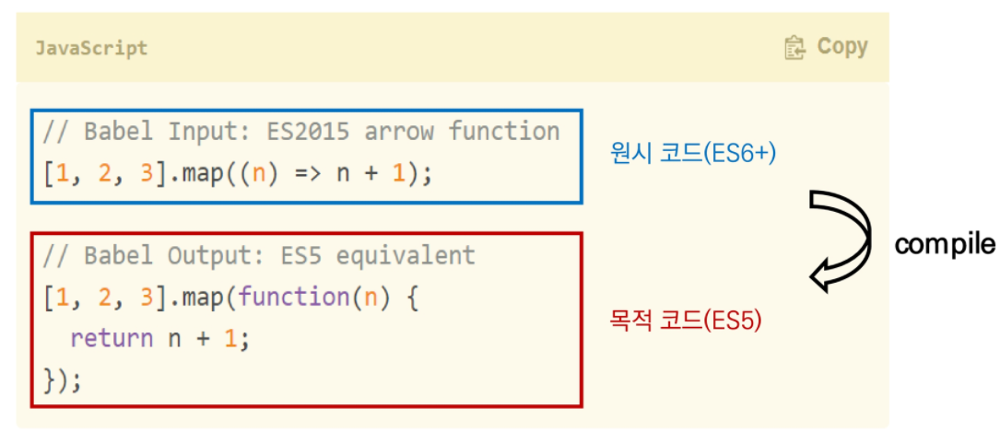

# JavaScript | Vue CLI & Router

### 목차

> SFC
>
> Vue CLI
>
> Pass Props & Emit Events
>
> Vue Router

<br>

## SFC

### Component (컴포넌트)

- 기본 HTML 엘리먼트를 확장하여 재사용 가능한 코드를 캡슐화하는데 도움을 줌
- CS에서는 다시 사용할 수 있는 범용성을 위해 개발된 소프트웨어 구성 요소를 의미
- 컴포넌트는 유지보수를 쉽게 만들어 줄 뿐만 아니라, 재사용성 측면에서도 매우 강력한 기능을 제공
- Vue 컴포넌트 === Vue 인스턴스

### SFC (Single File Component)

- Vue의 컴포넌트 기반 개발의 핵심 특징
- 하나의 컴포넌트는 `.vue` 확장자를 가진 하나의 파일 안에서 작성되는 코드의 결과물
- 화면의 특정 영역에 대한 HTML, CSS, JavaScript 코드를 하나의 `.vue` 파일에서 관리
- `.vue` 확장자를 가진 싱글 파일 컴포넌트를 통해 개발하는 방식
- Vue 컴포넌트 === Vue 인스턴스 === .vue 파일

#### 정리

- Vue 컴포턴트는 Vue 인스턴스(`new Vue({})`)이기도 함
- Vue 인스턴스는 `.vue` 파일 안에 작성된 코드의 집합
- HTML, CSS, JavaScript를 `.vue` 라는 확장자를 가진 파일 안에서 관리하며 개발

<br>

## Vue CLI

- Vue.js 개발을 위한 표준 도구
- 프로젝트의 구성을 도와주는 역할을 하고, Vue 개발 생태계에서 표준 tool 기준을 목표로 함
- 확장 플러그인, GUI, ES2015 구성 요소 제공 등 다양한 tool 제공

#### Node.js

- 자바스크립트를 브라우저가 아닌 환경에서도 구동할 수 있도록 하는 **자바스크립트 런타임 환경**
  - 브라우저 밖을 벗어날 수 없던 JS 언어의 태생적 한계를 해결
- Chrome V8 엔진을 제공하여 여러 OS 환경에서 실행할 수 있는 환경을 제공
- 단순히 **브라우저만 조작할 수 있던 JS를 SSR 아키텍처에서도 사용할 수 있도록 함**
- 2009, Ryan Dahl에 의해 발표

#### NPM (Node Package Manage)

- 자바스크립트 언어를 위한 패키지 관리자
  - python에는 pip, node.js에는 npm
  - pip와 마찬가지로 다양한 의존성 패키지를 관리
- Node.js의 기본 패키지 관리자
- Node.js 설치 시 함께 설치됨

```bash
# 설치
$ npm install -g @vue/cli

# 버전 확인
$ vue --version

# 프로젝트 생성
$ vue create my-first-app

# Vue 버전 선택
Default ([Vue 2] bable, eslint)

# 서버 실행
npm run serve
```


### Babel & Webpack

#### Babel

- JavaScript Compiler
- 자바스크립트의 ECMAScript2015+ 코드를 이전 버전으로 번역/변환해주는 도구
- 과거 JS의 파편화/표준화 영향으로 코드의 스펙트럼이 매우 다양
  - 최신 문법을 사용해도 이전 브라우저/환경에서 동작하지 않는 상황이 발생
- 원시 코드(최신 버전)를 목적 코드(구 버전)로 옮기는 번역기가 등장하면서 개발자는 더 이상 코드가 특정 브라우저에서 동작하지 않는 상황에 대해 고민하지 않아도 됨



#### Webpack

- Static Module Bundler
- 모듈 간 의존성 문제를 해결하기 위한 도구
  - Module 의존성 문제
    - 모듈의 수가 많아지고 라이브러리 / 모듈 간 의존성(연결성)이 깊어지면서 특정한 곳에서 발생한 문제가 어떤 모듈 간의 문제인지 파악하기 어려워짐
- 프로젝트에 필요한 모든 모듈을 매핑하고 내부적으로 종속성 그래프를 빌드

- **Bundler**
  - 모듈 의존성 문제를 해결해주는 작업은 Bundling이라고 함
  - 이러한 일을 해주는 도구가 bundler, Webpack은 다양한 Bundler 중 하나
  - 여러 모듈을 하나로 묶어주고 묶인 파일은 하나(또는 여러개)로 합쳐짐
  - Bundling된 결과물은 순서에 영향을 받지 않고 동작하게 됨
  - snowpack, parcel, rollup.js 등 다양한 모듈 번들러 존재


### Vue 프로젝트 구조

- **node_modules**
  - node.js 환경의 여러 의존성 모듈
- **public/index.html**
  - Vue 앱의 뼈대가 되는 파일
  - 실제 제공되는 단일 html 파일

- **src/assets**
  - webpack에 의해 빌드 된 정적 파일
- **src/components**
  - 하위 컴포넌트들이 위치
- **src/App.vue**
  - 최상위 컴포넌트

- **src/main.js**
  - webpack이 빌드를 시작할 때 가장 먼저 불러오는 entry point
  - 실제 단일 파일에서 DOM과 data를 연결했던 것과 동일한 작업이 이루어지는 곳
  - Vue 전역에서 활용할 모듈을 등록할 수 있는 파일

- **babel.config.js**
  - babel 관련 설정이 작성된 파일
- **package.json**
  - 프로젝트의 종속성 목록과 지원되는 브라우저에 대한 구성 옵션이 포함
- **package-lock.json**
  - node_modules에 설치되는 모듈과 관련된 모든 의존성을 설정 및 관리
  - 팀원 및 배포 환경에서 정확히 동일한 종속성을 설치하도록 보장하는 표현
  - 사용할 패키지의 버전을 고정
  - 개발 과정 간 의존성 패키지 충돌 방지

<br>

## Pass Props & Emit Events

- Vue app은 자연스럽게 중첩된 컴포넌트 트리로 구성
- 컴포넌트간 부모-자식 관계가 구성되며 이들 사이에 필연적으로 의사소통이 필요함

- 부모는 자식에게 데이터를 전달(**Pass props**) 하고, 자식은 자신에게 일어난 일을 부모에게 알림(**Emit event**)
  - 부모-자식이 명확하게 정의된 인터페이스를 통해 격리된 상태를 유지할 수 있음
- "props는 아래로, events는 위로"
- 부모는 props를 통해 자식에게 '데이터'를 전달하고, 자식은 events를 통해 부모에게 '메시지'를 보냄


### Props

- props는 부모(상위) 컴포넌트의 정보를 전달하기 위한 사용자 지정 특성
- 자식(하위) 컴포넌트는 props 옵션을 사용하여 수신하는 props를 명시적으로 선언해야 함
- 데이터는 props 옵션을 사용하여 자식 컴포넌트로 전달됨 (단방향)
- 주의
  - 모든 컴포넌트 인스턴스에는 자체 격리된 범위가 있음
  - 자식 컴포넌트의 템플릿에서 상위 데이터를 직접 참조할 수 없음

- 작성법
  - Static Props 작성
    - `prop-data-name="value"` (부모 컴포넌트에 작성)
    - `props: { prop-data-name: Type }` (자식 컴포넌트에 작성)
  - Dynamic Props 작성
    - `v-bind` directive를 사용해 부모의 데이터의 props를 동적으로 바인딩
    - 부모에서 데이터가 업데이트될 때마다 자식 데이터로도 전달됨

- 이름 컨벤션

  - 선언시 (during declaration)
    - camelCase

  - HTML (in template)
    - kebab-case

- `data`
  - 컴포넌트의 data는 반드시 함수여야 함
  - 새로운 data 객체를 반환(return)해야 함
  - 그렇지 않으면 각 인스턴스가 모두 같은 data 객체를 공유하게 됨


### Emit

- Listening to Child Components Events
- `$emit(eventName)`
  - 현재 인스턴스에서 이벤트를 트리거
  - 추가 인자는 리스너의 콜백함수로 전달
- 부모 컴포넌트는 자식 컴포넌트가 사용되는 템플릿에서 `v-on`을 사용하여 자식 컴포넌트가 보낸 이벤트를 청취 (v-on을 이용한 사용자 지정 이벤트)

- 작성
  - 자식 컴포넌트에서 `$emit`  인스턴스 메서드를 사용해서 이벤트를 트리거
  - 부모 컴포넌트는 자식 컴포넌트가 사용되는 템플릿에서 `v-on` directive를 사용하여 자식 컴포넌트가 보낸 이벤트를 청취

- 이름 컨벤션
  - 컴포넌트 및 props와 달리, 이벤트는 자동 대소문자 변환을 제공하지 않음
  - HTML의 대소문자 구분을 위해 DOM 템플릿의 v-on 이벤트 리스너는 항상 자동으로 소문자 변환됨
    - `v-on:myEvent` → `v-on:myevent`
  - 이벤트 이름에는 항상 kebab-case를 사용하는 것을 권장

<br>

## Vue Router

- Vue.js 공식 라우터
- 라우트(route)에 컴포넌트를 매핑한 후, 어떤 주소에서 렌더링할 지 알려줌
- SPA 상에서 라우팅을 쉽게 개발할 수 있는 기능을 제공

#### Vue Router 시작하기

- 프로젝트 생성 및 이동
- Vue Router plugin 설치 (Vue CLI 환경)

```bash
$ vue add router
```

- Vue Router로 인한 변화
  - App.vue 코드
  - router/index.js 생성
    - 라우트에 관련된 정보 및 설정이 작성되는 곳
  - views 디렉토리 생성

##### Vue Router

- `<router-link>`
  - 사용자 네비게이션을 가능하게 하는 컴포넌트
  - 목표 경로는 `to` prop으로 지정
  - HTML5 히스토리 모드에서 router-link는 클릭 이벤트를 차단하여 브라우저가 페이지를 다시 로드하지 않도록 함
  - `a` 태그이지만 기존 GET 요청을 보내는 a 태그와 조금 다르게, 기본 GET 요청을 보내는 이벤트를 제거한 형태로 구성됨

- `<router-view>`
  - 주어진 라우트에 대해 일치하는 컴포넌트를 렌더링하는 컴포넌트
  - 실제 component가 DOM에 부착되어 보이는 자리를 의미
  - router-link를 클릭하면 해당 경로와 연결되어 있는 index.js에 정의한 컴포넌트가 위치

##### History mode

- HTML History API를 사용해서 router를 구현한 것
- 브라우저의 히스토리는 남기지만 실제 페이지는 이동하지 않는 기능을 지원
- 페이지를 다시 로드하지 않고 URL을 탐색할 수 있음
  - SPA의 단점 중 하나인 URL이 변경되지 않는 점을 해결


#### 1. Named Routes

- 이름을 가지는 라우트
- 명명된 경로로 이동하려면 객체를 vue-router 컴포턴트 요소의 prop에 전달


#### 2. 프로그래밍 방식 네비게이션

- `<router-link>`를 사용하여 선언적 탐색을 위한 a 태그를 만드는 것 외에도, router의 인스턴스 메서드를 사용하여 프로그래밍 방식으로 같은 작업을 수행할 수 있음
  - `$router.push()` ...

- Vue 인스턴스 내부에서 라우터 인스턴스에 `$router`로 접근할 수 있음
- 다른 URL로 이동하려면 `this.$router.push`를 호출할 수 있음
  - 새로운 항목을 히스토리 스택에 넣기 때문에 사용자가 브라우저의 뒤로가기 버튼을 클릭하면 이전 URL로 이동
- `<router-link :to="...">` 를 클릭하면 `$router.push(...)` 를 호출하는 것과 같음


#### 3. Dynamic Route Matching

- 동적 인자 전달
- 주어진 패턴을 가진 라우트를 동일한 컴포넌트에 매핑해야 하는 경우
- `:` 콜론으로 시작
- 컴포넌트에서 `this.$route.params`로 사용 가능


#### components와 views

- 기본적으로 작성된 구조에서 components 폴더와 views 폴더 내부에 각기 다른 컴포넌트가 존재하게 됨
- 정해진 구조가 있는 것은 아니며, 아래와 같이 구조화하여 활용
- `App.vue`
  - 최상위 컴포넌트
- `views/`
  - router(index.js)에 매핑되는 컴포넌트를 모아두는 폴더
  - ex. App 컴포넌트 내부에 About & Home 컴포넌트 등록
- `components/`
  - router에 매핑된 컴포넌트 내부에 작성하는 컴포넌트를 모아두는 폴더
  - ex. Home 컴포넌트 내부에 HelloWorld 컴포넌트 등록


#### Environment Variable

- 프로젝트 최상단에 배치하여 환경 변수를 지정할 수 있음
- `NODE_ENV`, `BASE_URL` 및 `VUE_APP_`으로 시작하는 변수만 클라이언트 번들에 정적으로 포함됨
- `.env.local`에 작성하는 환경 변수는 개발 단계에서 원격 저장소에 노출시키지 않기 위해 git에서 무시되며, 모든 경우에 로드하기 위해 사용
- 환경 변수는 빌드에 포함되므로 누구나 앱 파일을 검사하여 볼 수 있고, 실제 배포 단계에서는 배포 서비스에서 이러한 환경변수를 설정할 수 있도록 환경을 제공함