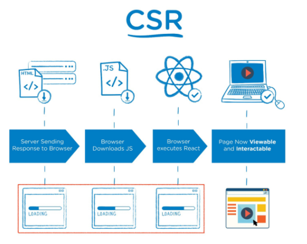
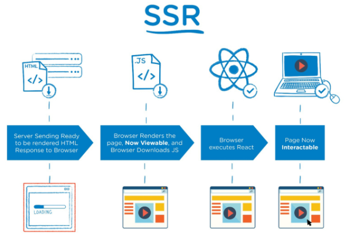
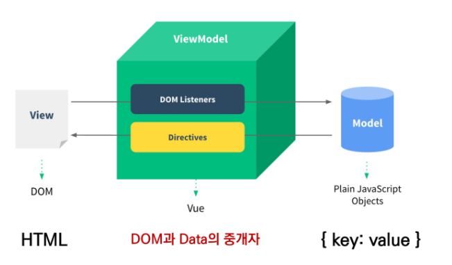
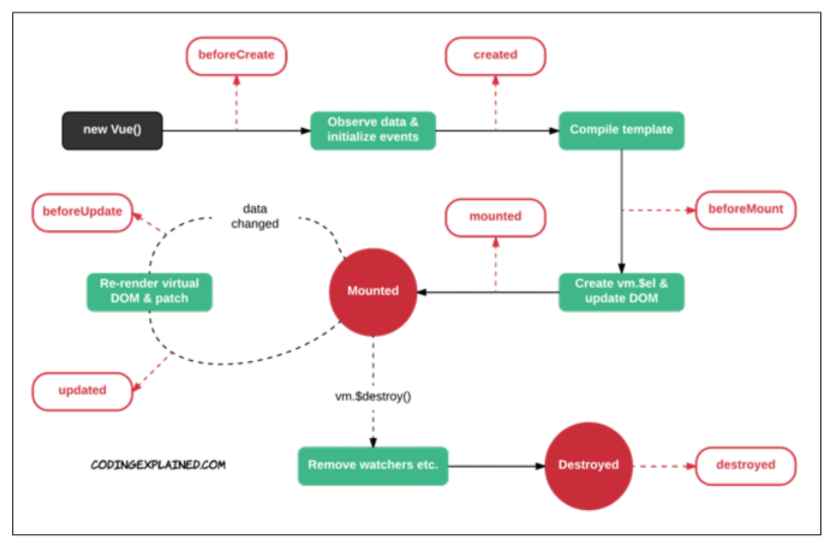

# JavaScript | Vue Intro

### 목차

> Intro
>
> Vue.js
>
> Basic Syntax

<br>

## Intro

### Front-End Development

- HTML, CSS, JavaScript를 활용해서 데이터를 볼 수 있게 만들어 줌
- 사용자는 데이터를 눈으로 볼 수 있고, 데이터와 상호작용 할 수 있음
- 프론트엔드 프레임워크 예시
  - **Vue.js, React, Angular**

### Vue.js

- 사용자 인터페이스를 만들기 위한 진보적인 JS 프레임워크
- 현대적인 Tool과 다양한 라이브러리를 통해 **SPA**(**S**ingle **P**age **A**pplication)를 완벽하게 지원

#### SPA

- 단일 페이지 애플리케이션 (Single Page Application)
- 현재 **페이지를 동적으로 렌더링**함으로써 사용자와 소통하는 Web Application

- 단일 페이지로 구성되며 서버로부터 **최초에만 페이지를 다운로드**하고 이후에는 **동적으로 DOM을 구성**
  - 처음 페이지를 받은 이후에는 서버로부터 새로운 전체 페이지를 불러오는 것이 아닌, 현재 페이지 중 **필요한 부분만 동적으로 다시 작성**
- 연속되는 페이지 간 UX(사용자 경험) 향상
- 동작 원리의 일부가 **CSR**(**C**lient **S**ide **R**endering)의 구조를 따름

##### SPA 등장 배경

- 과거 웹사이트는 요청에 따라 매번 새로운 페이지를 응답하는 방식
  - MPA (Multi Page Application)
- 스마트폰이 등장하면서 모바일 최적화의 필요성 대두. 모바일 네이티브 앱과 같은 형태의 웹페이지가 필요해짐
- 이러한 문제 해결 위해 Vue.js 같은 프론트엔드 프레임워크 등장
  - CSR, SPA 등장
- 1개의 웹페이지에서 여러 동작이 이루어지며 모바일 앱과 비슷한 형태의 사용자 경험(UX) 제공


#### CSR

- Client Side Rendering
- 서버에서 화면을 구성하는 SSR 방삭괴 달리 클라이언트에서 화면을 구성
- 최초 요청시 HTML, CSS, JS 등 데이터를 제외한 리소스를 응답받고 이후 클라이언트에서 필요한 데이터만 요청해서 동적으로 JS를 통해 DOM을 렌더링
- 처음에 뼈대만 받고 브라우저에서 동적으로 DOM을 그린다!
- SPA가 사용하는 렌더링 방식



- 장점
  - 서버와 클라이언트간 트래픽 감소
    - 웹 애플리케이션에 필요한 모든 정적 리소스를 최초에 한 번 다운로드한 후 필요한 데이터만 갱신
  - 사용자 경험(UX) 향상
    - 전체 페이지를 다시 렌더링하지 않고 변경되는 부분만을 갱신하기 때문
- 단점
  - SSR에 비해 전체 페이지 렌더링 시점이 느리다
  - SEO에 어려움이 있음. 최초 문서에 데이터가 없기 때문에

#### SSR

- Server Side Rendering
- 서버에서 클라이언트에게 보요줄 페이지를 모두 구성하여 전달하는 방식
- JS 웹 프레임워크 이전에 사용되던 전통적인 렌더링 방식



- 장점
  - 초기 구동 속도가 빠름
    - 클라이언트가 빠르게 컨텐츠를 볼 수 있음
  - SEO에 적합
    - DOM에 이미 모든 데이터가 작성되어 있기 때문

- 단점
  - 모든 요청마다 새로운 페이지를 구성하여 전달
    - 반복되는 전체 새로고침으로 인해 UX 떨어짐
    - 상대적으로 트래픽이 많아 서버의 부담이 클 수 있음

#### SSR & CSR

- 두 방식의 차이는 렌더링 주체가 누구인가!
- 화면을 그리는 것(렌더링)을 서버가 하면 SSR, 클라이언트가 하면 CSR
- '어떤 방식이 더 좋다'가 아니라, 서비스 or 프로젝트 구성에 맞는 방법을 적절하게 선택하는 것이 중요
  - 하나를 사용하거나 SSR, CSR을 섞어서 구성할 수 있음

- ex.

  - Django에서 Axios를 활용한 좋아요/팔로우 로직 

    - 대부분은 Server에서 완성된 HTML을 제공(`return render()`)하는 구조 (SSR)

    - 좋아요/팔로우 요소는 JS(AJAX & DOM 조작)를 활용 (CSR)
      - AJAX를 활용해 비동기 요청으로 필요한 데이터를 클라이언트에서 서버로 직접 요청을 보내서 받아오고 JS를 활용하여 DOM을 동적으로 조작

    ​	

#### SEO 대응

- Vue.js 혹은 React 등 SPA 프레임워크는 SSR을 지원하는 SEO 대응 기술이 이미 존재
  - SEO 대응이 필요한 페이지에 대해 선별적 SEO 대응 가능
- 추가로 별도의 프레임워크를 사용하기도 함
  - **Nuxt.js**
    - Vue.js 응용 프로그램을 만들기 위한 프레임워크
    - SSR 지원
  - **Next.js**
    - React 응용 프로그램을 만들기 위한 프레임워크
    - SSR 지원

<br>

## Vue.js

### Why Vue.js?

- Vanilla JS
  - 한 유저가 100만 개의 게시글을 작성했다고 가정
  - 이 유저가 닉네임을 변경하면, 게시글 100만 개의 작성자 이름이 모두 수정되어야 함
  - '모든 요소'를 선택해서 '이벤트'를 등록하고 값을 변경해야 함
- Vue.js
  - DOM과 Data가 연결되어 있으면
  - Data를 변경하여 이와 연결되 DOM이 알아서 변경됨
  - 우리가 신경쓸 부분은 오직 **Data**에 대한 관리

### Concepts of Vue.js

#### MVVM Pattern

- 애플리케이션 로직을 UI로부터 분리하기 위해 설계된 디자인 패턴
- 구성 요소
  - **M**odel
  - **V**iew
  - **V**iew **M**odel



##### Model

- Vue에서 Model은 **JavaScript Object**이다.
- 이 Object는 Vue Instance 내부에서 data로 사용되는데, 이 값이 바뀌면 View(DOM)가 반응함

##### View

- Vue에서 View는 **DOM(HTML)**이다
- Data의 변화에 따라서 바뀌는 대상

##### ViewModel

- Vue에서 ViewModel은 모든 **Vue Instance**이다
- View와 Model 사이에서 Data와 DOM에 관련된 모든 일을 처리
- ViewModel을 활용해서 Data를 얼마만큼 잘 처리해서 보여줄 것인지(DOM)를 고민하는 것


### Django & Vue.js 코드 작성 순서

- Django
  - 데이터의 흐름
  - url → views → template
- Vue.js
  - Data가 변화하면 DOM이 변경
  - Data 로직 작성 → DOM 작성

<br>

## Basic Syntax

### Vue Instance

- 모든 Vue 앱은 Vue 함수로 새로운 인스턴스를 만드는 것부터 시작
- Vue 인스턴스를 생성할 때 Options 객체를 전달해야 함
- 여러 Options를 사용하여 원하는 동작을 구현
  - Options/DOM
    - `el`
      - Vue 인스턴스에 연결(마운트)할 기존 DOM 엘리먼트가 필요
      - CSS 선택자 문자열 or HTML Element로 작성
      - new를 이용한 인스턴스 생성 때만 사용
    - `data`
      - Vue 인스턴스의 데이터 객체
      - Vue 인스턴스의 상태 데이터를 정의하는 곳
      - Vue Template에서 **interpolation**을 통해 접근 가능
      - `v-bind`, `v-on`과 같은 **directive**에서도 사용 가능
      - Vue 객체 내 다른 함수에서 `this` 키워드를 통해 접근 가능
      - 주의
        - 화살표 함수 사용 X
        - 화살표 함수가 부모 컨텍스트를 바인딩하기 때문에, `this` 키워드가 예상과 달리 Vue 인스턴스를 가리키지 않음
    - `methods`
      - Vue 인스턴스에 추가할 메서드
      - **interpolation**을 통해 접근 가능
      - **directive**에서도 사용 가능
      - `this` 키워드를 통해 접근 가능
      - 주의
        - 화살표 함수를 메서드를 정의하는데 사용하면 안됨
        - 화살표 함수가 부모 컨텍스트를 바인딩하기 때문에 `this`는 Vue 인스턴스가 아니며 `this.a`와 같이 정의되지 않음
- Vue Instance === Vue Component

```javascript
// Vue Instance 기본 구조
const app = new Vue({
    el: '#app',
    data: {
    	message: 'Hello',
	},
    methods: {
        greeting: function () {
            console.log('hello')
        }
    },
})
```

- `this` 키워드
  - Vue 함수 객체 내에서 Vue 인스턴스를 가리킴
  - 화살표 함수를 사용하면 안되는 경우(this 키워드가 제대로 동작하지 않음)
    - data
    - method 정의

<br>

### Template Syntax

#### Interpolation (보간법)

- Text

  - `<span>메시지: {{ msg }}</span>`

- Raw HTML

  - `<span v-html="rawHtml"></span>`

- Attributes

  - `<div v-bind:id="dynamicId"></div>`

- JS 표현식

  - `{{ number + 1}}`

  - `{{ message.split('').reverse().join('') }}`

    

#### Directive (디렉티브)

- v-접두사가 있는 특수 속성
- 속성 값은 단일 JS 표현식이 됨 (v-for는 예외)
- 표현식의 값이 변경될 때 반응적으로 DOM에 적용하는 역할
- 전달 인자 (Arguments)
  - `:` 콜론을 통해 전달인자를 받을 수도 있음
- 수식어 (Modifiers)
  - `.` 점으로 표시되는 특수 접미사
  - directive를 특별한 방법으로 바인딩해야 함을 나타냄

##### v-text

- element의 textContent를 업데이트
- 내부적으로 interpolation 문법이 v-text로 컴파일 됨

```javascript
// 아래 코드는 동일함
<p v-text="message"></p>
<p>{{ mesage }}</p>
```


##### v-html

- element의 innerHTML을 업데이트
  - XSS 공격에 취약할 수 있음
- 임의로 사용자로부터 입력받은 내용은 v-html에 절대로 사용 금지!!!


##### v-show

- 조건부 렌더링 중 하나
- element는 항상 렌더링되고 DOM에 남아 있음
- 단순히 element에 display CSS 속성을 토글하는 것


##### v-if, v-else-if, v-else

- 조건부 렌더링 중 하나
- 조건에 따라 블록을 렌더링
- directive의 표현식이 true일 때만 렌더링
- element 및 포함된 directive는 토글하는 동안 삭제되고 다시 작성됨

##### v-show와 v-if

- v-show (Expensive initial load, cheap toggle)
  - CSS display 속성을 `hidden` 으로 만들어 토글
  - 실제로 렌더링은 되지만 눈에서 보이지 않는 것이기 때문에 딱 한번만 렌더링 되는 경우라면 v-if에 비해 상대적으로 렌더링 비용이 높음
  - 자주 변경되는 요소라면 한 번 렌더링된 이후부터 보여주는지에 대한 여부만 판단하면 되기 때문에 토글 비용이 적음
- v-if (Cheap initial load, expensive toggle)
  - 전달인자가 false인 경우 렌더링되지 않음
  - 화면에서 보이지 않을 뿐만 아니라 렌더링 자체가 되지 않기 때문에 렌더링 비용이 낮음
  - 자주 변경되는 요소의 경우 다시 렌더링해야 하므로 비용이 증가할 수 있음


##### v-for

- 원본 데이터를 기반으로 element 또는 템플릿 블록을 여러번 렌더링
- `item in items` 구문 사용
- `item` 위치의 변수를 각 요소에서 사용할 수 있음, 객체의 경우는 `key`
- v-for 사용시 반드시 `key` 속성을 각 요소에 작성해야 함
- v-if와 함께 사용하는 경우 v-for가 우선순위가 더 높음
  - 가능하다면 v-if와 v-for를 동시에 사용하지 말 것!


##### v-on

- element에 이벤트 리스너를 연결
- 이벤트 유형은 전달인자로 표시
- 특정 이벤트가 발생했을 때, 주어진 코드가 실행 됨
- 약어 (Shorthand)
  - `@`
  - `v-on:click` → `@click`


##### v-bind

- HTML 요소의 속성에 Vue의 상태 데이터를 값으로 할당
- Object 형태로 사용하면 value가 true인 key가 class 바인딩 값으로 할당
- 약어 (Shorthand)
  - `:`
  - `v-bind:href` → `:href`


##### v-model

- HTML form 요소의 값과 data를 양방향으로 바인딩
- 수식어
  - `.lazy`
    - input 대신 change 이벤트 이후에 동기화
  - `.number`
    - 문자열을 숫자로 변경
  - `.trim`
    - 입력에 대한 trim을 진행


##### Options/Data - computed

- 데이터를 기반으로 하는 계산된 속성
- 함수 형태로 정의하지만 함수가 아닌 **함수의 반환값이 바인딩** 됨
- 종속된 데이터에 따라 저장(캐싱)됨
- 종속된 데이터가 변경될 때만 함수를 실행
- 어떤 데이터에도 의존하지 않는 computed 속성의 경우 절대로 업데이트되지 않음
- 반드시 반환값이 있어야 함

##### computed & methods

- computed 속성 대신 methods에 함수를 정의할 수 있음
  - 최종 결과에 대해 2가지 접근 방식은 서로 동일
- 차이점은 computed 속성은 종속 대상을 따라 저장(캐싱) 됨
  - computed는 종속된 대상이 변경되지 않는 한 computed에 작성된 함수를 여러 번 호출해도 다시 계산하지 않고 계산되어 있던 결과를 반환
- methods는 호출하면 렌더링을 다시 할 때마다 항상 함수를 실행


##### Options/Data - watch

- 데이터를 감시
- 데이터에 변화가 일어났을 때 실행되는 함수

##### computed & watch

- computed
  - 특정 데이터를 직접적으로 사용/가공하여 다른 값으로 만들 때 사용
  - 속성은 계산해야 하는 목표 데이터를 정의하는 방식으로 '선언형 프로그래밍' 방식이다.
  - "특정 값이 변동하면 해당 값을 다시 계산해서 보여준다."
- watch
  - 특정 데이터의 변화 상황에 맞춰 다른 data 등이 바뀌어야 할 때 사용
  - 감시할 데이터를 지정하고 그 데이터가 바뀌면 특정 함수를 실행하는 방식
  - '명령형 프로그래밍' 방식
  - "특정 값이 변동하면 다른 작업을 한다."
    - 특정 대상이 변경되었을 때 콜백 함수를 실행시키기 위한 트리거
- computed와 watch는 어떤 것이 더 우수한 것이 아니라 사용하는 목적과 상황이 다르다.


##### Options/Assets - filter

- 텍스트 형식화를 적용할 수 있는 필터
- interpolation 또는 v-bind를 이용할 때 사용 가능
- JS 표현식 마지막에 `|` (파이프)와 함께 추가되어야 함
- 이어서 사용(chaining) 가능


### Lifecycle Hooks

- 각 Vue 인스턴스는 생성될 때 일련의 초기화 단계를 거침
  - 데이터 관찰 설정이 필요한 경우
  - 인스턴스를 DOM에 마운트하는 경우
  - 데이터가 변경되어 DOM을 업데이트 하는 경우...
- 이 과정에서 사용자 정의 로직을 실행할 수 있는 Lifecycle Hooks도 호출된다.

- 예시
  - `created`
    - vue 인스턴스 생성된 후 호출




### lodash library

- 모듈성, 성능 및 추가 기능을 제공하는 JavaScript 유틸리티 라이브러리
- array, object 등 자료구조를 다룰 때 사용하는 유용하고 간편한 유틸리티 함수들을 제공
- 함수 예시
  - revers, sortBy, range, random, ...