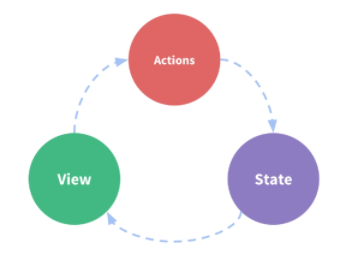
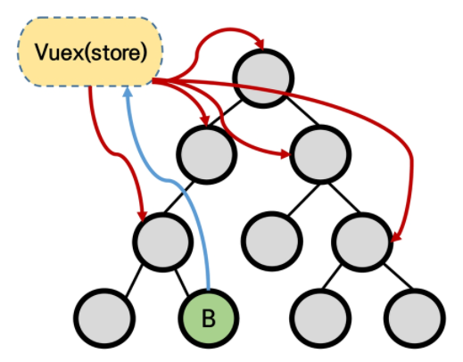
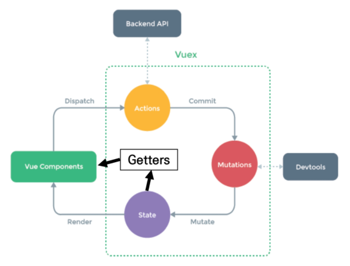

# JavaScript | Vuex

### 목차

> Vuex
>
> Vuex Core Concepts
>
> Todo app with Vuex

<br>

## Vuex

### Vuex

- 상태 관리 패턴 + 라이브러리 (Statement management pattern + Library)
- 상태 (state)를 전역 저장소로 관리할 수 있도록 지원하는 라이브러리
  - 상태가 예측가능한 방식으로만 변경될 수 있도록 보장하는 규칙을 설정
  - **중앙 집중식 저장소** 역할

#### State

- Data
- 해당 애플리케이션의 핵심이 되는 요소
- 중앙에서 관리하는 모든 상태 정보

#### 상태 관리 패턴

- 컴포넌트의 공유된 상태를 추출하고 이를 전역에서 관리하도록 함
- 컴포넌트는 커다란 view가 되고 모든 컴포넌트는 트리 구조에 상관없이 상태에 엑세스하거나 동작을 트리거할 수 있음
- 상태 관리 및 특정 규칙 적용과 관련된 개념을 정의하고 분리함으로써 **코드의 구조와 유지 관리 기능 향상**

#### 기존 Pass props & Emit event

- 단방향 데이터 흐름

  - state는 앱을 작동하는 원본 소스 (data)
  - view는 state의 선언적 매핑
  - action은 view에서 사용자 입력에 대해 반응적으로 state를 바꾸는 방법 (methods)

  

#### Vuex를 활용한 state 관리

- 상태를 한 곳(store)에 모아 놓고 관리 가능
- 상태의 변화는 모든 컴포넌트에서 공유
- 상태 변화는 오로지 Vuex가 관리하고 해당 상태를 공유하고 있는 모든 컴포넌트는 state의 변화에 반응



<br>

## Vuex Core Concepts



### State

- 중앙에서 관리하는 모든 상태 정보 (Data)
- Vuex는 Single State Tree를 사용
  - 원본 소스 (single source of truth)의 역할
- 각 애플리케이션마다 단 하나의 저장소만 갖게된다는 것을 의미
- 여러 컴포넌트 내부에 있는 특정 state를 중앙에서 관리
- State가 변화하면 해당 state를 공유하는 여러 컴포넌트의 DOM은 자동으로 렌더링
  - 각 컴포넌트는 Vuex Store에서 state 정보를 가져와 사용

### Mutations

- 실제로 state를 변경하는 유일한 방법
- mutation의 handler(핸들러 함수)는 반드시 동기적이어야 함
  - 비동기적 로직(콜백함수)은 state가 변화하는 시점이 의도한 것과 달라질 수 있으며, 콜백이 실제로 호출될 시기를 알 수있는 방법이 없음
- 첫 번째 인자로 항상 `state`를 받음
- Actions에서 `commit()` 메서드에 의해 호출됨

### Actions

- state를 변경하는 대신 `commit()` 메서드를 통해 mutations를 호출
- 비동기 작업이 포함될 수 있음
  - Backend API와 통신하여 Data Fetching 작업 수행
- `context` 객체 인자를 받음
  - store.js 파일 내에 있는 모든 요소의 속성에 접근 가능하고 메서드 호출이 가능
  - 단, state를 직접 변경하지 않음 (state 변경은 오직 mutations에서!!!)
- 컴포넌트에서 `dispatch()` 메서드에 의해 호출됨

### Getters

- state를 변경하지 않고 값을 활용하여 계산을 수행 (computed와 유사)
- computed 속성과 마찬가지로 getters의 결과는 state 종속성에 따라 캐시(cached)되고, 종속성이 변경된 경우에만 재계산 됨
- 실졔 상태를 변경하지 않음

<br>

## Todo app with Vuex

- 해당 부분은 개념보다는 실제 코드 위주의 내용이므로, JS 코드 위주로 작성되어 있음


### Init Project

- Create Project

```bash
$ vue create todo-vuex-app
$ cd todo-vuex-app
```

- Add Vuex Plugin in Vue CLI

```bash
$ vue add vuex
```


### Create Todo

- 컴포넌트에서 Vuex Store의 state에 접근

```javascript
$store.state
```

- computed로 변경
  - 현재 state의 값이 변화하는 것이 아님
  - 매번 새로 호출하는 것은 비효율적
  - todo가 새롭게 추가되는 등 변경 사항이 있을 때에만 새로 계산한 값을 반환하는 방향으로 변경
  - `this`를 사용해 Vue Instance에 접근

```js
computed: {
    todos: function () {
        return this.$store.state.todos
    }
}
```

- Actions & Mutations
  - Actions의 **context** 객체
    - Vuex store의 전반적인 맥락 속성을 모두 포함
    - `context.commit` 으로 mutation을 호출하거나, `context.state` / `context.getters`를 통해 state와 getters에 접근 가능
    - `dispatch()`로 다른 actions 호출도 가능
  - Mutation Handler Name
    - 핸들러 함수 이름은 상수로 작성하는 것을 권장
    - 디버깅하기에 유용하고, 전체 애플리케이션에서 어떤 것이 mutation인지 한 눈에 파악할 수 있음

```js
// TodoForm.vue

methods: {
	createTodo: function () {
		const todoItem = {...}
		this.$store.dispatch('createTodo', todoItem)
	}
}
```

```js
// index.js

...
mutations: {
    CREATE_TODO: function (state, todoItem) {
        state.todos.push(todoItem)
    }
},
actions: {
    createTodo: function (context, todoItem) {
        context.commit('CREATE_TODO', todoItem)
    }
},
```

```js
// JavaScript Destructuring Assignment

// 변경 전. context
actions: {
    createTodo: function (context, todoItem) {
        context.commit('CREATE_TODO', todoItem)
    }
},
    
// 변경 후. { commit }
actions: {
    createTodo: function ({ commit }, todoItem) {
        context.commit('CREATE_TODO', todoItem)
    }
},  
```


### Delete Todo

- 컴포넌트에서 dispatch 호출

```js
methods: {
    deleteTodo: function () {
        this.$store.dispatch('deleteTodo', this.todo)
    }
}
```

- Actions & Mutations

```js
actions: {
    deleteTodo: function ({ commit }, todoItem) {
        commit('DELETE_TODO', todoItem)
    }
}
```

```js
mutations: {
    DELETE_TODO: function (state, todoItem) {
        // 1. todoItem에 첫번째로 만나는 요소의 index 값 찾기
        const index = state.todos.indexOf(todoItem)
        // 2. 해당 index 1개만 삭제하고 나머지 요소를 토대로 새로운 배열 생성
        state.todos.splice(index, 1)
    }
}
```


### Update Todo

- 컴포넌트에서 dispatch 호출

```js
methods: {
    updateTodoStatus: function () {
        this.$store.dispatch('updateTodoStatus', this.todo)
    }
}
```

- Actions & Mutations

```js
actions: {
    updateTodoStatus: function ({ commit }, todoItem) {
        commit('UPDATE_TODO_STATUS', todoItem)
    }
}
```

```js
mutations: {
    UPDATE_TODO_STATUS : function (state, todoItem) {
        state.todos = state.todos.map(todo => {
            if (todo === todoItem) {
                return {
                    title: todoItem.title,
                    isCompleted: !todo.isCompleted,
                    date: todoItem.date
                }
            } else {
                return todo
            }
        })
    }
}
```

#### JavaScript Spread Syntax

- 전개 구문
- 배열, 문자열같이 반복 가능한(iterable) 문자를 요소로 확장하여, 0개 이상의 key-value 쌍으로 된 객체로 확장할 수 있음
- `...` 을 붙여서 요소/키가 0개 이상의 iterable object를 하나의 object로 간단하게 표현
- ECMAScript2015에서 추가됨
- 주 사용처
  - 함수 호출
    - 배열의 목록을 함수 인자로 활용 시
  - 배열
    - 배열 연결
    - 배열 복사
  - 객체
    - **객체 복사**

```js
// JavaScript Spread Syntax

// 적용 전
mutations: {
    ...
    return {
        title: todoItem.title,
        isCompleted: !todo.isCompleted,
        date: todoItem.date
    }
}

// 적용 후
mutations: {
    ...
    return {
        ...todo,
        isCompleted: !todo.isCompleted
    }
}
```


- 취소선 긋기
  - `v-bind`를 사용한 class binding

```js
<span :class="{ 'is-completed': todo.isCompleted}">
    ...

<style>
	.is-completed {
        text-decoration: line-through;
    }    
</style>
```


### Getters

- 완료된 todo 갯수

```js
// index.js

getters: {
    completedTodosCount: function (state) {
        return state.todos.filter(todo => {
            return todo.isCompleted === true
        }).length
    }
}
```

```js
// App.vue

computed: {
    completedTodosCount: function () {
        return this.$store.getters.completedTodosCount
    },
},
```

- 미완료된 todo 갯수
  - 완료된 케이스에서 true를 false로 변경하고 이름을 변경해서 사용

- 전체 todo 갯수

```js
// index.js

getters: {
    allTodosCount: function (state) {
        return state.todos.length
    }
}
```

```js
// App.vue

computed: {
    allTodosCount: function () {
        return this.$store.getters.allTodosCount
    }
}
```


### Component Binding Helper

- JS Array Helper Method를 통해 배열 조작을 편하게 하는 것과 유사
  - 논리적인 코드 자체가 변하는 것이 아닌 쉽게 사용할 수 있는 것에 초점
- 종류
  - mapState
  - mapGetters
  - mapActions
  - mapMutations
  - createNamespaceHelpers

```js
// mapState

import { mapState } from 'vuex'

export default {
    computed: {
        ...mapState([
            'todos',
        ])
    }
}
```

```js
// mapGetters

import { mapGetters } from 'vuex'

export default {
    computed: {
        ...mapGetters([
            'completedTodosCount',
            'uncompletedTodosCount',
            'allTodosCount',
        ])
    }
}
```

```js
// mapActions

// template 내에 해당 액션 이벤트에 인자를 넣어주어야 함
<span @click="updateTodoStatus(todo)"></span>
<button @click="deleteTodo(todo)"></button>

import { mapActions } from 'vuex'

export default {
    methods: {
        ...mapActions([
            'deleteTodo',
            'updateTodoStatus',
        ])
    }
}
```


#### Local Storage

- vuex-persistedstate
  - Vuex State를 자동으로 브라우저의 LocalStorage에 저장해주는 라이브러리 중 하나
  - 페이지가 새로고침 되어도 Vuex state를 유지시킴

```bash
# 설치
$ npm i vuex-persistedstate
```

```js
// 사용하기

import createPersistedState from 'vuex-persistedstate'

export default new Vuex.Store({
    plugins: [
        createPersistedState(),
    ],
})
```

