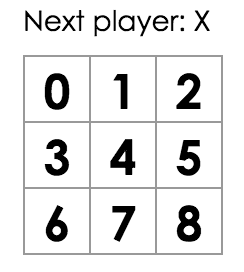
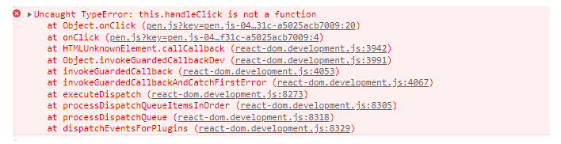
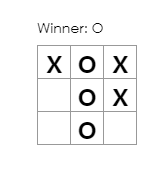

# React | Tic Tac Toe

### TIL

- 튜토리얼 문서를 따라가면서 틱택토 게임을 구현해보았다. 자바스크립트 코드 자체는 vue.js를 다뤄봐서 익숙했으나, 기본적인 props, state 등 부모 - 자식 간 데이터를 주고받는 관계가 조금 어려웠다. 공식문서를 계속해서 읽고 코드 구현을 해가면서 더 익숙해져야겠다.


#### 코드확인 및 게임하러 가기

https://codepen.io/dudqo225/pen/xxXLBWe


### React를 활용한 Tic Tac Toe 게임 만들기

- React 공식 홈페이지를 참고하여 자바스크립트 기반 게임을 만든다.
- www.ko.reactjs.org/tutorial/tutorial.html


### 주요 과정

- props를 통해 데이터 전달하기




- handleClick을 정의하지 않아 발생하는 에러




- handleClick

```javascript
handleClick(i) {
    const squares = this.state.squares.slice()
    squares[i] = 'X'
    this.setState({squares: squares})
}

// .slice() 연산자를 사용하여 squares 배열의 새로운 사본을 복사. 
```

##### 불변성의 특징

- 복잡한 특징을 단순하게 만든다.
  - 직접적인 데이터 변경을 피하면, 이전 버전의 이력을 유지하고 나중에 재사용할 수 있게 만들어줌
- 변화를 감지함
  - 참조하고 있는 불변 객체가 이전 객체와 다르다면 객체는 변한 것
- 렌더링 시기를 결정함
  - 데이터가 변경되었는지 여부를 판단하여 컴포넌트가 다시 렌더링할지를 결정할 수 있음


##### 게임 순서 만들기



##### 시간 되돌리기


