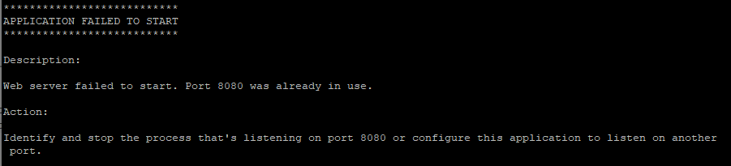
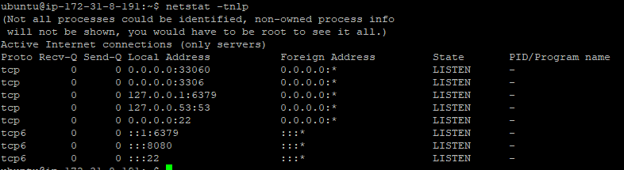
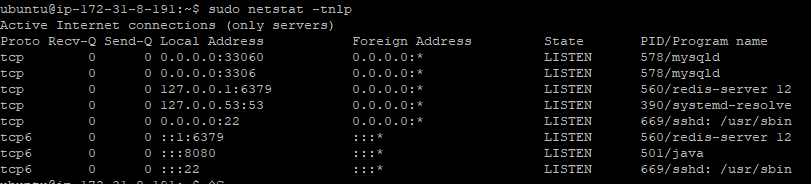

# Linux | Error - Spring with EC2

AWS EC2 서비스로 스프링 프로젝트를 배포하는 작업을 하던 중, `.jar` 파일을 실행하면 계속해서 아래와 같은 에러 메시지가 출력되면서 실행이 되지 않았다.



에러의 내용인즉, **8080** 포트가 이미 사용중이어서 실행할 수 없다는 얘기이다. 그래서 `application.yml` 파일에서 port를 8081로 변경 후, 다시 빌드하고 실행했다.

결과는, 위와 똑같은 메시지 출력. 몇 시간째 똑같은 상황만 되풀이 되다가,,, 해결책을 드디어 찾은 듯 하다.


ubuntu에서는  ` netstat -tnlp` 명령어로 현재 실행중인 포트 관련 정보를 출력할 수 있다. 하지만 각 포트에 대한 PID 정보를 정확히 확인할 수 없었다. 



> Not all processes could be identified, non-owned process info will not be shown, you would have to be root to see it all.

위 메시지를 계속해서 놓쳤기 때문에 몇 시간동안 개고생을 한 것 같다. 저 메시지의 의미는,

상세한 정보를 다 보기 위해서는 `root` 권한이 있어야 한다는 의미인 것 같다. root 권한 문제를 해결하기 위해서 Linux에서는 `sudo` 키워드를 사용하면 된다고 한다.


`sudo netstat -tnlp` 명령어로 실행하니,




짜잔. 에러 메시지도 없고, PID 정보도 정확하게 출력이 된다. 8080 포트를 사용중인 저 501 번호를 강제 종료시키면 해결될 것으로 보인다.(제발...)


`kill -9 {PID}` 명령어로 프로세스를 강제 종료 시킬 수 있다. `sudo` 키워드를 안붙이니까 강제종료가 또 되지않는다. `sudo kill -9 {PID}` 명령어로 모든 8080 관련 프로세스를 강제 종료 시켰다.


근데도 실행이 안된다.(젠장...)


원인이 다른 곳에 있었다..🤣

```yaml
## application.yml 파일
# 기존
spring:
	server:
		port: 8081
	
# 수정
server:
	port: 8081
	
spring:
	...
```


긴 시간동안 삽질한 것을 후회하지 않는다. 그 사이에 Linux 명령어도 다양하게 써보고, 프로젝트 자체도 Build 해보고.. EC2 인터페이스도 익숙해지고, Filezilla나 PuTTY도 많이 사용해봤으니 유익한 시간이었다고 생각한다.


