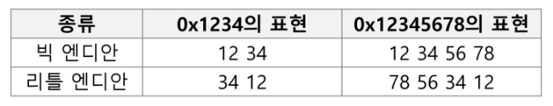

# Python | Bitwise Operation 비트 연산

### 비트 연산자

- `&`
  - 비트 단위로 AND 연산을 한다.
  - 특정 비트를 0으로 만드는 연산
  - 특정 비트를 검사
- `|`
  - 비트 단위로 OR 연산을 한다.
  - 특정 비트를 1로 만드는 연산
- `^`
  - 비트 단위로 XOR 연산을 한다.
  - 같으면 0, 다르면 1
  - 비트끼리 비교
  - 비트 토글 (비트를 반전시킴)
- `~`
  - 단항 연산자로서, 피연산자의 모든 비트를 반전시킴

- `<<`
  - 피연산자의 비트 열을 왼쪽으로 이동시킴
- `>>`
  - 피연산자의 비트 열을 오른쪽으로 이동시킴

 

#### 비트 연산

- `1<<n`
  - `2ⁿ` 의 값을 가짐
  - 원소가 n개일 경우 모든 부분집합의 수를 의미
  - Power set (모든 부분 집합)
    - 공집합과 자기 자신을 포함한 모든 부분집합
    - 각 원소가 포함되거아 포함되지 않는 2가지 경우의 수를 계산하면 모든 부분집합의 수가 계산됨
- `i & (1<<j)`
  - 계산 결과는 `i` 의 `j` 번째 비트가 1인지 아닌지를 의미함

 

#### 엔디안(Endianness)

- 컴퓨터의 메모리와 같은 1차원 공간에 여러개의 연속된 대상을 배열하는 방법을 의미. HW 아키텍처마다 다름
- 속도 향상을 위해서 바이트 단위와 워드 단위로 변환하여 연산할 때 올바르게 이해하지 않으면 오류를 발생시킬 수 있음

- 분류

  - 빅 엔디안(Big-endian)
    - 큰 단위가 앞에 나옴. 네트워크
  - 리틀 엔디안(Little-endian)
    - 작은 단위가 앞에 나옴. 대다수의 Desktop 컴퓨터

  