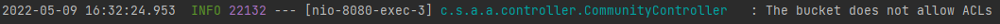
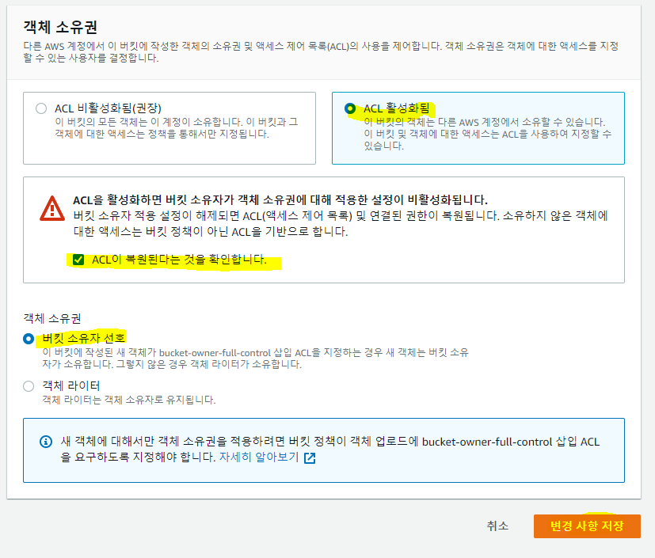
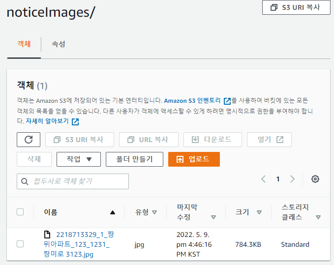

# AWS | S3 이미지 업로드 관련 오류

 

스프링 부트 서버 실행 후 이미지를 업로드하는 API를 실행하면 **The bucket does not allow ACLs** 라는 오류 메시지가 뜬다.

 

#### ACL 이란?

- Access List
- 접근 제어 리스트 → 접근을 허용하거나 거부하는 리스트를 통해서 필터링 기능을 수행
- 특정 주소를 가진 호스트의 접근을 막거나 특정 서비스를 **차단하는 등의 목적**으로 활용 가능함

 

##### 문제 해결 방법은?

S3 콘솔 → 권한 탭에 접근하여 **객체 소유권**을 변경해준다.

 

이후, 이미지가 정상적으로 업로드 되는 것을 확인할 수 있음!

 

***

### 참고 자료

- https://velog.io/@shinsw627/The-bucket-does-not-allow-ACLs

- https://net-gate.tistory.com/18