# Dockerize 실습

### 프로젝트 개요

- SSAFY 1학기 관통 프로젝트 결과물 도커화(Dockerize) 해보기


### 과제 진행

##### 1. 도커 개발환경 설정

1. 도커 설치
   - 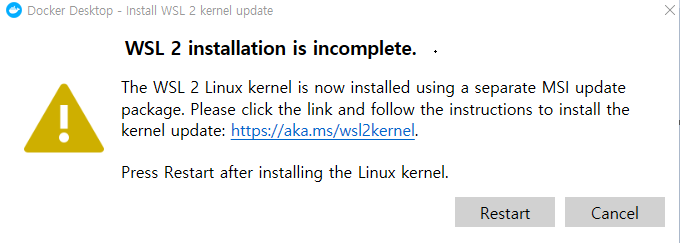
   - 위 이미지와 같은 설치 오류 발생
   - https://blog.nachal.com/1691 블로그 글 참고하여 문제 해결

2. 도커 버전 확인

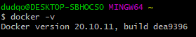

3. 테스트용 Hello world 도커 컨테이너 실행

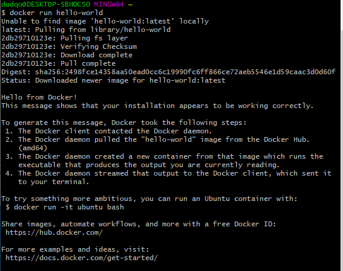


##### 2. 도커 기본 명령어 실습

1. 컨테이너 조회
   - `-a` 옵션은 정지(실행 종료)된 컨테이너까지 포함해서 조회하는 옵션

```bash
docker ps - a
```

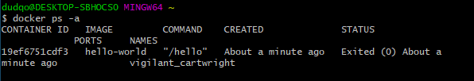


2. Hello world 컨테이너 삭제
   - 컨테이너 실행시 `docker run --name=[컨테이너 이름]` 으로 `--name` 옵션을 추가하면 지정된 이름으로 컨테이너 생성 가능
   - 컨테이너 id는 앞의 일부분만 입력 가능

```bash
docker rm [컨테이너ID or NAME]
```


3. 도커 이미지 조회

```bash
docker images
```

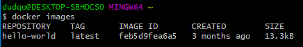


4. Hello world 도커 이미지 삭제
   - TAG 중에서 최신을 의미하는 `latest`  태그명 생략 가능

```bash
docker rmi [이미지ID or 이미지명:TAG명]
```

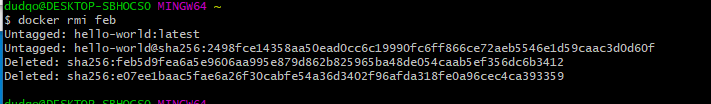


##### 3. Jenkins를 이용한 도커 실습

1. 도커 컨테이너로 Jenkins 실행 및 실행 중(Up STATUS)인지 확인
   - `-d` : 백그라운드 데몬으로 실행시키는 옵션
   - `-p` : 가상 머신(Guest PC)에서 동작하는 서비스에 docker proxy 서비스가 NAT 기능을 수행해 포트 포워딩을 해주어 실제 머신(HOST PC) IP로 서비스에 접속 가능하도록 해줌
   - 컨테이너 삭제시, 생성된 데이터가 같이 삭제되므로 호스트 PC 디렉토리에 데이터가 생성되도록 컨테이너에 볼륨 마운트 옵션을 추가하여 실행시킨다.
     - 옵션 : `-v/your/home:/var/jenkins_home`

```bash
docker run --name myjenkins -d -p 9080:8080 jenkins/jenkins

docker ps
```

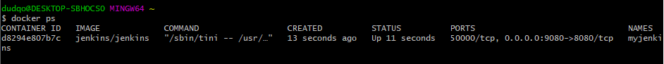


2. Jenkins 서버 컨테이너의 bash 실행 후 컨테이너 OS 버전 확인
   - 컨테이너에 bash가 포함되어 있지 않은 서비스의 경우, bash 대신 sh를 사용해도 됨
   - git-bash에서 "the input device is not a TTY." 에러가 발생하면 CMD창을 이용하거나 명령어 앞에 `winpty`를 추가
     - `winpty docker exec -it myjenkins bash`
     - 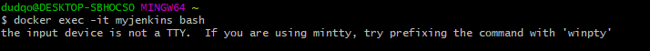
   - bash가 실행된 상태는 ssh로 리눅스 서버에 접속해서 명령어를 사용하는 것과 비슷함
   - `-it` 옵션
     - `-i` : interactive 모드로 표준입출력을 키보드와 화면을 통해 가능하도록 하는 옵션
     - `-t` : 텍스트 기반의 터미널(TTY)을 에뮬레이션 해주는 옵션

```bash
docker exec -it myjenkins bash
```

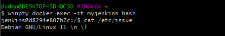


3. 컨테이너 안(bash)에서 Admin 패스워드가 저장된 파일 확인 후 bash 종료

```bash
cat /var/jenkins_home/secrets/initialAdminPassword

exit
```

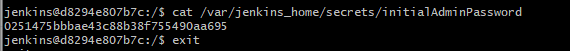


4. 2, 3번 한번에 실행하기
   - docker 명령어는 HOST PC에서 실행하는 명령어이므로 컨테이너 안쪽(bash)에서 실행하는 방식과 비교하여 실행 위치를 혼동하지 않도록 해야함
   - `docker logs myjenkins` 명령어를 실행해서 컨테이너 실행 시 출력된 메시지에서도 패스워드 확인이 가능

```bash
docker exec myjenkins cat /var/jenkins_home/secrets/initialAdminPassword
```


5. 컨테이너 안에 있는 패스워드 파일 개발 PC로 복사하기
   - 반대로 컨테이너 안에 파일을 복사해서 넣으려면 다음 명령어로 가능 (scp 명령 방식과 비슷)
     - `docker cp 파일명 myjenkins:/var/jenkins_home(컨테이너 경로)`

```bash
docker cp myjenkins:/var/jenkins_home/secrets/initialAdminPassword ./
```


6. 웹브라우저에 접속하여 패스워드를 붙여넣고 Jenkins 설정 계속 진행하기
   - http://localhost:9080

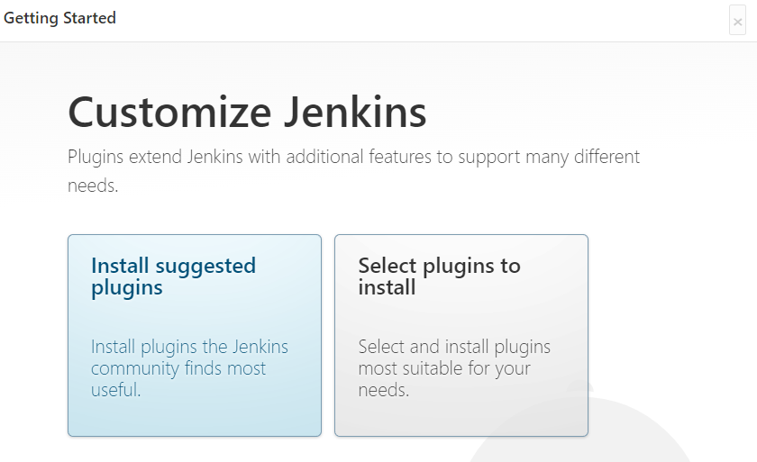

7. Install suggested plugins 선택 > 계정 설정 완료 후 환영 페이지 확인

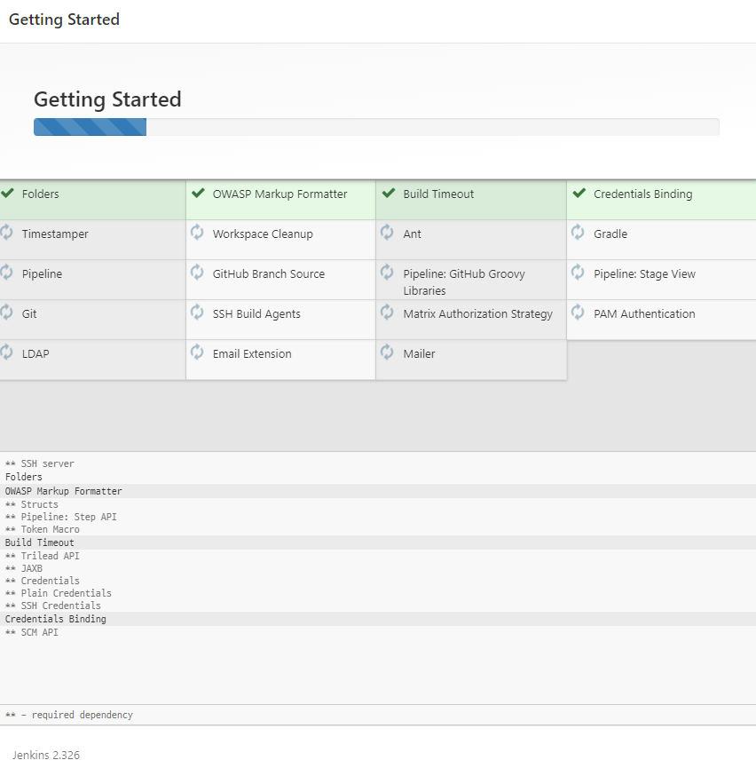

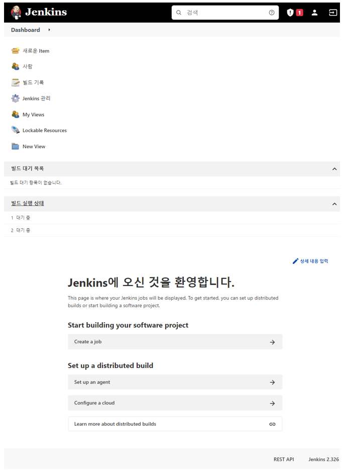


8. 컨테이너 재시작하여 Up Tatus 시간이 초기화 된 것을 확인 후 삭제
   - `docker start/stop/restart`를 사용하면 서비스를 시작/정지/재시작 하는 것처럼 컨테이너 레벨로 서비스 제어가 가능
   - `-f` : 실행중인 컨테이너도 강제 삭제 가능한 옵션

```bash
docker restart myjenkins
docker ps

docker rm -f myjenkins
docker rmi [jenkins 이미지ID]
```


##### 4. 관통 프로젝트 프론트엔드 도커 이미지 제작

1. 관통 PJT 코드 다운로드

```bash
git clone https://lab.ssafy.com/<project path>

cd <project name>

dir
frontend backend
```


2. 로컬에서 프론트엔드 실행 및 웹브라우저 접속하여 확인

```bash
cd frontend
npm install
npm run serve
```


3. <project_home>/frontend/Dockerfile 작성 후 프론트엔드용 도커 이미지 빌드

   - 개발환경이 아닌 운영환경에서 많이 사용하는 NGINX 예제 사용을 권장

   - `-t` : 도커 이미지 TAG명으로 버전관리 용도로 사용

   - `sh: vue-cli-service: not found` 에러 발생시 아래 내용을 추가

     - `RUN npm install --production`
     - `RUN npm install @vue/cli-service`

   - Dockerfile 작성

     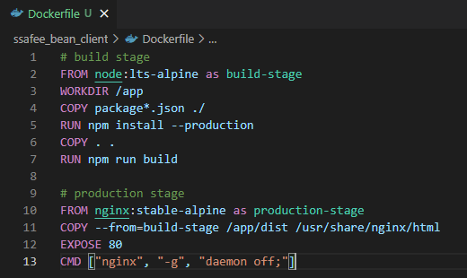

   - 도커 이미지 빌드

   ```bash
   docker build . -t front:0.1
   ```


4. 이미지에  TAG 추가하기
   - TAG는 이미지 ID에 대한 alias/포인터 같이 이미지 이름처럼 사용해서 쉽게 관리하는데 도움이 됨

```bash
docker tag front:0.1 front:latest
```

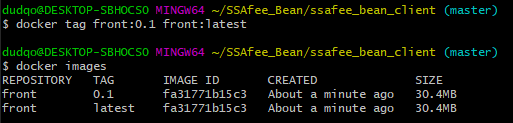


5. 이미지 TAG 삭제하기
   - 도커 이미지를 삭제하는 명령어(`docker rmi`)로 TAG를 삭제하고 실제 이미지는 모든 TAG가 삭제되면 삭제됨

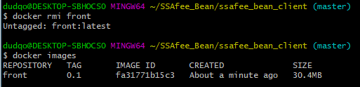


6. 도커로 프론트엔드 실행 및 웹브라우저로 접속해서 확인

   - 웹브라우저 : http://localhost

   - `--rm` 은 컨테이너가 정지되면 자동삭제되는 옵션. 임시테스트용으로 컨테이너를 실행시켜보는 용도로 유용함

```bash
winpty docker run -it -p 80:80 --rm front:0.1
```

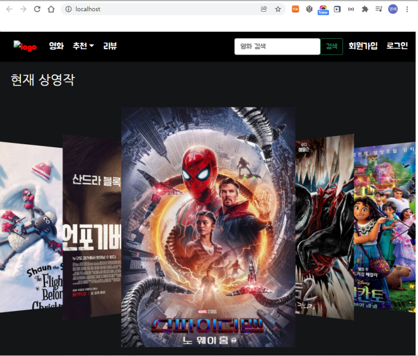


##### 5. 관통 프로젝트 백엔드 도커 이미지 제작

1. 로컬에서 백엔드 실행 및 확인
   - http://localhost:8000
   - django가 설치되어 있어야 하며, 간단히 정상 동작함을 확인하고 서버는 종료


2. <projcet_home>/backend/Dockerfile 을 작성하고 도커 이미지 빌드
   - 운영환경에서는 NGINX + Gunicor을 사용하지만, 개발서버로 간단히 Dockerfile 작성
   - 참고 링크의 Dockerfile에서 설명 주석을 제거해야 정상 빌드됨
   - 의존성 패키지 파일(requirements.txt)이 없다면 `pip freeze > requirements.txt` 로 의존성 패키지 파일 생성

```bash
docker build . -t back:0.1
```

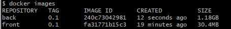


3. 도커로 백엔드 실행 및 확인
   - http://localhost:8000
   - `--rm` 은 컨테이너가 정지되면 자동으로 삭제되는 옵션. 임시테스트용으로 유용함

```bash
winpty docker run -it -p 8000:8000 --rm back:0.1
```


4. 개발용 DB로 사용할 MySQL 컨테이너 실행 및 정상 실행 여부 조회
   - `docker ps`
   - `-e` : 컨테이너 OS의 한경 변수로 전달하는 방법
     - mysql 컨테이너가 실행되면 호출되는 docker-emtrypoint.sh 에서는 전달한 환경변수와  command argument(`--character-set-server=utf8mb4` ...) 등 원하는 password, db명 등을 전달받아 설정함.
     - 도커 이미지를 제작할 때 이러한 옵션들을 제공해야 개발자가 편리하게 활용 가능함

```bash
docker run --name mysql -p 3306:3306 -e MYSQL_ROOT_PASSWORD=ssafyssafyroomroom -e MYSQL_DATABASE=ssafy -d mysql --character-set-server=utf8mb4 --collation-server=utf8mb4_unicode_ci
```

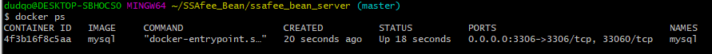


5. MySQL 서버 컨테이너 안에 포함되어 있는 mysql 클라이언트 명령어를 실행시켜 DB 접속 테스트

```bash
docker exec -it mysql mysql -uroot -p ssafy
```

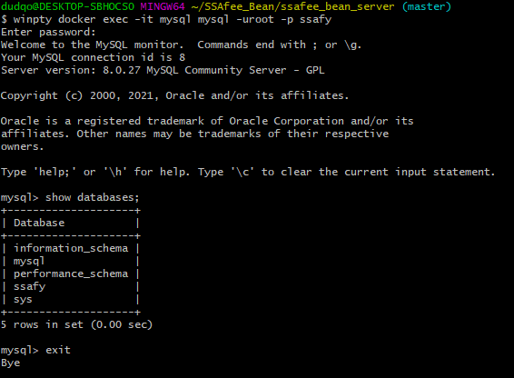


### TIL

1학기 관통프로젝트를 활용하여 도커화(Dockerize) 하는 실습을 진행하였다. 도커의 개념이 무엇인지도 잘 몰랐지만, 주어진 명세서 순서대로 과제를 진행하면서 모르는 개념이나 어려운 내용은 구글링을 통해 학습하면서 진행하였다.

도커를 요약, 정리하자면, **애플리케이션을 묶어서 실행, 배포 할 수 있도록 도와주는 오픈 소스 SW** 로 **개발, 테스트, 서비스 서버 등 다양한 환경을 쉽게 관리할 수 있게 해주**는 것이다.

명세서에 따른 과제 수행은 완료하였지만 아직 도커 개념이 잘 이해되지 않고 어렵다. 프로젝트를 진행하면서 더 공부해야겠다.