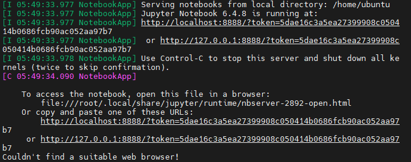
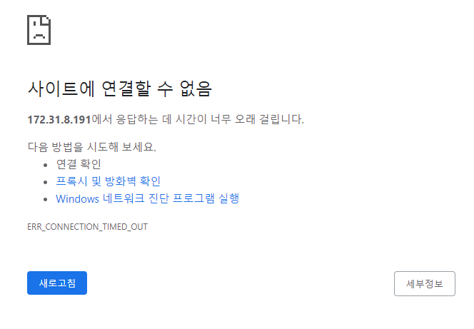
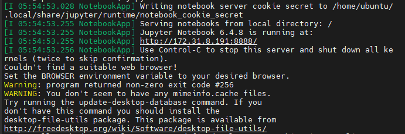
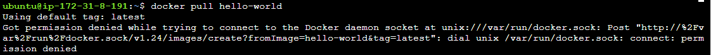
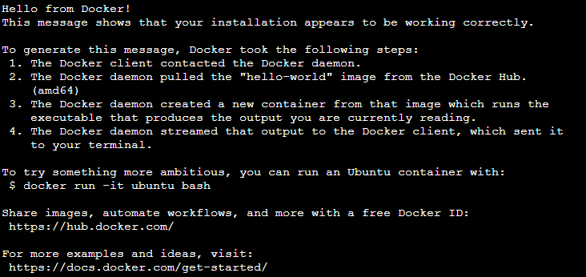
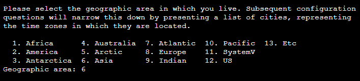

# Docker | 도커 알아보기


### Docker

도커란?

- 컨테이너 기반의 오픈소스 가상화 플랫폼
- 툴 업데이트, 회사에서 사용하는 툴 변경  등  여러가지 이유로 계속 바뀌는  서버 환경과 개발 환경 문제를 해결하기 위해 등장함
- 서버 및 개발  환경이 바뀌면 컴퓨터 세팅부터 다시해야 하고 그 과정에서 여러가지 문제들이 발생할 수 있음
- 도커를 통해서 서버 관리/개발 방식이 편리하게 바뀌게 되었음!


***


### Jupyter Notebook

웹 브라우저 환경에서 작업을 수월하게 하기 위해 jupyter notebook을 설치하자


##### Jupyter Notebook 설치

```bash
$ sudo apt-get install python3-pip
$ sudo pip3 install notebook
```


##### Jupyter Notebook 패스워드 설정

```python
from notebook.auth import passwd
passwd()

# 비밀번호 입력
# 비밀번호 복사 후 종료
```


##### Config 설정

- Jupyter Notebook에서 비밀번호 사용하도록 config 파일 생성 후 설정 변경

```bash
$ jupyter notebook --generate-config
$ sudo vi /home/ubuntu/.jupyter/jupyter_notebook_config.py
```


- config 설정 변경
  - `shift + g` : 문서 맨 끝으로 이동

```bash
# 환경설정 객체 생성
c = get_config()
c.NotebookApp.password = u'패스워드 입력'
c.NotebookApp.ip = 'ip주소'
c.NotebookApp.notebook_dir = '/'
```


- 루트권한 가진 상태로 쥬피터노트북 실행

```bash
$ sudo jupyter-notebook --allow-root
```


위 코드로 실행시 



이미지에 보이는 것 처럼 localhost로 접속만 가능했다..


EC2 퍼블릭 IP:8888 포트로 접속해보니, 아래와 같이 사이트에 연결할 수 없다는 메시지도 나온다.



우선 EC2 보안그룹에 8888 포트에 관한 권한을 추가하고 EC2 보안그룹이 제대로 인스턴스에 적용되었는지 확인해야 한다.


주피터 노트북 실행을 `jupyter notebook` 명령어로 실행하니 



`private ip:8888` 경로로 접속하라는 안내 메시지가 정상적으로 출력된다


##### Jupyter Notebook 관련 설정

주피터 노트북이 항상 실행되도록 설정해보자.

실행된 상태에서 `ctrl + z` 로 잠시 빠져나온 뒤, `bg` 명령어를 입력하고 `disown -h` 를 입력.


##### 보안 https 적용

`mkdir ssl` 로 폴더를 생성

`cd ssl` 로 해당 폴더로 이동한다

```bash
$ sudo openssl req -x509 -nodes -days 365 -newkey rsa:1024 -keyout "개인키" -out "공개키" -batch
```

- 개인키 : `cert.key`
- 공개키 : `cert.pem`


##### Jupyter Notebook Config 환경설정 파일에 추가

```bash
c.NotebookApp.certfile = u'/home/ubuntu/ssl/cert.pem'
c.NotebookApp.keyfile = u'/home/ubuntu/ssl/cert.key'
```


##### 서버 재부팅 시 주피터 노트북 자동 실행되도록 설정

`which jupyter-notebook` 명령어로 주피터 노트북이 깔려있는 경로를 찾는다.

```bash
$ sudo vi /etc/systemd/system/jupyter.service
```

```
[Unit]
Description=Jupyter Notebook Server

[Service]
Type=simple
User=ubuntu
ExecStart=/usr/bin/sudo /usr/local/bin/jupyter-notebook --allow-root --config=/home/ubuntu/.jupyter/jupyter_notebook_config.py

[Install]
WantedBy=multi-user.target
```

- service 파일을 생성하면 이후 ec2 원격서버를 껐다가 켜도 자동으로 Jupyter Notebook이 실행된다.

```bash
$ sudo systemctl daemon-reload

$ sudo systemctl enable jupyter

$ sudo systemctl start jupyter
```

***


### 도커 설치하기

먼저 apt 업데이트를 해준다

```bash
$ sudo apt update
```


##### 유틸 설치

```bash
$ sudo apt install apt-transport-https

$ sudo apt install ca-certificates

$ sudo apt install curl # 특정 웹사이트에서 데이터 다운로드 받을 때 사용

$ sudo apt install software-properties-common
```


curl 유틸을 사용하여 도커 설치를  위한 세팅을 진행하자

`curl -fsSL https://download.docker.com/linux/ubuntu/gpg | sudo apt-key add  -`

`sudo add-apt-repository "deb [arch=amd64] https://download.docker.com/linux/ubuntu bionic stable"`


도커 설치 후 `sudo apt update` 해준다.


##### 도커 설치

```bash
$ apt-cache policy docker-ce

$ sudo apt install docker-ce

$ sudo systemctl status docker # 도커 상태 확인
```

- 도커를  설치하면 시스템 서비스로 자동  설치된다.


##### 도커 실행해보기

hello-world 도커 이미지를 다운받아서 도커가 잘 동작하는지 테스트 해보자

`docker pull hello-world`



하지만  위와 같이   권한 오류가 발생한다.


`chmod` 명령어로 파일에 대한  권한 변경이 필요하다.

```bash
$ sudo chmod 666 /var/run/docker.sock
```


##### 도커 기본 명령어

```bash
$ docker images # 도커 이미지 확인

$ docker rm <id> # 도커 컨테이너 삭제

$ docker rmi <id> # 도커 이미지 삭제

$ docker run  <image 이름> # 도커 이미지 실행
```


다운받은 hello-world 이미지를 컨테이너로 띄워보자 명령어는 `docker run hello-world` 이다




정상적으로 hello-world 이미지가 실행된다!!


`docker ps -a` 명령어로 어떤 컨테이너가 동작했는지 확인할 수 있다


정상적으로 이미지 다운 및  도커 컨테이너 띄우기가 동작하는 것을 확인하였으니, hello-world 컨테이너를 삭제하자. 삭제 명령어는 위 `dokcer rm <container id>` 와 같다.

하지만 컨테이너를 삭제한다고 해서 다운받은 **도커 이미지 자체가 삭제되는 것은 아니다**


##### 서버 이미지 만들기

`/home/ubuntu` 경로에 디렉토리 생성

`mkdir example` 로 example 디렉토리 생성하고 `cd example` 로 해당 디렉토리로 이동한다.


```bash
$ sudo vi Dockerfile
```

- 도커파일 이름은 항상 `Dockerfile` 이어야 함!


```dockerfile
FROM ubuntu:20.04
MAINTAINER Youngbae Son <dudqo225@naver.com>

RUN apt-get update
RUN apt-get install -y apache2 # Install Apache web server (Only 'yes')

EXPOSE 80

CMD ["apachectl", "-D", "FOREGROUND"]
```

위와 같이 도커 파일에 다양한 명령어를 사용하여 도커파일을 생성할 수 있다. 다양항 명령어 사용에 대한 공부가 별도로 필요해 보인다.


##### Dockerfle build

```bash
$ docker build -t example .
```

- `-t` : 태그. 이름을 붙일 수 있음
- `.` : 현재 경로에서 생성


##### 오류 발생!!!



파일 빌드를 하는 도중에, 위와 같이 사는 지역을 선택해야 하는 경우가 있었다. 6을 넣고 다음으로 넘어가려는데, 한참 시간이 지나도 진행이 되지 않았다..


구글링을 해보니, 도커파일 빌드시 사용자 상호작용을 하지 않게끔 설정하는 환경변수가 있었다.

`ENV DEBIAN_FRONTEND=noninteractive` 와 같이 도커 파일에 해당 내용을 작성하여 상호작용 방지기능을 활성화할 수 있다.


##### 도커파일 실행

```bash
$ docker run -p 80:80 example
```

- `-p` : 호스트 포트와 컨테이너 서버의 포트 연결
  - 앞부분 - Host Port
  - 뒷부분 - Container Server Port
  - `:` colon으로 연결

- 뒤에 도커 이미지 이름 명시


##### 실행중인 모든 컨테이너 삭제

```bash
$ docker rm -f `dockerps -a -q`
```

- 자주 사용할 수 있는 명령어인듯 하다


##### Docker Repo README 예시

```markdown
# Docker  실전 연습 예제
### Installation
<pre>
cd /home
git clone https://github.com/레포지토리 경로
</pre>
### Run
<pre>
# Login For Private Docker Repository
docker login
docker pull  dockerhub경로
docker run -p 80:80 -v /home/Dokcer-Practice/Project:/var/www/html 도커경로
</pre>
```


***

