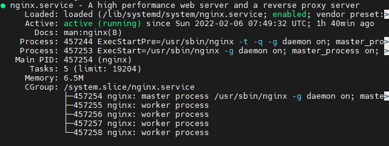
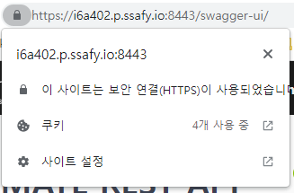

# Server | Spring Boot HTTPS 적용


기존에 React App으로 제작한 프론트엔드를 배포하면서 적용했던 SSL 인증서 개념을 백엔드 서버에도 똑같이 적용하여 HTTPS 보안 설정을 해보려고 한다.

<br>

이전에 Front-End 프로젝트를 Nginx를 통해서 프록시 서버로 적용했었다. 이때, `SSL` 인증서를 발급받고 `.conf` 파일에 설정을 작성했었다. 우리는 이 `.conf` 파일에 추가적으로 백엔드 서버 관련 설정을 작성할 것이다.

<br>

```bash
# .conf 파일 설정 추가
...

server {
  listen 8443 ssl;
  listen [::]:8443 ssl;

  ssl_certificate "[SSL 인증서 경로]";
  ssl_certificate_key "[SSL private 인증서 경로]";

  ssl_session_cache shared:SSL:1m;
  ssl_session_timeout  10m;
  ssl_ciphers HIGH:!aNULL:!MD5;
  ssl_prefer_server_ciphers on;

  location / {
   proxy_set_header  Host $http_host;
   proxy_set_header  X-Real-IP $remote_addr;
   proxy_set_header  X-Forwarded-For $proxy_add_x_forwarded_for;
   proxy_set_header  X-Forwarded-Proto $scheme;
   proxy_set_header  X-NginX-Proxy true;

   proxy_buffer_size          128k;
   proxy_buffers              4 256k;
   proxy_busy_buffers_size    256k;
   proxy_connect_timeout 300s; 
   proxy_read_timeout 600s; 
   proxy_send_timeout 600s;   

   proxy_pass http://[도메인주소]:8081;

   proxy_redirect off;
   charset utf-8;
  }
}
```

- **listen 8443** : 8443 포트로 보안 설정을 하겠다는 의미
- **location - proxy_pass** : 일반서버 8081 포트 주소를 작성

<br>

이로써, Nginx를 통해서 클라이언트 - 서버 모두 보안 설정을 할 수 있다.

```bash
$ sudo systemctl stop nginx
$ sudo systemctl start nginx
$ sudo systemctl status nginx
```

Nginx를 재시작하고, 상태를 확인하면 정상적으로 Nginx가 실행되고 있음을 확인할 수 있다.



<br>



우리 프로젝트의 백엔드 서버가 보안 적용이 제대로 되었다. 스웨거도 정상적으로 접속이 되고, 위 이미지와 같이 오류없이 적용된 것을 확인했다. 👍