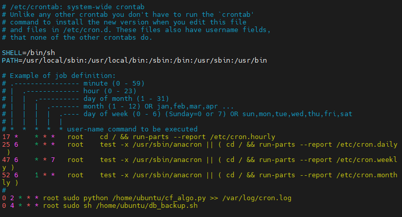
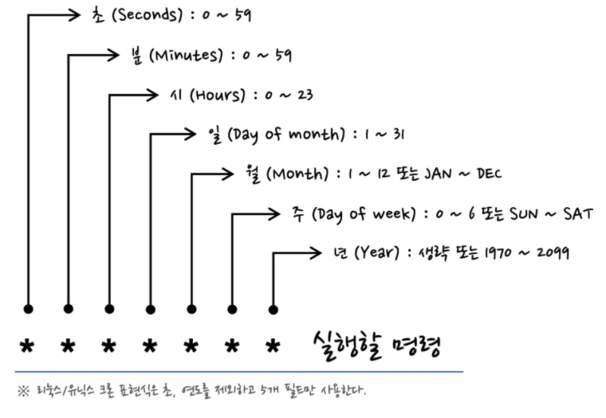

# Server | Cron

<br>

웹 서비스를 개발하고 **AWS EC2** 서버에 배포를 하다보면, 다양한 이유로 **스케쥴링**을 해야 하는 경우가 있다.

<br>

*데이터베이스 백업, 파이썬 스크립트 실행 등...*

<br>

이럴 때 사용하는 것이 **Cron**이다.

<br>

### Cron 이란?

- 유닉스 계열 컴퓨터 OS의 **시간 기반 잡 스케쥴러**
- 고정된 시간, 날짜, 간격에 주기적으로 실행할 수 있도록 스케쥴링할 때 사용함


<br>

```bash
# Cron 실행
vim /etc/crontab
```

위 코드를 실행하면 스케쥴링 코드를 작성할 수 있는 crontab 파일이 열린다.

<br>



- Cron Expressions
  - 리눅스/유닉스 기반 Cron에는 **5개**의 필드가 사용된다.
  - 내가 원하는 시간, 주기에 원하는 파일, 코드 등을 실행할 수 있다.
  - 

<br>

**✨ 주의 사항 ✨**

- Crontab으로 작성할 경우, **쉘 스크립트**나 **Python 코드** 내에 작성된 경로는 반드시, **절대경로**로 작성해야 한다.
- 상대경로 XXX. 절대경로로 작성하기!!!
- 예를 들어, `./test.csv` 와 같이 `.` 을 활용한 상대경로로 작성하면 정해진 시간에 크론이 실행될 때 정상적으로 실행되지 않는다.

<br>

**cron**을 사용해서 DB 백업, 추천 알고리즘 Python 코드 등의 스케쥴링을 작성할 수 있었다.

<br>

***

#### 참고 자료

- https://any-ting.tistory.com/87
- https://m.blog.naver.com/myohyun/222030669275
- https://madplay.github.io/post/a-guide-to-cron-expression