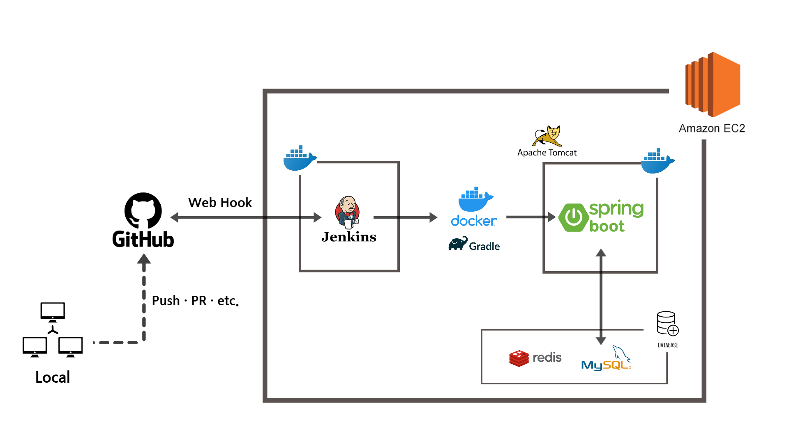

# Server | EC2 & Docker Deploy with Jenkins Ⅰ

> Spring Boot 기반의 프로젝트를 진행하고 있다. 
>
> AWS EC2 클라우드 서버에 배포를 하고, Docker를 이용하여 컨테이너화하여 이미지를 띄우고, Jenkins와 GitHub 저장소를 연결하여 자동으로 배포하는 간단한 CI/CD 과정을 경험하면서 다양한 오류와 시행착오를 겪었다.
>
> 이 과정들을 정리해놓지 않으면 당장 며칠 뒤면 무조건 잊어버릴 것이라는 생각에 기록으로 남기고자 한다.

본격적인 기록 작성에 앞서, 전반적인 흐름을 그림으로 표현해 보았다.

**왼쪽** 에서 **오른쪽** 으로 흐름이 이어진다고 보면 된다.

전체적인 배포 과정은 다음과 같다.

1. **Local** 에서 개발을 진행한다.
2. **GitHub (또는 GitLab) Repository**에 코드 Push나 Pull Request와 같은 Action이 발생한다.
3. GitHub Repository와 EC2에서 Docker 컨테이너로 띄워진 Jenkins는 **Web Hook**으로 연결되어 있다. Action이 발생하면 Web Hook을 통해서 Jenkins에서 이를 캐치하고 사전에 설정된대로 빌드가 이루어진다.
4. Gradle을 통해서 Spring Boot 프로젝트에 대한 **Build**가 이루어지고, Dockerfile을 통해서 **Docker Image**가 생성된다.
5. 이후 만들어진 **Docker Image**가 **Run**(실행)되면서 새로운 Docker 컨테이너로 **Spring Boot 프로젝트를 띄운다**.

참고로 데이터베이스(DB)의 안정성을 위해서 MySQL과 Redis DB는 Docker 컨테이너가 아닌, EC2 서버 자체에 설치하였다.

지금부터 각 과정에 대한 설명과 그 안에서 겪었던 여러 오류에 대해서 기록하겠다.

***

### 1. Local에서 개발 진행

다들 알고 있듯이 이 과정에 대해서는 특별히 설명할 부분이 없다. 개발자들이 진행하는 프로젝트의 성격도 다르고, 그에 따른 기술 스택.. 사용 언어나 프레임워크, 라이브러리 등이 모두 천차만별일 것이다.

내가 진행하고 있는 프로젝트를 기준으로 하면,

- Language - `JAVA 8`
- Framework - `Spring Boot`
- Build Tool - `Gradle 7.3.2`

- DB - `MySQL`, `Redis`, `H2`
- Library - `SMTP`, `Gson`, `jwt` ...
- `JPA`, `Hibernate`, `JUnit` ...

등 다양한 프레임워크, 라이브러리, 툴을 활용하고 있다.

기획한 프로젝트에 따라서 각자 맡은 파트에 대한 개발을 성실하고 열심히 진행하면 된다!

그리고 사실 이제 개발을 배우기 시작한 햇병아리 주니어라서 이 부분에 대해서 이렇다 저렇다 할 짬밥이 안된다..

최선을 다해서 수없이 많은 오류에 부딪혀 가며 개발을 진행하자💪

***

### 2. GitHub Repository

개발자라면 누구나 GitHub 혹은 GitLab 같은 서비스를 이용하고 있을 것이다.

작게는 개인이 학습한 내용이나 작성한 코드를 올릴 수 있고, 크게는 회사에서 진행하는 프로젝트나 운영하는 서비스의 방대한 코드를 올리면서 버전 관리를 할 수 있는 서비스이다.

더 자세한 얘기를 하기에는 이 글은 Git 이나 GitHub보다는 **"배포"** 에 초점이 맞추어져 있으므로 넘어가도록 하겠다.

우리의 **구** 선생님은 모르는 것이 없기 때문에 혹시 Git이나 GitHub를 모른다면 당장 선생님에게 질문하도록 하자.

일반적으로 1단계 - 로컬에서 코드를 작성하고나면 개발자들은 GitHub Repository에 코드를 Push하게 된다.

우리팀의 경우 깃헙 저장소의 브랜치를 크게 master | develop | feature branch 3가지로 분기하였다. 

**feature/{기능}** 브랜치를 따서 각 기능에 대한 코드를 작성하고, 코드 구현이 완료되면 이를 **develop** 브랜치에 Merge한다. Bug fix나 Refactoring이 끝난 코드는 다시 **master** 브랜치에 이관하면서 배포 준비를 한다.

다른 브랜치에서 Push나 Pull Request와 같은 상황이 발생하는 것은 무시하고 **master** 브랜치에서 Push나 PR 같은 Action 이 일어날 때 이를 캐치하려고 한다.

그 이유는 master 브랜치가 배포를 하기 위한 브랜치이고 또 배포를 할 수 있는 브랜치이기 때문이다. 코드에 버그가 없고 배포하여 사용자들이 이용할 수 있는 상태라고 여겨지는 branch이기 때문에 해당 브랜치에 상태 변화가 일어나는 것을 캐치할 것이다. 물론 master 브랜치에 있는 코드에도 버그가 있을 수 있어서 이를 **hotfix** 브랜치에서 잡아내기도 한다.

다음 단계에서는 우리 프로젝트 소스 코드가 올라가 있는 GitHub Repository의 master 브랜치와 CI/CD Tool인 Jenkins 간 연결에 대해서 살펴볼 것이다.

***

#### [Server | EC2 & Docker Deploy with Jenkins Ⅱ](./server_ec2_docker_jenkins_deploy_2) 에서 계속...

