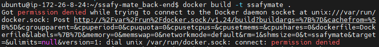
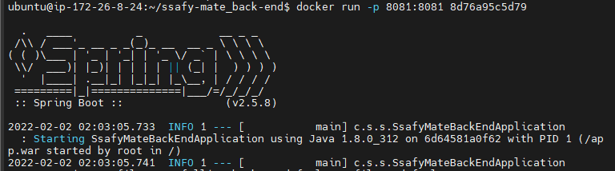
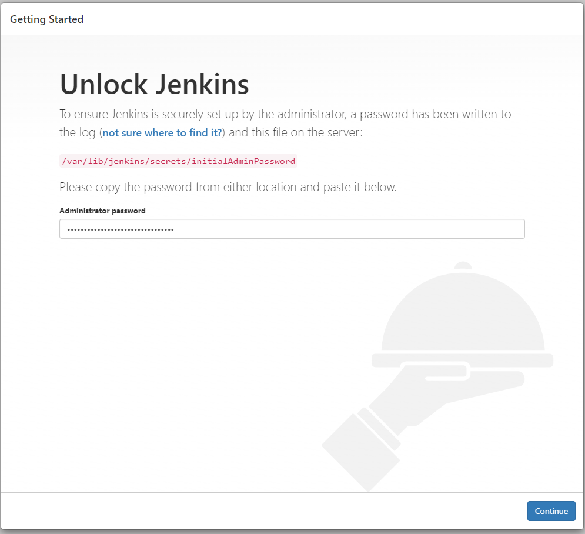
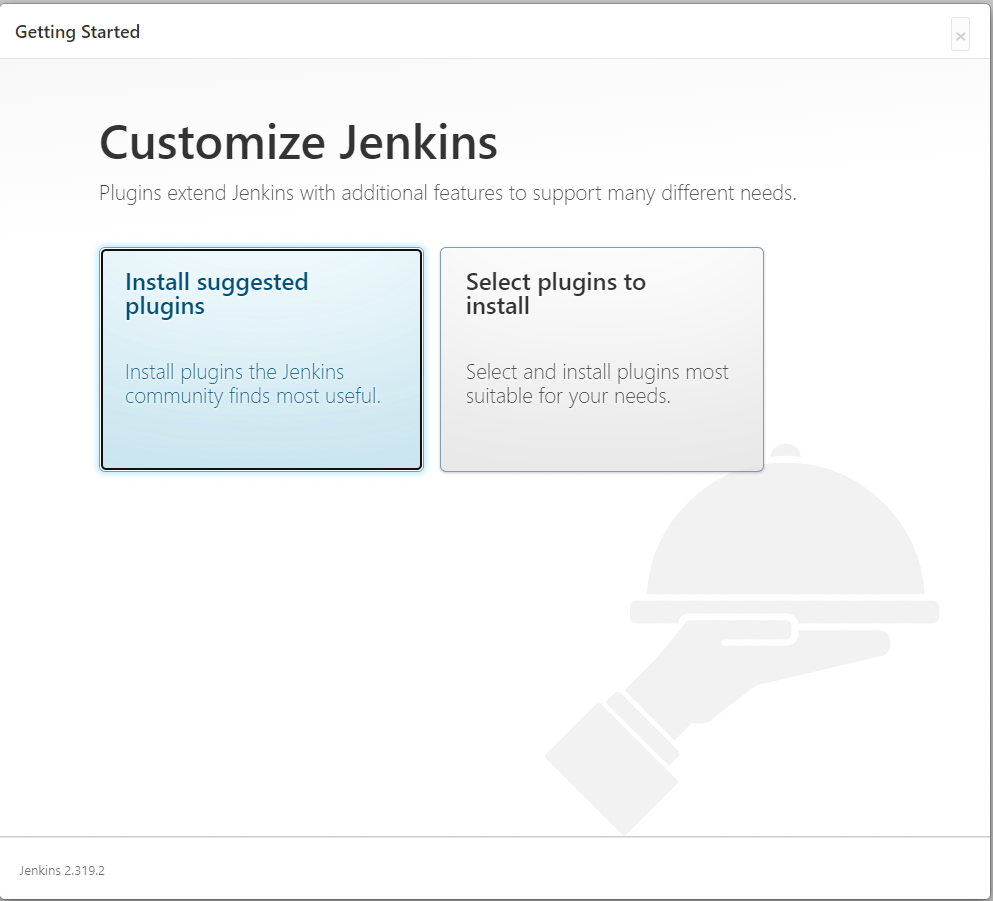
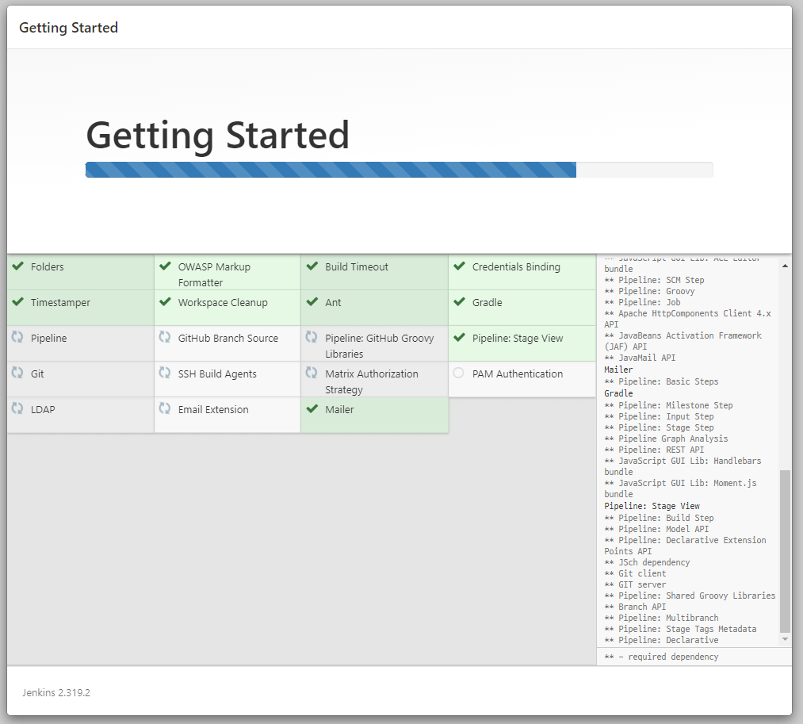

# Server | EC2 & Docker Deploy with Jenkins Ⅱ

<br>

지난 1편에 이어서, 배포 과정을 계속하기 위해서는 AWS EC2 서버에 Docker와 Jenkins가 깔려있어야 한다. 먼저 Docker를 깔아보자.

<br>

### 3. Docker 설치

```bash
$ sudo apt install docker.io

$ sudo systemctl status docker
```

위 명령어를 통해서 EC2 서버에 Docker를 설치하고 정상적으로 설치되었는지 상태  확인을 해보자.

<br>

Docker 뿐만 아니라 Ubuntu 서버에서는 파일이나 디렉토리 작성/수정/삭제와 같은 행동에 대해서 권한 오류가 빈번히 발생한다. Docker의 경우에도 아래와 같은 권한 오류가 발생할 수 있다.

<br>


<br>



<br>

권한을 부여하는 `chmod` 명령어로 파일에 대한 권한 변경을 할 수 있고, 위와 같은 오류를 해결할 수 있다.

- 참고 자료 - https://github.com/occidere/TIL/issues/116

```bash
$ sudo chmod 666 /var/run/docker.sock
```

<br>

권한 오류를 해결하고 `docker run` 명령어를 입력하면 아래와 같이 정상적으로 Spring Boot 서버가 실행되는  것을 확인할 수 있다.



- `docker run -p [EC2포트]:[docker포트] [컨테이너 ID]`

<br>

<br>

***

##### 🙅‍♂️ 잠깐!!!

`chmod` 명령어를 서버 루트나 특정 디렉토리에서 잘못 사용하게 되면 서버 자체에 대한 접근이 제한될 수 있으므로 주의해서 사용하자.

***

<br>

<br>

##### Docker 기본 명령어

```bash
$ docker images # 도커 이미지 확인

$ docker rm <id> # 도커 컨테이너 삭제

$ docker rmi <id> # 도커 이미지 삭제

$ docker run  <image 이름> # 도커 이미지 실행
```

<br>

***

<br>

기본적으로 Docker를 설치하고 정상적으로 작동하는 것을 확인했다면, 다음으로 Docker 컨테이너로 Jenkins를 띄우기 위해서 Jenkins를 설치해보자.

<br>

### 4. Jenkins 설치

<br>

- 패키지 업데이트

```bash
$ wget -q -O - https://pkg.jenkins.io/debian/jenkins.io.key | sudo apt-key add -
echo deb http://pkg.jenkins.io/debian-stable binary/ | sudo tee /etc/apt/sources.list.d/jenkins.list
$ sudo apt update
```

<br>

- GPG Error 발생시
  - Error 로그에 나타난 16 자리의 키를 활용. 아래 코드를 작성한다.

```bash
$ sudo apt-key adv --keyserver  keyserver.ubuntu.com --recv-keys [16자리키]
```

<br>

이후 `sudo apt update` 명령어로 업데이트를 재시도한다.

<br>

- Jenkins 설치 및 실행 확인

```bash
$ sudo apt-get install jenkins
$ sudo systemctl status jenkins
```

<br>

Jenkins 접속 포트 변경이 필요할 시 아래 코드로 포트  변경이 가능하다. 나의 경우 9000번 포트로 변경하고 사용하였다.

```bash
$ sudo vi /etc/default/jenkins

# 포트 변경
HTTP_PORT = 9000
```

<br>

위  설정이 다 끝나면 Jenkins 서비스를 재시작 하자.

```bash
$ sudo service jenkins restart
```

<br>

Jenkins에 접속하기 위해서는 초기 비밀번호가 필요하다.  아래 명령어로 초기  비밀번호를 미리 확인해두자.

```bash
$ sudo cat /var/lib/jenkins/secrets/initialAdminPassword
```

<br>

- `EC2 도메인:9000` 포트로 접속 후, 초기비밀번호 입력



<br>

- 플러그인 설치



<br>

- 플러그인 설치가 완료되면 젠킨스 설치 끝!



<br>

간단하게 EC2 서버에 Jenkins를 설치하고, 초기 비밀번호를 입력하고 접속 후 플러그인 설치까지 완료하였다.

위 과정이 완료되면 다음 단계로 넘어갈 수 있다.

***

<br>

#### [Server | EC2 & Docker Deploy with Jenkins Ⅲ](./server_ec2_docker_jenkins_deploy_3.md) 에서 계속...
