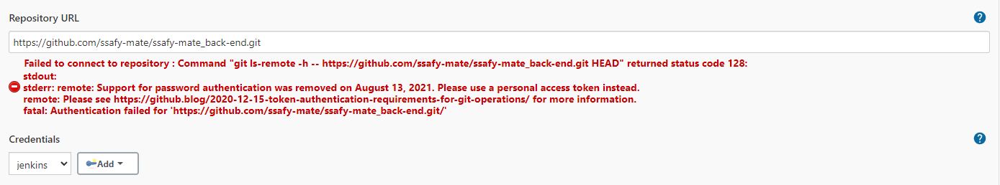

# Server | EC2 & Docker Deploy with Jenkins Ⅱ


## 배포 순서

1. Git Repository 생성

2. Spring Boot 프로젝트 생성 및 Git Upload

3. EC2에 Docker 설치

   1. `sudo apt install docker.io`

4. EC2에서 Git Repo Pull

   1. Github Personal Access Token

      

      1. https://curryyou.tistory.com/344

   2. /src/main/resources/ application.yml 파일 작성

   3. 프로젝트 루트 경로에 Dockerfile 생성

      1. ```bash
         
         ```

         

5. Spring Boot 프로젝트 빌드

   1. 권한 문제 - https://javalism.tistory.com/106

   

6. Docker

   1. 이미지 생성

      1. 
      2. 권한 문제 - https://github.com/occidere/TIL/issues/116

   2. 컨테이너 생성 및 실행

      

      - `docker run -p [EC2포트]:[docker포트] [컨테이너 ID]`

7. Jenkins
   1. 설치


- 패키지 업데이트

```bash
$ wget -q -O - https://pkg.jenkins.io/debian/jenkins.io.key | sudo apt-key add -
echo deb http://pkg.jenkins.io/debian-stable binary/ | sudo tee /etc/apt/sources.list.d/jenkins.list
$ sudo apt update
```


- GPG Error 발생시
  - Error 로그에 나타난 16 자리의 키를 활용

```bash
$ sudo apt-key adv --keyserver  keyserver.ubuntu.com --recv-keys [16자리키]
```


이후 업데이트 재시도


- Jenkins 설치 및 실행 확인

```bash
$ sudo apt-get install jenkins
$ sudo systemctl status jenkins
```


- Jenkins 접속 포트 변경

```bash
$ sudo vi /etc/default/jenkins

# 포트 변경
HTTP_PORT = 9000
```


- 서비스 재시작

```bash
$ sudo service jenkins restart
```


- 초기 비밀번호 확인

```bash
$ sudo cat /var/lib/jenkins/secrets/initialAdminPassword
```


- 9000 포트로 접속 후, 초기비밀번호 입력


- 플러그인 설치


- 플러그인 설치가 완료되면 젠킨스 설치 끝!


2. Jenkins - Github 연동

   

- SSH 키 생성

```bash
$ sudo mkdir /var/lib/jenkins/.ssh
$ sudo ssh-keygen -t rsa -f /var/lib/jenkis/.ssh/id_rsa
```


- Github Deploy Key 등록
  - github 프로젝트 > Settings > Delpoy Keys > Add deploy key

```bash
# Public Key 찾기
$ cat id_rsa.pub
```

퍼블릭 키 값을 찾고 해당하는 값을 등록


- Jenkins Credential 등록

Jenkins 관리 > Manage Credentials > Credentials > Domains (global) > Add credentials 클릭

종류는 SSH Username with private key로 선택

Private Key > Enter directly 체크 후, 프라이빗 키 입력

```bash
# Private Key 찾기
$ cat id_rsa
```


##### Docker Hub 설정

https://hub.docker.com 에서 회원가입, Repository 생성


##### Jenkins - Docker 설정

- Docker 그룹에 젠킨스 추가

```bash
$ sudo usermod -aG docker jenkins
$ su - jenkins
```


- Docker 권한 변경

```bash
$ sudo chmod 666 /var/run/docker.sock
```


- 젠킨스에서 Docker 로그인

```bash
$ sudo su - jenkins
$ docker login

# 아이디, 비밀번호 입력
```


##### Jenkins Item

- Item 생성하기 - Freestyle project


- Github 정보 입력
  - github Project 체크
  - 소스코드 관리 > Git




위와 같이 에러 발생시

https 타입 대신 ssh 타입으로 git url을 설정


에러가 사라짐!!


##### 빌드 정보 입력

