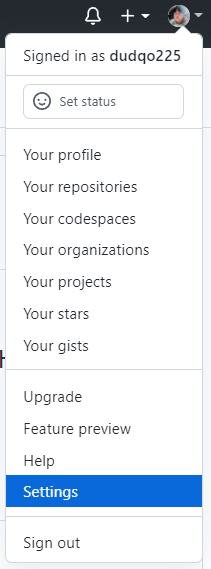
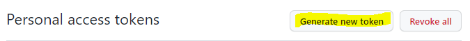
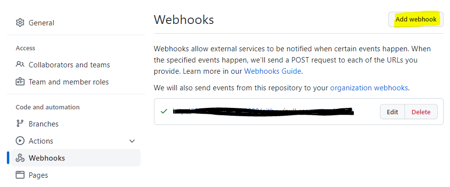
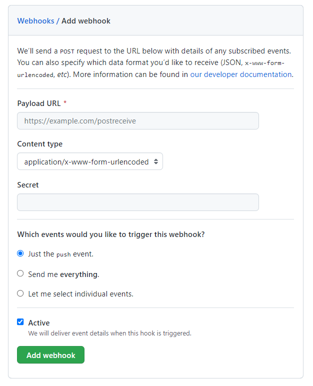
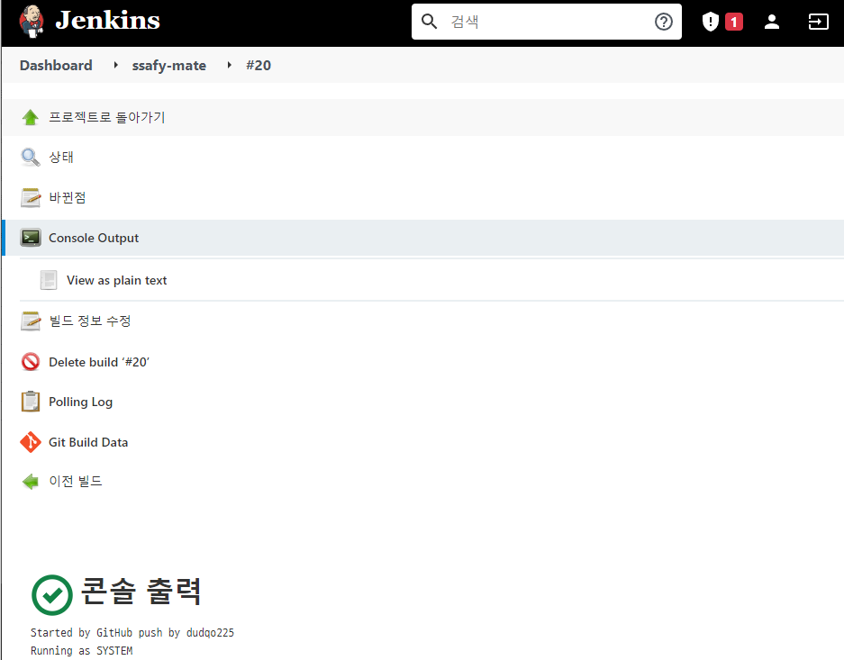

# Server | EC2 & Docker Deploy with Jenkins Ⅲ


2편에서 진행한 Docker 및 Jenkins 설치가 정상적으로 완료되었다면, 마지막으로 Web Hook으로 GitHub와 Jenkins를 연결하고 Jenkins 자동 배포 과정을 진행해보자.


### 5. GitHub - Jenkins Web Hook

웹 개발에서 Web Hook이란?

사용자 정의 callback 을 이용하여 웹페이지나 애플리케이션의 동작을 향상시키거나 변경하는 방법이다.


앞서 우리는 Github Repository의 Master 브랜치에 코드 푸쉬나 풀리퀘스트(PR) 같은 Action이 일어날 때 이를 Jenkins에서 캐치해야 한다고 이야기했다.

GitHub 과 Jenkins는 엄연히 다른 소프트웨어이고 서비스인데 한 쪽에서 일어난 변화를 어떻게 캐치할 수 있을까? 

이 때 사용하는 것이 바로 **Web Hook**이다. GitHub 과 Jenkins를 Web Hook으로 연결해여 상태 변화를 캐치. 빌드. 배포할  수 있다.


지금부터 Web Hook 설정에 대해서 알아보자.


1. 먼저 Jenkins > Jenkins 관리 > 플러그인 관리에서 **GitHub Integration Plugin** 을 설치한다.


2. 다음으로, GitHub에서 개인 Token을 발급받아야 한다.



깃허브 개인 프로필을 확인하는 메뉴에서 Settings에 들어간다. 메뉴 중 **Developer settings** 에서 **Personal access tokens** 메뉴를 클릭한다.




**Generate new token** 을 클릭하여 새로운 토큰을 생성한다. Note, Expiration을 설정하고 Select scopes를 설정한다. 나의 경우,  `repo` 와 `admin:repo_hook` 을 선택하였다.


***

##### 🙋‍♂️ 잠깐 !!!

아래와 같이 EC2 서버 자체에 Git Repository를 Clone할 때 권한 문제가 발생할 수 있다. 이 문제 역시 Personal access token을 통해서 문제를 해결 할 수 있다.

- 참고 자료 : https://curryyou.tistory.com/344


***


Token 생성이 완료되면 다시 EC2 서버로 돌아와서 Jenkins 관련 키를 생성한다.

- SSH 키 생성

```bash
$ sudo mkdir /var/lib/jenkins/.ssh
$ sudo ssh-keygen -t rsa -f /var/lib/jenkins/.ssh/id_rsa
```


키 생성이 완료되면 이를 GitHub Deploy Key로 등록해야 한다.

우리 프로젝트가 업로드 되어 있는 GitHub Repository > Settings > Deploy Keys > Add deploy key 를 클릭한다.


```bash
$ cat id_rsa.pub
```

위 명령어로 Public Key의 값을 찾고 해당하는 값을 **Key** 로 등록한다.


그리고 GitHub에 Web Hook 설정을 하기 위해서 GitHub Repository > Settings > Webhooks > Add webhook을 클릭한다.




- Payload URL : `http://{IP or Domain}:{Jenkins Port}/github-webhook` 으로 작성해야 한다.
-  Content type : `application/json` 으로 설정
- Which events ~
  - Let me select individual events 로 설정 후 개인이 원하는 상황/Action에서의 Web Hook 설정이 가능하다




- Jenkins Credential 등록

Jenkins 관리 > Manage Credentials > Credentials > Domains (global) > Add credentials 클릭하고,

종류는 `SSH Username with private key`로 선택한다.

Private Key > Enter directly 체크 후, 프라이빗 키를 입력한다.

Public Key를 찾을 때 처럼 `cat` 명령어를 사용하여 Private Key를 찾고 값을 넣어준다.

```bash
# Private Key 찾기
$ cat id_rsa
```


마지막으로 Jenkins에서 프로젝트 설정을 진행한다.

##### Jenkins Item 생성하기

- Item 생성하기 - `Freestyle project`

- Github 정보 입력
  - 소스코드 관리 > Git
  - `http` 로 시작하는 Github Repo 주소를 입력하면 아래와 같은 오류가 발생하게 된다.


GitHub Repository 주소를 `https` 타입 대신 `ssh` 타입으로 하여 Git URL을 설정하면 오류를 해결할 수 있다.


에러가 사라진 것을 볼 수 있다.


**Credentials**는 직전에 Private Key를 등록할 때 생성한 Credential을 설정한다.


Web Hook을 이용하여 GitHub와 Jenkins를 연결하였기 때문에 **빌드 유발**은 'GitHub hook trigger for GITScm polling' 으로 설정한다.


**Build** 관련 shell script를 작성하고 나면 Jenkins 설정은 끝이 난다.


##### Build - Execute shell

```bash
# 1. gradle build
chmod +x gradlew       # Permission Denied 권한 오류를 해결하기 위한 명령어
./gradlew clean build
```

```bash
# 2. Docker build
docker build --tag==[태그이름] .
```

```bash
# 3. Docker run
docker ps -q --filter name=[태그이름] | grep -q . && docker rm -f $(docker ps -aq --filter name=[태그이름])
docker run -d --name 태그이름 -p [EC2포트]:[Docker포트] [태그이름]:latest
```


1번과 2번은 기본적인 gradle 빌드와 docker 빌드 명령어이다. 

Ubuntu에서 사용자에 따른 권한 오류 문제가 자주 발생한다. Gradle 빌드를 할 때에도 권한 오류가 발생할 수 있으므로, `chmod` 권한부여 명령어를 선행하여 작성해준다.


3번 Docker Run 명령어의 경우,

첫째줄은 기존 실행중인 Docker Container 중에서 [태그이름]이 포함되어 있는 컨테이너를 조회하고, 삭제하는 명령어이다.

둘째줄은 [태그이름]을 지정하고 EC2포트와 Docker포트를 연결하면서 Docker 이미지를 실행시키는 명령어이다. 내가 진행한 프로젝트의 경우 Spring Boot 프로젝트를 8081 포트로 할당하였기 때문에 `8081:8081` 로 설정하였다.


위 과정이 문제 없이 진행된다면, 실제로 코드 작성을 하거나 Pull Request를 보내서 Git Hub를 업데이트 해보자.

아래와 같이 자동으로 Build & Run이 진행되고 과정 중에 오류가 없다면 정상적으로 실행되었다는 메세지를 볼 수 있을 것이다.




***


이 단계를 마지막으로 AWS EC2 서버에서 Docker와 Jenkins를 활용하여 자동 빌드-배포하는 과정을 진행해보았다. 배포를 하는 전체적인 흐름을 이해하고 따라가기 위해서 많은 시간이 소요되었고, 중간중간 예상치 못한 오류를 만나면서 많이 힘들었다.

하지만 구글에서 공식 자료를 찾아보고 개발 커뮤니티, 블로그의 다양한 글을 접하면서 많이 성장할 수 있었다는 생각이 든다.

이번에 해본 이 과정이 **서버**, **배포**, **CI/CD** 등 여러 개념의 전부는 아니겠지만 기초적인 흐름은 파악했다고 생각한다. 이를 기반으로 더 심화된 내용을 공부하고 내 프로젝트에 적용할 수 있도록 열심히 공부해야겠다. 2022.02.03