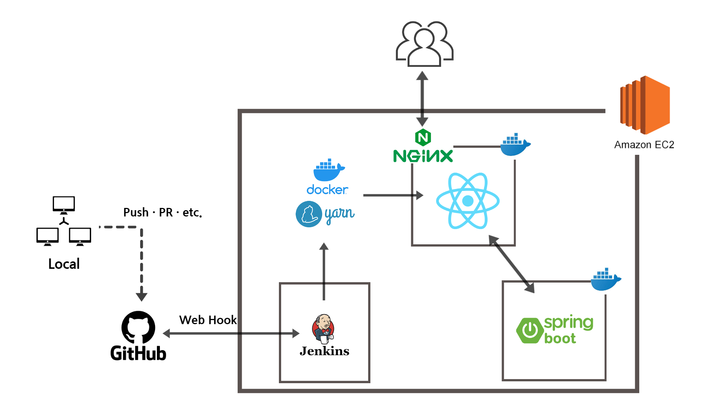
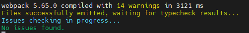
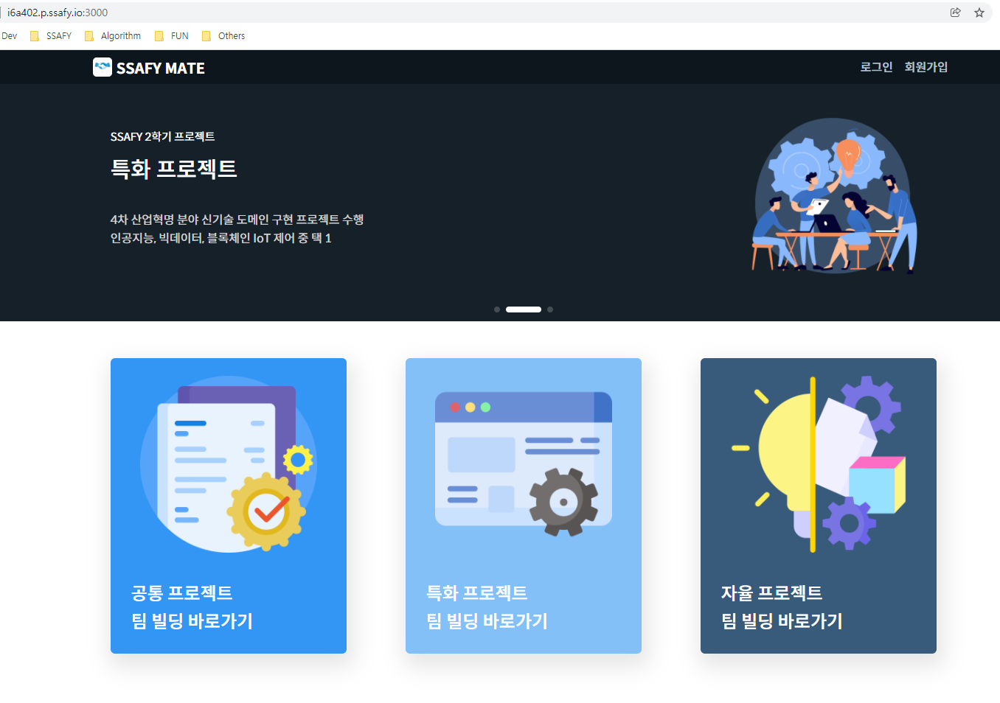

# Server | Front-end React App Deploy 1

<br>

우리 프로젝트에서는 프론트엔드 구현을 **TypeScript**를 활용한 **React** 라이브러리로 진행하였다. 백엔드와 마찬가지로 어느정도 개발 과정이 진행된 이후 AWS EC2 서버에 배포하는 과정이 필요하다.

<br>

이번 글에서는 React 앱 소스코드가 올라가 있는 GitHub Repository를 EC2 서버에 내려받고, 기초 셋팅 및 빌드. 실행하는 과정을 정리하고자 한다. 이후 Nginx를 설치하여 실 서비스에 초점을 맞춘 배포 과정을 진행할 것이다. 

<br>



흐름은 다음과 같다.

1. React 앱 소스코드가 올라가 있는 GitHub Repository EC2 서버에 Clone 하기
2. EC2 서버에 nodejs, npm, yarn 설치하기
3. React App Build 및 실행하기
4. Nginx 설치 후 연동하기
5. HTTPS 보안 연결하기 - Let's Encrypt 활용
6. Jenkins & Docker로 자동 배포하기

<br>

***

<br>

### 1. React 앱 소스코드

로컬에서 어느정도 개발을 진행하였다면 대부분 GitHub 나 Gitlab 같은 서비스 플랫폼에 소스 코드를 업로드한다. 우리는 이 코드를 AWS EC2 서버에 내려받아야 한다.

<br>

```bash
git clone <Repository URL>
```

위 명령어로 프로젝트 소스 코드가 업로드되어 있는 GitHub Repository를 내려받는다. 이 과정에서 권한 관련 오류가 발생할 수 있다. 백엔드 서버를 배포할 때와 마찬가지로, GitHub 레포를 내려받을 때 ID / PW가 아닌, **ID / Personal Token**을 입력해야 한다. 해당 과정에 대한 자세한 내용은 [Server EC2 Docker Jenkins Deploy 3](./server_ec2_docker_jenkins_deploy_3.md) 에서 확인할 수 있다.

<br>

이 과정은 개발을 공부하고 있는 누구나 쉽게 진행할 수 있는 부분이라 생각하기 때문에 이정도에서 마무리 짓고 다음 단계로 넘어가도록 하겠다.

<br>

***

<br>

### 2. EC2 서버에 nodejs, npm, yarn 설치하기

React 앱을 실행하기 위해서는 그에 맞는 환경이 준비되어야 한다. 이 단계에서는 nodejs와 npm, yarn을 설치하여 패키지 관리 및 환경 설정을 진행할 것이다.

<br>

##### nodejs 및 npm 설치

```bash
$ sudo apt-get update
$ sudo apt-get install -y build-essential
$ sudo apt-get install curl
```

설치에 앞서 `curl` 과 `build-essential` 를 먼저 설치해야 한다. C, C++ 개발 컴파일에 필요한 기본 라이브러리 설치가 안되어 에러가 발생할 수 있는 상황을 막기 위함이다.

<br>

```bash
# LTS 버전인 14.x 설치
$ curl -sL https://deb.nodesource.com/setup_14.x | sudo -E bash -
$ sudo apt-get install -y nodejs
```

<br>

```bash
# npm 설치
$ sudo apt install npm
```

<br>

```bash
# 버전 확인
$ npm -v
$ node -v
```

위 명령어들이 정상적으로 동작한다면 우리는 nodejs와 npm을 제대로 설치한 것이다.

<br>

다음으로 **yarn** 을 설치해보자. yarn은 npm과 마찬가지로 자바스크립트(타입스크립트)의 패키지를 관리해주는 시스템이다.

npm의 대안책으로 개발된 것으로, 속도나 일관성, 안정성 면에서 npm보다 좀 더 우수하다. 우리 프로젝트에서는 npm 대신 yarn을 사용하기로 하였으므로, yarn을 설치하도록 하겠다.

<br>

```bash
# yarn 레포지토리 활성화
$ curl -sS https://dl.yarnpkg.com/debian/pubkey.gpg | sudo apt-key add -
```

<br>

```bash
# yarn APT 레포지토리 추가
echo "deb https://dl.yarnpkg.com/debian/ stable main" | sudo tee /etc/apt/sources.list.d/yarn.list
```

<br>

```bash
# 패키지 목록 업데이트 및 yarn 설치
$ sudo apt update
$ sudo apt install yarn
```

<br>

```bash
# yarn 버전 확인
$ yarn --version
```

위 명령어들이 정상적으로 동작하였다면 yarn 설치도 제대로 된 것이다.

<br>

***

<br>

기본적인 설치 및 셋팅이 끝났다면 소스 코드를 활용하여 React 앱을 빌드하고 실행해보자.

<br>

### 3. React App Build 및 실행하기

이미 대부분의 개발은 로컬에서 끝난 상태이고, 어느정도 완성된 코드들이 GitHub Repository에 있기 때문에 EC2 서버에서는 내려받은 코드의 패키지 설치(의존성 설정)을 진행하면 될 것이다.

```bash
$ yarn install
```

혹은 필요에 따라서 새로운 패키지를 의존성(종속성) 추가할 수도 있다.

```bash
$ yarn add <package_name>
```

<br>

React 앱은 기본적으로 json과 yarn.lock 파일을 통해서 의존성 관리를 하기 때문에 코드를 공유하는 모든 사용자들이 똑같은 종속성을 갖게 된다. 백엔드에서 `.gradle` 파일을 통해서 의존성 관리를 하는 것과 동일한 개념이다.

<br>

패키지 설치가 끝나고 나면 프로젝트 빌드를 진행할 수 있다.

```bash
$ yarn build
```

명령어를 통해서 우리 프로젝트를 빌드한다. 이 과정 또한 로컬이나 GitHub Develop 브랜치에서 점검 및 테스트를 끝냈을 것이므로 별 문제없이 진행될 것이다.

<br>

```bash
$ yarn start
```

위 명령어는 React App을 실행하는 명령어이다. 빌드가 정상적으로 된다면, 같은 위치 내에 `build` 폴더가 생기고 그 안에 있는 파일을 실제 서버에 올려서 실행시킬 수 있을 것이다. 하지만 먼저 `yarn start` 명령어를 통해서 실제로 우리가 만든 프론트 엔드 앱이 잘 실행되는지 확인해보자.



서버가 돌아가면서 이슈가 발견되지 않으면, 정상적으로 앱이 실행되는 로그를 확인할 수 있다.

**도메인:3000** URL로 접속하면 다음과 같이 개발한대로 프론트엔드 화면이 보인다!!!



<br>

***

<br>

위 과정까지가 기본적인 소스 코드 내려받기, 환경 셋팅, 빌드를 완료한 것이다. 다음으로 우리 서비스를 좀 더 안정적으로 보안이 튼튼한 서비스로 만드는 단계 + Jenkins & Docker를 활용한 자동 배포 단계가 남아있다.

<br>

#### [Server front-end React App deploy 2](./server_front_end_react_app_deploy_2.md)에서 계속...

