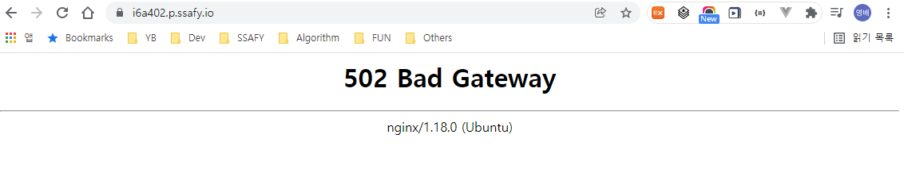
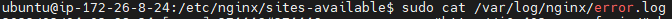
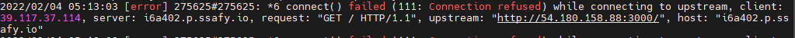
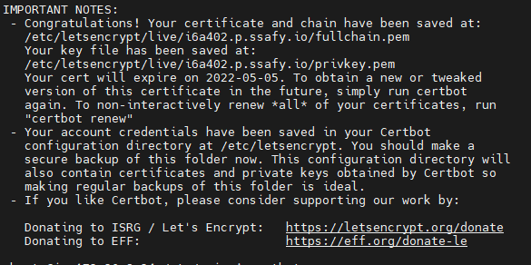
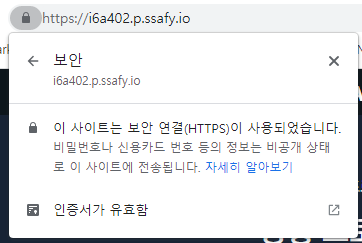

# Server | Front-end React App Deploy 2

1편에 이어서 Nginx를 연결하여 안정적인 웹서버를 구축하고, SSL을 적용하여 https로 사이트 보안을 강화하는 과정을 진행해보자

<br>

### 4. Nginx 설치 후 연동하기

일반적으로 `npm start` 혹은 `yarn start` 명령어로 우리가 개발한 프론트엔드 코드를 실행시킨다. 이는 브라우저에서 바로 확인할 수 있는 것이고 개발 편의를 위한 것이다. 사용자에게 안정적인 서비스를 제공하기  위해서 웹서버를 연동해야 하는데, 우리는 Nginx 를 연결할 것이다. (백엔드에서는 Spring Boot - Apache Tomcat 으로 연동)

![CentOS7 에 Nginx 설치 - JP-HOSTING](data:image/png;base64,iVBORw0KGgoAAAANSUhEUgAAASgAAACqCAMAAAAp1iJMAAAAulBMVEX///8Uq04jIB8AAAAAp0MNqktVunQzsl8ApkAAqUgfHBuq2rj39/fA48sWEhBcWlobFxYzMTB5eHg4NTXZ2NgRDApzxItNuXHh4eHNzMyQj49mZWQApDi7urpIR0bHx8fr9u+Eg4MMBQCs27rm5uafnp5BPz5owYTQ6tia06vg8eY6s2R5x5EhrlXP6tfG5tCqqalhX1+Oz6Ln9OtSunR3xpC338OT0KWFy5qf1bBycHBPTk2joqK/v76WMRgHAAAJSElEQVR4nO2dC1eiTBiAQaAFIrLSlCIzM22zdttv723+/7/1MfcLM1qmIvI+e84e5Bbz9PLORZgcBwAAAACArXN03pv+qvoidp+HWR4FUfjpvuoL2W2G53ngIoJ8Oqz6YnaYz3nkMqL8v6ovZ1c5cn1Xxo8gVRl46NG7TiKcQarSeSxrglRV5m8YGTSRVPW56ovbHb4+hRZNOFW5R1Vf4G7w/cB418n3X++h6ovcAf7ktrtOVvUzqfo6K+bW95dqwqkq/Fv1pVbJl0+LkpNK+PS16sutiuF0SXLS778f36u+5Er47w3JSbv/8j9VX/T2+RW9LTmp+P5h1Re+Xe5nb09OKuHTl6ovfnu8MzmpBPnBsOoCbInP705OKg0ZgDkKVklOKr6/9wMwpsGUVdjzAZjk53o0uXs+AGMfTFmFKP9ddYE2w3DhYMoq+MFeNtWf1hlOhMCvulAb4Hbd8YTw93D4c2oLqCCKlsRaYN0h6FVdrPVzYK7vorz383EahfbaMMh7f6aWnmHwqepirZ8DY1SE50O89b5nuzOjHt7jb95oUb4YNzk0mnCDGd1uzHFNERU8STscGU3l/HuFmeHubIooX2kyfjbefXzzoSFNNUaUOgx3XlYhVWtHBo8NFeX0SvuAKKMox9XzEIgyi/quywBRZlHOF63qA1EWUXrDEkTZRDmPStUHoqyi1KoPRNlFOU9S1QeiFogaSkZAlC7qUdr1XiR0EKWLmspDcLfcFIjSRZ3nckz9YVJAVElUlMsJ60cEomyi3Fx+ToVWfSDKIMoNh2J3WvWBKJMoZcCTVH0gyiTKjeSq71cOomyiXP+ndASq+kCUWZSby4+TH/ggyibKzeWnyT8FIMomyg2lJ1SGfgSibKICVzroIQdRNlFuNJOO+iVMgCiMEOX659Jht3wJRGEkUW5ofOoJRGFkUW5ueucTRGEUUdKjGQIQhVFFBVH5jU8QhVFFqVUfAURhNFGuP9VPAKIwuig31B+3B1GYkig3114MarQo0Zwsi9KrvkaLEoMqhsfQA38on6DJoiLRWXla+ijr7wY/w+mGrLlkCpdC5A/pBKbjGyOKDTcNLW+FRjOep8rPdzZJlBs9HSXO8ND6hkeQT78OC5G3rvHw5ohygzAP80VvGUdhjvYwm9xHUY/rf12vsFhqv9efe/O7Lh/DOB5Td87X/2ZjeFB1oTbC7w9ODKET7O2cNsNlk7S9T9M+T+j2npm1FrP3UwQehh+fcaQhk06+Zfa/xQQ5fcF2z/n+40OpKghne5ycVBbPULoYP9j7mX5kVp2mZW8nZLGzysQ/ez3Fj5X3TyWlTRqVZVlD5nvVZ3pfjD4P/DwZO9cNMfWO6e5KE9tlzlXy7FxXc93bh/81isUYklMhKrsu/m8MD7MFE9hQTH/9pBBV/GtMRCGWTfLqS1//CZIiPyVNyeaMRQMw1gmCkyxrTC7nWOd6DfKDvZzHbnXujQMwDZ7E3E45VUVhw+aafivqDOeR8k4oICONFe/3SO/HYWPFkJyWcuiHftjsv9nxVr7eQjQBAAAAAAAAAAAAAAAAAAAAAAB8gKQzf359vmraszsKL5PBYHApr8nOijUnwsn47szzvNFoVPzfuumLHY+L/QbHaOkCneSffJIxOslZsfMd2jQ4UxT30cbByXgDxdkcx904jj35ebjMQ2t4yW68UdxixF3vmJfvJG230xO0dDpCh7xKJ+njk3SKpW67WOoqv4pJijbebKhEG+K4jcrfktZkXrGGiRq3uy2VNrd6UgiMz9DSadqSjkH08UmQqLmHt0nPcD57WPlGi7V+sKiWdyfWyKLGHoumIgaYKmZKF9U9FScRokq/ioSYm2+6ZGuGiJKjQRZ1RrZ2Pe9kMCkSVUveWRfV8kQCk0SNiZgLtukb2rl9vI3CrRMqKn3hayRR+CZpFekEl9gZv3ZJ6JD0UhLVHvCTSKKcO2KK5ra58qk+UFGsUI4iahLju0Yq1DHJRni5JKrlXbH9ZFF4Rx5Daazd6jWBiRLRIEQlhl9+K+ZZqiwqbrPdFFGZJyzeoMohPtl4udYOEyWiQYjCS+mpsv8zylMj3BIoi2qNWCZSRDkvKavnOqU6sC5wUXFK1whRV55yO2GwgS72YRDFKwVVFAlNlNrwXSglxPqARaVyNOii1JczcJlJNtdEtbED2rJURdFawRvTvF7HrhASld60pGS0TBTCIKp9OYiFHE2UM8GNqQmpCp63UrI1g0R177ASGg2LRUlool5w/okneJsuqk8aGlojok5gURfOWcxz7KqiLklTkuQ0XRSp7Ujg9s2n23GoKBINuNSri6JtcLSmJMphonjFWDOoKOcyZdnDIqp/LYENlEQ5FyNWJZZF4ZPJTa2awUQlPBosoi48Cdy2Kouize6xSZRDO5V1fcORiXLuRrTet4mSxltMzQMsCh+BOivWiBrVsspzJFFOTKPhI6KcQZtUCoYcFatN0rohRM1pNHxIFBZUdOXstV6qDHbWByHK+UeiYUmOWizKOe3iSmFsbEfVOUtJomg0dFbrwlBRpFIYdTRRAzKQSlqdWynYupFEkdujTXoiq4pyXj1xEi7qig4aePVtScmiEtHPWF0UGSAgJ+GiulQQ6xxvoWDrRhZFy8FF4fQ+elX279iGWbioTJyEiSKjdeiWw12ltvIVYE1QRJFycFF90a/hnPIWvE2UNBZIRZFMjkOzIw121gtVFI8G0trRvj/hO5B+rU3U2NNE4eo0lWrFlvKlXj0aVqoo0uXjokjjxzvlRSEDbzTIbKJIl0+IulJG60aifYHpZP2sDiPDmigWDaRY9FPqvbzOs/nzaZcYoF9eWkWxVjgVhT/x0TqqjaWvcT/rdBKlU7ibaKJYNNDfP8vuKXpCY0SjbUSV2EXRfh2xQRodE75xQAY76ScyF1ANQkoX5bRjSZRzI1rUvC5jdZZdFGtfIlF9Kath6KgVjTA0u9S8lqLm6vj/s6c+pZGKp1AWiOqI+ws7U9qYJGjpT+gn104tpuH6x78rYAxwl47n7+TG87o4zOJ21/MuRWjEuOuHll7QkvI0AV6DRD3jhVTe5nQ9af+sn4zr0PvrZAXKKHaC1iiXfn1xOSlKdvLt4kquyvFYJ46FPjpEScjJdUZmjcowalN8nMk/IunUsaEOAAAAAAAANJ3/ARhgwpkiBJABAAAAAElFTkSuQmCC)

<br>

##### Nginx 설치

```bash
$ sudo apt install nginx
```

<br>

##### Conf 파일 설정

Nginx가 정상적으로 설치되면, Ubuntu 서버의 `/etc/nginx/` 경로에 디렉토리가 생성된 것을 확인할 수 있다. 우리가 개발한 React 앱과 Nginx 연결을 위해 `.conf` 파일을 작성할 것이다.

```bash
# /etc/nginx/sites-available/ 경로
$ sudo vim [임의의 이름].conf
```

```bash
# .conf 파일 내 설정 작성
server {
  listen 80;
  server_name i6a402.p.ssafy.io;

  location / {
    root   /home/ubuntu/ssafy-mate_front-end/build;
    index  index.html index.htm;
    try_files $uri /index.html;
  }
}
```

`.conf` 설정 파일 내의 내용을 간단하게 보면,

- listen : 프론트엔드 기본 포트인 80을 의미
- server_name : ec2 서버의  ip주소 or 도메인
- location
  - `/` : `domain/` 로 웹서버 경로 설정
  - root : 해당 경로에서 파일을 찾겠다는 의미
  - index : 해당 경로의 index 파일을 찾아 메인 페이지로 띄워준다
  - try_files : 이 부분은 아직 잘 이해되지 않아 다른 블로그를 참고하면 좋을 듯 하다. 핵심은, 페이지 라우팅을 `/index.html` 로 한다는 의미이다.
    - 참고 : https://www.hanumoka.net/2019/12/29/react-20191229-react-nginx-deploy/

<br>

설정파일이 완료되면 `/etc/nginx/sites-available/[파일명].conf` 파일을 `/etc/nginx/sites-enabled/[파일명].conf` 경로로 **심볼릭 링크(Symbolic Link)** 연결을 해주어야 한다.

***

<br>

##### Symbolic Link란?

Symbolic Link, Symlink를 이해하기 쉬운 예제는 **바로가기** 파일이다. 컴퓨터를 사용하다 보면 외우기도 어려운 복잡한 경로에 프로그램이 설치되어 있는 경우가 많이 있다. 우리는 이 파일을 일반적으로 **바탕화면**에 복사해서 사용한다. 똑같은 파일을 복사 즉, 바로가기 파일을 생성해서 바탕화면에 옮겨놓고 편리하게 프로그램을 사용한다. 심볼릭 링크는 이처럼 똑같은 파일을 다른 경로에 복사하는 것을 의미한다. 

<br>

단순히 원본파일을 가리키도록 링크를 연결시켜서 원본파일 자체의 크기가 매우 크더라도, 복사한 파일의 크기는 전혀 상관이 없으며, 원본 파일이 삭제된다면 링크 파일이 빨간색으로 표시되면서 원본파일이 없음을 표시한다.

- 참고 : https://server-talk.tistory.com/140

***

<br>

다음은 심볼릭 링크로 연결되는 디렉토리에 대한 설명이다.

- `/sites-available` : 서버 환경에 대한 설정 파일이 있는 디렉토리. 가상 서버가 사용되거나 - 사용되지 않거나 여부에 상관없이 설정 파일이 위치한다.
- `/sites-enabled` : sites-available에 있는 서버에 관한 설정 파일 중 실행하고자 하는 파일을 symbolic link로 연결한 디렉토리. 이 디렉토리에 위치한 설정 파일을 통해서 서버가 셋팅됨
- `nginx.conf` : Nginx에 관한 기본 설정파일

<br>

```bash
# Symbolic Link 생성
$ sudo ln -s /etc/nginx/sites-available/[파일명].conf /etc/nginx/sites-enabled/[파일명].conf
```

<br>

심링크 연결까지 완료되었다면, Nginx를 재시작하고 상태를 확인해보자.

```bash
$ sudo systemctl stop nginx
$ sudo systemctl start nginx
$ sudo systemctl status nginx
```

<br>

Ubuntu 서버의 80번 포트는 방화벽 허용을 해야 외부 접근이 가능하다고 한다.

```bash
$ sudo iptables -I INPUT 1 -p tcp --dport 80-j ACCEPT
```

위 명령어 입력을 통해  80포트 방화벽 허용을 추가하고, EC2 도메인 주소로 접속을 해보자.



🙄 ??? 502 에러가 뜬다..

<br>



```bash
$ cat /var/log/nginx/error.log
```

명령어를 통해서 어떤 에러가 발생한건지 확인해보았다.

<br>



`111: Connection refused` 에러가 보이는데, 이 부분에서 많은 시간 삽질을 했다.

나는 보통 log에 찍힌 오류 메시지를 읽고 이해가 되면 바로 해결하지만, 이해가 안될 경우 해당 오류 메시지나 오류 코드를 복사해서 구글에서 찾아보곤 한다. 이번에도, 에러 메시지 자체가 잘 이해되지 않아서 구글링을 해보았다. **502 Bad Gateway** 에 대해서 다양한 블로그 글과 해결방법을 찾아보았지만,

<br>

결론적으로, 저 문제는 **React 앱이 서버에서 실행되지 않아 발생한 에러**였다. 😂

<br>

지금까지 진행한 과정은 Nginx를  설치하고 이를 우리 프로젝트의 `build` 디렉토리와 연결만 한 것이다. 실제로 React 프로젝트(`:3000`)를 가동하고 `http:<도메인>` 주소로 접속해야 정상적으로 웹 서버가 구동이 된다.

<br>

이로써, Nginx 설치 및 React 앱 연동을 완료하였다.

- 참고자료 : https://www.hanumoka.net/2019/12/29/react-20191229-react-nginx-deploy/

***

<br>

다음으로는 http 일반서버를 보안이 강화된  https 보안서버로  연결하는 과정을 진행하겠다.

<br>

### 5. HTTPS 보안 연결하기

예전의 웹사이트는 일반적으로 http로 통신을 했다. 최근에는 보안을 강화한 **https** 를 지원하는 서비스, 사이트가 늘어나고 있다. 구글에서는  https 보안이 적용되지 않은 웹사이트는 위함한 사이트로 판단하고, 검색 결과에서 상위 노출을 하지 않거나 접근 제한을 하는 등의 정책을 내세우고 있다.

<br>

우리가 제공하는 서비스의 보안서버 적용은 사용자의 데이터 보안을 강화하는 측면에서 매우 중요하다고 할 수 있다.

<br>

보안 인증서를 발급받는 방법은 여러가지가 있다고 한다. 그중에서 **Let's Encrypt** 라고 하는 무료 인증서를 발급받는 방법을 진행할 예정이다.


##### ✨Let's Encrypt 란?

자동화된 프로세스를 통해 보안 웹사이트를 위한 인증서를 제공하는 인증 기관이다. 기존의 인증서 수동 생성, 유효성 확인, 디지털 서명, 설치, 갱신 등 복잡한 과정을 없애고 **편리하게 무료 인증서를 발급**받을 수 있다. 2012년 모질라 직원 2명에 의해 시작되었다. 최근 많은 웹사이트에서 이를 활용하여 보안서버를 적용하고 있다.

***

<br>

##### Letsencrypt 설치 및 인증서 발급

```bash
$ sudo apt update -y & sudo apt install letsencrypt -y
$ sudo letsencrypt certonly --standalone -d [도메인URL]
```

<br>

위 명령어를 입력하면, 이메일을 입력하고 여러 Notice에 대해 `Y/N` 을 입력하는 과정을 거치게 된다. 발급이 완료되면, 아래와 같이 인증서가 발급된 디렉토리 주소와 Note 내용을 확인할 수 있다.



<br>

위 예시의 경우, 인증서 만료기한이 2022년 5월 5일이다. 이 기한을 연장/갱신하려면 다음 명령어를 입력해야 한다.

```bash
$ certbot renew
```

<br>

매우 간편하고 쉽게 https 보안 서버 적용을 위한 SSL(Secure Sockets Layer) 인증서를 발급 받았다.

다음으로 발급받은 인증서를  Nginx 설정 파일에 연결시켜주자.

<br>

4단계에서 `/etc/nginx/sites-available/ ` 하위 경로에 작성한 `.conf` 파일을 열고 다음과 같이 작성한다.

```bash
# .conf 파일 내 설정 작성
server {
  listen 80;
  server_name i6a402.p.ssafy.io;

  location / {
    root   /home/ubuntu/ssafy-mate_front-end/build;
    index  index.html index.htm;
    try_files $uri /index.html;
    return 301 https://$host$request_uri;
  }
}

server {
  listen 443 ssl;
  listen [::]:443 ssl;

  ssl_certificate "/etc/letsencrypt/live/i6a402.p.ssafy.io/fullchain.pem";
  ssl_certificate_key "/etc/letsencrypt/live/i6a402.p.ssafy.io/privkey.pem";

  ssl_session_cache shared:SSL:1m;
  ssl_session_timeout  10m;
  ssl_ciphers HIGH:!aNULL:!MD5;
  ssl_prefer_server_ciphers on;

  location / {
   proxy_set_header  Host $http_host;
   proxy_set_header  X-Real-IP $remote_addr;
   proxy_set_header  X-Forwarded-For $proxy_add_x_forwarded_for;
   proxy_set_header  X-Forwarded-Proto $scheme;
   proxy_set_header  X-NginX-Proxy true;

   proxy_buffer_size          128k;
   proxy_buffers              4 256k;
   proxy_busy_buffers_size    256k;
   proxy_connect_timeout 300s;
   proxy_read_timeout 600s;
   proxy_send_timeout 600s;

   proxy_pass http://i6a402.p.ssafy.io:3000;

   proxy_redirect off;
   charset utf-8;
  }
}
```

가장 큰 변화 내용은 다음과 같다.

- **redirect  설정** : 80 포트로 접속할 경우 `301` 리다이렉트를 통해 https 보안서버로 이동시킨다.
- **443** : `443` 포트는 https 보안 서버를 위한 포트이다.
- **ssl_certificate & ssl_certificate_key** : letsencrypt를 통해 발급 받은 인증서가 저장되어 있는 경로를 입력한다.
- 그외의 설정들은 프록시 서버에 대한 설정값이다.

<br>

`.conf` 파일 작성이 완료되면 nginx를 재시작하고 다시 우리의 도메인 주소에 접속하여 https 보안이 제대로 적용되었는지 확인하면 된다.

```bash
# nginx 재시작
$ sudo service nginx restart
```

<br>



제대로 HTTPS 보연 연결이 된  것을 확인할 수 있다!!! 😁

<br>

***

<br>

다음으로 진행할 것은 Jenkins 연동 및 Docker를 활용하여 컨테이너로 띄우는 단계가 남아있다.

<br>

#### [Server front-end React App deploy 3]()에서 계속...
