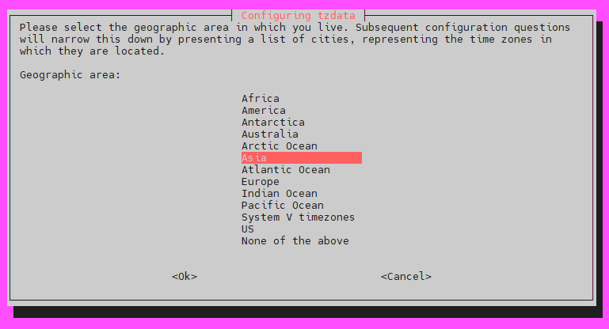
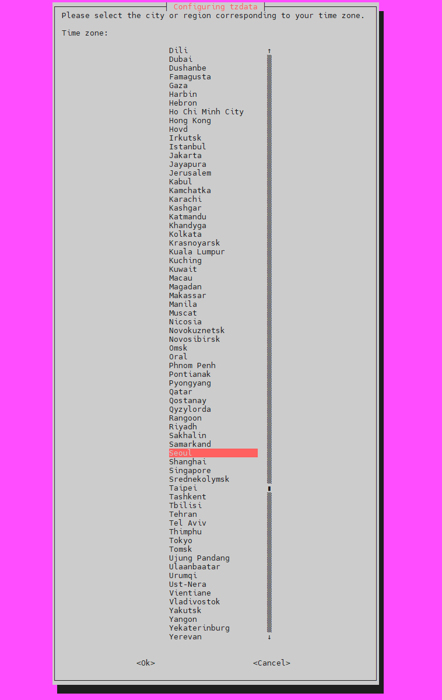
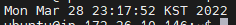

# Server | Ubuntu Timezone

<br>

AWS EC2 인스턴스를 실행하면, 초기 설정은 **영국 표준시**로 되어 있다.

```bash
# Server Timezone 확인
date
```

<br>

대한민구, 서울 기준의 시간으로 바꾸고 싶다면 어떻게 해야할까?

<br>

```bash
# Timezone 변경하기
sudo dpkg-reconfigure tzdata
```

- 설정화면에서 **Asia** → **Seoul** 선택하기





<br>

타임존 변경 후 다시 `date` 명령어를 입력하면, 우리나라 표준시에 맞는 타임존을 확인할 수 있다.



<br>

시간대 변경 후 **Cron** 을 재시작해야 한다.

```bash
# Cron 재시작
sudo service cron restart
```

<br>

***

#### 참고 자료

- https://syssurr.tistory.com/272