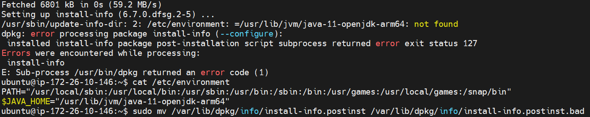

# Server | Ubuntu - pip

</br>

Linux 기반의 **Ubuntu** 서버에서 파이썬 및 관련 라이브러리 설치 후 Python Script를 실행하는 과정에서 여러가지 문제가 발생하였다.

</br>

발생한 문제는 다음과 같다.

1. Python 버전 문제
2. `pip` 설치
3. 라이브러리 설치

</br>

이번 글에서는 `pip` 설치에 대해서 알아보자.

</br>

### pip3 설치

Ubuntu 서버에 파이썬 패키지 관리를 위한 `pip`를 설치하려면 아래 코드를 입력해야 한다.

```bash
# Python 2.x
apt-get install python-pip

# Python 3.x
apt-get install python3-pip
```

<br>

우리 프로젝트는 **Python 3.x** 대 버전을 쓰기 때문에 해당하는 코드로 `pip` 설치를 하자.

<br>

`apt-get install`, `apt-get update`, `apt-get upgrade` 등의 코드로 현재 Ubuntu 서버를 업데이트하고 필요한 것을 설치하다 보면, 아래와 같은 오류가 발생하는 경우가 있다.



<br>

위 이미지의 오류는, *`/etc/environment` 경로에 작성된 것이 존재하지 않는다. 찾을 수 없다.* 는 내용의 오류이다.

이 오류에 대한 해결 방법은 다음 코드를 입력하는 것이다.

```bash
# 특정 파일 삭제
sudo mv /var/lib/dpkg/info/install-info.postinst /var/lib/dpkg/info/install-info.postinst.bad
```

- `/var/lib/dpkg/~` 경로의 특정 파일을 삭제하고 나면 위 오류가 해결된다.

<br>

#### 참고 자료

- http://wanochoi.com/?p=3575
- https://askubuntu.com/questions/1069702/dpkg-error-processing-package-install-info