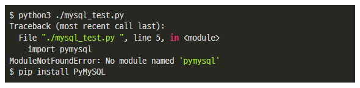
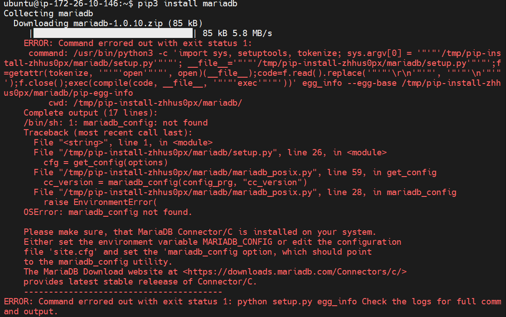

# Server | Ubuntu - Python Library

</br>

Linux 기반의 **Ubuntu** 서버에서 파이썬 및 관련 라이브러리 설치 후 Python Script를 실행하는 과정에서 여러가지 문제가 발생하였다.

</br>

발생한 문제는 다음과 같다.

1. Python 버전 문제
2. `pip` 설치
3. 라이브러리 설치

</br>

이번 글에서는 라이브러리 설치에 대해서 알아보자.

</br>

### Python 라이브러리 설치

<br>

Ubuntu 서버에 프로젝트 환경에 맞는 **Python** 버전 설정과 **pip** 설치가 완료되었다면, 코드 실행에 필요한 다양한 라이브러리를 설치해야 한다.

<br>

우리 프로젝트의 경우, **유저 기반 협업 필터링** (User-based Collaborative Filtering) 코드가 작성되어 있는 `.py` 실행을 위해서 여러가지 **데이터 분석** 관련 라이브러리를 설치해야 한다.

```bash
# 빅데이터 분석 및 추천 알고리즘을 위한 라이브러리
pip3 install mariadb

pip3 install sqlalchemy

pip3 install pymysql

pip3 install pandas

pip3 install sklearn
```

<br>

프로젝트에 필요한 라이브러리를 하나씩 설치해도 되지만, `requirements.txt` 파일에 작성해서 일괄 설치해도 된다.

<br>



가끔씩 위 이미지와 같이 **ModuleNotFoundError** 오류가 발생할 때가 있다.

파이썬 스크립트에서 사용하는 패키지 or 라이브러리인데, 현재 서버에 해당 패키지 or 라이브러리가 설치되어 있지 않으면 발생하는 오류이다. 

<br>

예를 들어,

파이썬과 **MariaDB** 를 연결하기 위한 패키지/라이브러리를 설치하기 위해 `pip3 install mariadb` 코드를 작성하였으나, 아래와 같은 오류가 발생하였다.



<br>

```bash
# mariadb 패키지/라이브러리 설치 오류 해결을 위한 코드
sudo apt-get update -y
sudo apt-get install -y libmariadb-dev
```

<br>

구글링을 통해서 해당 오류와 관련된 커뮤니티, 블로그 등을 참고하여 해결할 수 있다. **stackoverflow** 강력 추천!!!

</br>

#### 참고 자료

- https://busyman.tistory.com/412
- https://stackoverflow.com/questions/33446347/no-module-named-pymysql
- https://stackoverflow.com/questions/63027020/problem-with-pip-install-mariadb-mariadb-config-not-found