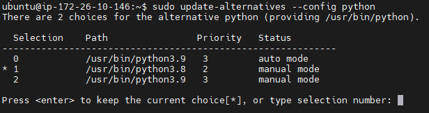

# Server | Ubuntu - Python

</br>

Linux 기반의 **Ubuntu** 서버에서 파이썬 및 관련 라이브러리 설치 후 Python Script를 실행하는 과정에서 여러가지 문제가 발생하였다.

</br>

발생한 문제는 다음과 같다.

1. Python 버전 문제
2. `pip` 설치
3. 라이브러리 설치

</br>

이번 글에서는 Python 버전 관리에 대해서 알아보자.

</br>

### Python 버전 문제

```bash
# 현재 설치 및 적용되어 있는 Python 버전 확인
python --version

# 파이썬 설치 경로 확인
which python

# 설치되어 있는 파이썬 버전 리스트 확인
ls /usr/bin/ | grep python
```

<br>

우리의 서버에는 `Python 2.x` 버전 또는 `Python 3.x` 등 다양한 버전의 파이썬을 설치할 수 있다. **Ubuntu** 서버에 파이썬을 설치하는 방법은 구글에 너무나도 많이 있기 때문에 Pass...

<br>

설치된 버전에 따라서 오류가 발생하는 케이스가 있어서 우리 프로젝트에는 `python 3.8.x` 버전을 설치하고 적용하려고 한다.

```bash
# 특정 Python 버전을 등록하는 코드
sudo update-alternatives --install /usr/bin/python python /usr/bin/python3.6 1
sudo update-alternatives --install /usr/bin/python python /usr/bin/python3.8 2
```

<br>

```bash
# 파이썬 버전 선택을 위한 코드
sudo update-alternatives --config python
```

<br>



파이썬 버전 선택을 위해서 코드를 입력하면 위 이미지와 같이 다양한 **버전**, **우선순위**, **상태** 등을 볼 수 있고, 원하는 **번호를 입력하여 우리 프로젝트 서버의 파이썬 버전을 선택**할 수 있다.

</br>

#### 참고 자료

- https://daechu.tistory.com/5
- https://seongkyun.github.io/others/2019/05/09/ubuntu_python/