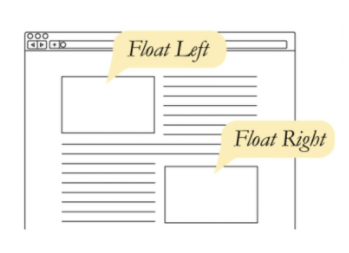
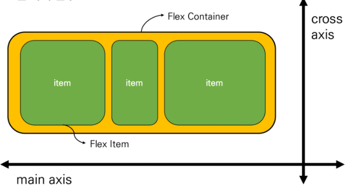

# CSS | Float & Flexbox

### CSS Layout

- 웹 페이지에 포함되는 요소들을 어떻게 취합하고 그것들이 어느 위치에 놓일 것인지를 제어
  - Display
  - Position
  - Float
  - Flexbox
  - Grid System

### Float

- 한 요소(element)가 정상 흐름(normal flow)으로부터 빠져 텍스트 및 인라인(inline) 요소가 그 주위를 감싸 요소 좌/우측을 따라 배치되어야 함을 지정

- 본래는 이미지 좌/우측 주변으로 텍스트를 둘러싸는 레이아웃을 위해 도입
- 이미지가 아닌 다른 요소들에도 적용하여 웹사이트 전체 레이아웃을 만드는데까지 발전

- 속성
  - none: 기본값
  - left: 요소를 왼쪽으로 띄움
  - right: 요소를 오른쪽으로 띄움
- Float clear
  - floating 요소의 부모 속성에 클래스로 설정
  - 맨 마지막 자식으로 가상 요소(`::after`)를 하나 생성
  - 보통 content 속성과 함께 짝지어, 장식용 콘텐츠로 추가
  - 기본값은 inline
  - 선행 floating 요소 다음일 수 있는지 or 그 아래로 내려가야 되서 해제되어(cleared)야 하는지 지정

- 정리
  - flexbox 및 grid 레이아웃이 나오기 전에 열 레이아웃을 만드는데 사용됨
  - flexbox / grid 출현과 함께 본래 텍스트 블로 안에서 이미지를 float 하는 역할로 돌아감
  - 웹에서 여전히 사용하는 경우도 있음 (ex. naver nav bar)

  

### Flexbox

- CSS Flexible Box Layout

  - 오랫동안 CSS Layout을 작성할 수 있는 도구는 float / positioning 뿐 이었다.
  - Flexible Box module은 인터페이스 내의 아이템간 '공간배분' 과 '정렬' 기능을 제공하기 위한 1차원 레이아웃 모델
  - 공간배분과 정렬을 위한 단방향 레이아웃이다.
  - 요소
    - Flex Container (부모 요소)
      - flexbox 레이아웃을 형성하는 가장 기본적인 모델
      - flex item 이 놓여있는 영역
      - `display` 속성을 `flex` or `inline-flex` 로 지정
    - Flex Item (자식 요소)
      - Container의 콘텐츠
  - 축
    - Main axis (메인축)
    - Cross axis (교차축)

  

  - 적용 속성
    - 배치 방향 설정 : `flex-direction`
    - 메인축 방향 정렬 : `justify-content`
    - 교차축 방향 정렬 : `align-items`, `align-self`, `align-content`
    - 기타 : `flex-wrap`, `flex-flow`, `flex-grow`, `order` ...
  - content / items / self
    - content : 여러줄
    - items : 한 줄
    - self : flex item 개별 요소
    - 예시
      - `justify-content` : 메인축 기준 여러 줄 정렬
      - `align-items` : 교차축 기준 한 줄 정렬
      - `align-self` : 교차축 기준 선택한 요소 하나 정렬
