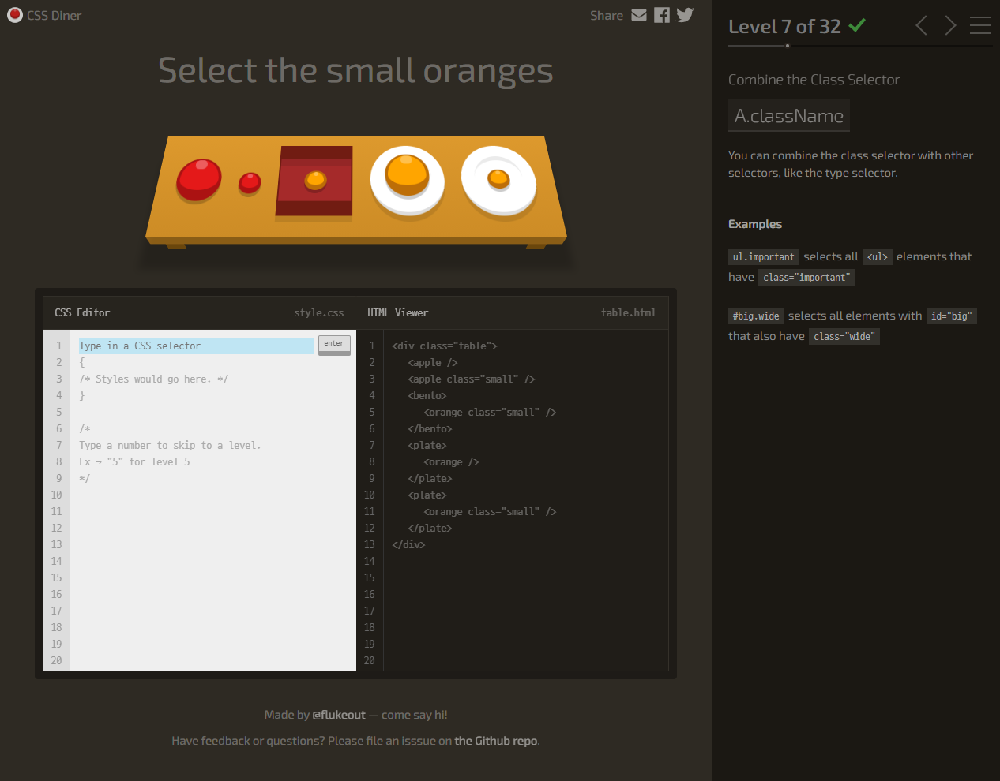

# CSS | Selector (선택자)

- CSS를 통해 HTML 문서를 고칠 때, 정확한 선택자를 통해서 원하는 요소를 수정해야 한다.
- 모든 선택자를 외울 필요는 없지만, 기본적인 선택자 작동 원리를 알고 있어야 하며 필요시 구글링을 통해 파악할 수 있어야 함

  

### Selector

- 적용 순서
  - `!important` > `인라인` > `#(id)` > `.(class)` > `요소 선택자` > `소스 순서`

  

- CSS Selector 연습을 위한 깃허브 링크

  - [CSS Diner](flukeout.github.io)

  - 총 32가지 문제가 있으며,
    - CSS Editor
    - HTML Viewer
    - 문제 풀이를 위한 설명글이 있다.

(이미지 출처: CSS Diner)

> 가벼우면서도 어려운 문제들이다.
>
> CSS selector 관련 문제가 생길 때 실제 예시로써 활용할 수 있을 것 같다. 👍