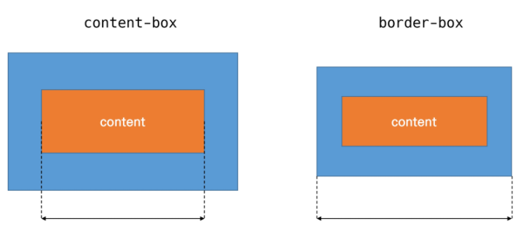

# CSS | Basic 기초

- CSS 란?
  - **C**ascading **S**tyle **S**heets
  - 스타일, 레이아웃 등을 통해 HTML 을 표시하는 방법을 지정하는 언어

</br></br>

- CSS 구문

  ```css
  h1 {
      color: blue;
      font-size: 15px;
  }
  ```

  - 용어 정리
    - `h1` : 선택자 (Selector)
    - `{}` : 중괄호 안에 선언 (Declaration)
    - `color` or `font-size` : 속성 (Property)
    - `15px` : 값 (Value)
  - CSS 구문은 선택자와 함께 열림
  - 선택자를 통해 스타일을 지정할 HTML 요소를 선택
  - 속성 - 값 하나의 쌍으로 이루어진 선언을 진행
  - 속성 (Property) : 어떤 스타일 기능을 변경할지 결정
  - 값 (Value) : 어떻게 스타일 기능을 변경할지 결정

</br></br>

- CSS 정의 방법
  1. 인라인 (Inline) - 태그 안에 `style` 속성을 직접 활용
  2. 내부 참조 (Embedding) - head 태그 내에 `<style>` 태그에 지정
  3. 외부 참조 (Link File) - 분리된 CSS 파일을 `<head>` 영역에서 `<link>` 를 통해 불러오기

</br></br>

- CSS Selectors
  - 선택자 (Selectors)
    - HTML 문서에서 특정한 요소를 선택하여 스타일링 하기 위해서는 선택자라는 개념이 필요
    - 기본 선택자
      - 전체 선택자, 요소 선택자
      - `.` 클래스 선택자 , `#` 아이디 선택자, 속성 선택자
    - 결합자 (Combinators)
      - 자손 결합자, 자식 결합자
      - 일반 형제 결합자, 인접 형제 결합자
  - CSS 적용 우선순위 (cascading order)
    - `!important` > 인라인 > id 선택자 > class 선택자 > 속성 선택자 > 요소 선택자 > 소스 순서
  - CSS 상속
    - 부모 요소의 속성을 자식에게 상속
    - 속성 중에는 상속이 되는 것과 되지 않는 것이 있다
      - 상속 되는 것 : ex. Text 관련 요소 (font, color, text-align), opacity, visibility 등
      - 상속 되지 않는 것 : ex. Box model 관련 요소 (width, height, margin, padding, border, box-sizing, display), position 관련 요소 (position, top/right/bottom/left, z-index) 등
  - 심화
    - 자손 결합자 : A 하위 모든 B 요소
    - 자식 결합자 : A 바로 아래 B 요소
    - 일반 형제 결합자 : A 뒤에 위치하는 모든 B 요소
    - 인접 형제 결합자 : A 바로 뒤에 위치하는 B 요소

</br></br>

- CSS 단위
  - 크기 단위
    - px (픽셀)
      - 모니터 해상도의 한 화소인 픽셀이 기준
      - 크기가 변하지 않기 때문에 **고정적**인 단위
    - %
      - 백분율 단위
      - 가변적인 레이아웃에서 자주 사용
    - em
      - 바로 위, 부모 요소에 대한 상속 영향을 받는다
      - 배수 단위, 요소에 지정된 사이즈에 대한 상대적인 사이즈를 갖는다
    - rem
      - 상속의 영향을 받지 않음
      - 최상위 요소(html)의 사이지를 기준으로 배수 단위를 갖는다
    - viewport
      - 유저에게 바로 보이는 웹 콘텐츠 영역
      - 스마트폰, 태블릿 디바이스 화면을 일컫는 용어로 사용된다
      - 디바이스의 viewport 를 기준으로 상대적인 사이즈가 결정됨
      - vw, vh, vmin, vmax ...
  - 색상 단위
    - 색상 키워드
      - 대소문자 구분 X
      - red, blue, green 같은 특정 색을 글자로 표현
    - RGB 색상
      - 16진수 표기법, 함수형 표기법으로 특정 색을 표현
      - `#FFFFFF` or `rgb()`
    - HSL 색상
      - 색상, 채도, 명도를 통해 특정 색을 표현
      - `hsla()`
  - CSS 문서 표현
    - 텍스트, 색상, 배경, 목록, 표 등을 꾸밀 수 있다

</br></br>

- CSS Box model

  - 모든 HTML 요소는 box 형태로 되어 있다

  - 하나의 박스는 4개 영역으로 이루어짐

    - content : 글/이미지 등 실제 내용
    - padding : 테두리 안쪽 내부 여백. 요소에 적용된 배경색/이미지는 padding 까지 적용
    - border : 테두리 영역
    - margin : 테두리 바깥 외부 여백. 배경색 지정할 수 없다
    - *margin/padding/border 에 shorthand 가 있다.*

  - box-sizing

    - 기본적으로 모든 요소의 box-sizing은 `content-box` : padding 제외 순수한 contents 영역만을 box로 지정
    - border 까지의 너비를 지정하고 싶을 경우 : `border-box` 로 설정

    
    - 마진 상쇄(Margin collapsing) : block A top과 block B bottom에 적용된 margin이 둘 중 큰 값으로 겹쳐지는 현상

</br></br>

- CSS Display
  - 어떻게 보여지는지 (Display) 에 따라 문서에서의 배치가 달라질 수 있다.
  - HTML 요소들을 시각적으로 어떻게 보여줄지 결정하는 속성
  - display
    - `display: block`
      - 줄 바꿈이 일어나는 요소 (div / ul, ol, li / p / hr / form 등)
      - 화면 전체 가로 폭을 차지
      - 블록 요소 안에 인라인 요소가 들어갈 수 있다
      - 정렬
        - `margin-right: auto;` - 좌측 정렬
        - `margin-left: auto;` - 우측 정렬
        - `margin-right: auto; margin-left: auto;` - 중앙 정렬
    - `display: inline`
      - 줄 바꿈이 일어나지 않는 행의 일부 요소 (span / a / img / input, label / b, em, i, strong 등)
      - content 너비만큼 가로폭을 차지
      - width, height, margin-top/bottom 지정이 불가
      - 상하 여백은 `line-height` 로 지정
      - 정렬
        - `text-align: left;` - 좌측 정렬
        - `text-align: right;` - 우측 정렬
        - `text-align: center;` - 중앙 정렬
    - `display:  inline-block`
      - 블록과 인라인 요소 특징을 모두 갖는다
      - inline 처럼 한 줄에 표시가 가능하고
      - block 처럼 width, height, margint 속성 지정이 가능하다
    - `display: none`
      - 해당 요소를 화면에 표시하지 않는다. 공간조차 사라짐
      - vs `visibility: hidden` 은 해당 요소가 공간은 차지하나 화면에 표시되지 않는다

</br></br>

- CSS Position
  - 문서 상에서 요소를 배치하는 방법을 지정
  - `static` : 기본 값(기준 위치)
    - 좌측 상단부터 시작
    - 부모 요소 내에서 배치될 때는 부모 요소의 위치를 기준으로 배치됨
  - `relative` / `absolute` / `fixed`
    - relative : 상대 위치
      - 자기 자신의 static 위치를 기준으로 이동
      - 차지하는 공간은 static 일때와 같음
    - absolute : 절대 위치
      - 해당 요소를 문서의 흐름에서 제거한 후 레이아웃에 공간을 차지하지 않음
      - 가장 가까이 있는 부모/조상 요소를 기준으로 이동
      - 다른 모든 것과 별개로 독자적인 곳에 놓임
      - 페이지 내 다른 요소의 위치에 간섭하지 않는 격리된 사용자 인터페이스 기능을 만드는데 활용
        - 팝업 정보 상자, 제어 메뉴, 롤오버 패널, 유저 인터페이스 페이지 등
    - fixed : 고정 위치
      - 해당 요소를 문서의 흐름에서 제거한 후 레이아웃에 공간을 차지하지 않음
      - 부모요소와 관계없이 viewport를 기준으로 이동
      - 스크롤 시에도 항상 같은 곳에 위치한다

</br></br>

- 추가 자료
  - 학습 가이드 라인
    - [MDN web docs](https://developer.mozilla.org/ko/)
  - Emmet
    - HTML & CSS 를 작성할 때 보다 빠른 마크없을 위해서 사용되는 Open Source
    - 단축키, 약어 등을 사용
    - Text Editor 에서 지원
    - https://emmet.io/
    - https://docs.emmet.io/cheat-sheet/


