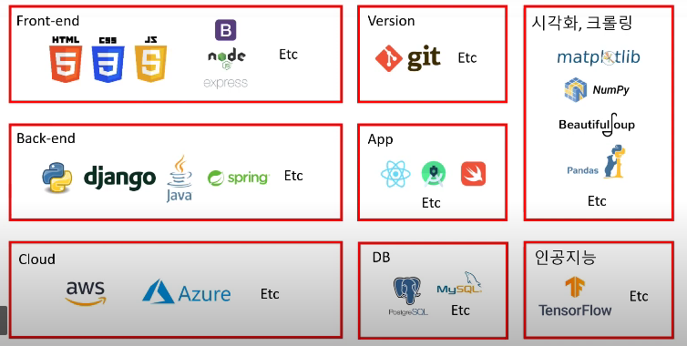

# HTML, CSS, JS, Front-End 개발자

### HTML

- **H**yper **T**ext **M**arkup **L**anguage

  - 하이퍼 텍스트 (Hyper Text)
    - 참조를 통해 한 문서에서 다른 문서로 즉시 접근할 수 있는 텍스트

  - 마크업 (Markup)
    - 문서의 구조를 표현하는 역할

- 프로그래밍 언어 vs 마크업 언어

  - 프로그래밍 언어 : 문제를 해결하기 위해 컴퓨터에게 주어지는 처리방법과 순서를 정해주는 명령문을 작성하는 언어
  - 마크업 언어 : 구조를 정해주는 언어
  - **HTML은 프로그래밍 언어가 아닌 마크업 언어**

 

### CSS

- **C**ascading **S**tyle **S**heet
  - 캐스캐이딩(Cascading)
    - 계단식, 위에서 아래로 흐르는
  - 스타일 시트 (Style Sheet)
    - 글꼴의 크기, 모양, 컬러, 문단 설정 등 미리 정의해서 스타일로 만들었다가 웹 문서의 본문에서 스타일을 참조하여 사용하는 기능

 

### JavaScript(JS)

- 자바의 명성에 힘입기 위해서 이름을 따온 것. 자바와 전혀 상관 없음!!!
- HTML, CSS로 만들어진 정적페이지를 동적으로 만들어주는 언어

 

### Front-End 개발자

