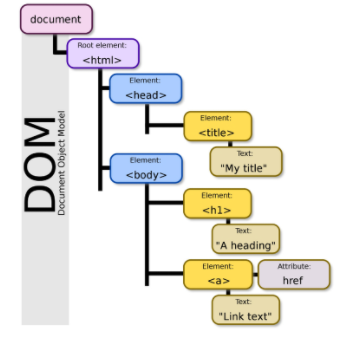

# HTML | Basic 기초

- 현재의 웹 표준
  - W3C (HTML5)
  - **WHATWG** (HTML Living Standard) - Apple, Google, Microsoft, Mozilla 등이 참여
  - *둘로 나뉜 웹 표준, 하나로 합쳐진다*

</br></br>

- HTML 이란?
  - **H**yper **T**ext **M**arkup **L**anguage 의 약어
  - 웹 페이지를 작성하기 위한(구조를 잡기 위한) 언어
  - 웹 콘텐츠의 **의미**와 **구조**를 정의

</br></br>

- HTML 기본 구조

  - VSC에서 `!` 단축키로 아래와 같이 기본 구조 생성 가능

  ```html
  <!DOCTYPE html>
  <html lang="ko">
  <head>
  	<meta charset="UTF-8">
      <title>Title</title>
  </head>
  <body>
      
  </body>    
  </html>
  ```

  - `<head>` 요소

    - 문서 제목, 문자코드(인코딩)와 같은 문서 정보를 담고 있으며, 브라우저에 나타나지 않는다.
    - CSS 선언 or 외부 로딩파일 지정 등을 작성

  - `<body>` 요소

    - 브라우저 화면에 나타나는 정보로 실제 내용에 해당됨

  - `DOM` (Document Object Model) 트리

    - 부모 관계 & 형제 관계

    

    - 문서의 구조화된 표현(Structured Representation) 을 제공하며, 프로그래밍 언어가 DOM 구조에 접근하여 문서 구조 및 스타일 내용 등을 변경할 수 있게 도움
    - 동일한 문서를 표현 / 저장/ 조작하는 방법을 제공
    - Web Page의 **객체 지향 표현**

    

  - 요소(element)

    ```html
    <h1>contents</h1>
    ```

    - HTML의 요소는 태그(`<>` 로 표현)와 내용(contents)로 구성되어 있다.

    - 태그가 콘텐츠를 감싸는 것으로 그 정보의 성격과 의미를 정의한다.

    - 요소는 중첩(nested) 될 수 있음

      - 요소 중첩을 통해 하나의 문서를 구조화
      - 여는 태그 - 닫는 태그 쌍을 잘 확인해야 한다.
      - 오류를 반환하지 X → 레이아웃이 깨진 상태로 출력되므로, 디버깅이 어렵다.

      

  - 속성(attribute)

    ```html
    <a href="https://www.google.com"></a>
    ```

    - 속성명 - 속성값으로 구성되어 있다.

    - 속성명 - 속성값 사이에 `공백`은 없고, 속성값은 `""` 쌍따옴표를 사용한다.

    - 속성을 통해서 태그의 부가적인 정보를 설정할 수 있다.

    - 요소는 속성을 가질 수 있고, 경로/크기 같은 추가적인 정보를 제공

    - 태그와 상관없이 사용 가능한 `HTML Global Attribute` 속성들도 있다.

    - HTML Global Attribute

      - id, class
      - hidden
      - lang
      - style
      - tabindex
      - title

      

  - 시맨틱 태그

    - HTML5에서 **의미론적** 요소를 담은 태그가 등장했다.
    - 대표적인 태그
      - header - 문서 전체 or 섹션의 머릿말 부분
      - nav - 내비게이션
      - aside - 사이드에 위치한 공간. 메인 콘텐츠와 관련성이 적은 콘텐츠
      - section - 문서의 일반적인 구분, 콘텐츠 그룹을 표현
      - article - 문서, 페이지, 사이트 안에서 독립적으로 구분되는 영역
      - footer - 문서 전체 or 섹션의 마지막 부분
    - 개발자, 사용자뿐만 아니라 검색엔진 등에 의미 있는 정보의 그룹을 태그로 표현
    - 단순히 구역을 나누는 것이 아닌, 의미를 가지는 태그를 활용
    - 코드의 가독성을 높이고 유지보수에 용이

</br></br>

- HTML 문서 구조화

  - 인라인 / 블록 요소

  - 그룹 콘텐츠

    - `<p>`
    - `<ol>`, `<ul>` 등등

  - 텍스트 관련 요소

    - `<a>`
    - `<b>` vs `<strong>` 등

  - 테이블

    - `<tr>`, `<td>`,`<th>`
    - `<thead>`, `<tbody>`, `<tfoot>` 등

  - form

    - `<form>` 은 서버에서 처리될 데이터를 제공하는 역할
    - 기본 속성
      - `action`
      - `method`

  - input

    - 입력 데이터 필드
    - `<label>` : 서식 입력 요소의 캡션
    - type에 따라 달라진다.
    - [MDN](https://developer.mozilla.org/ko/docs/) 사이트 참고

    

  