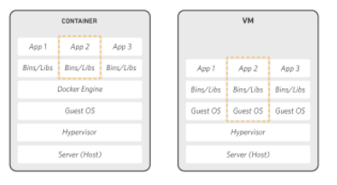

# Docker | Intro

### Docker

#### 도커란?

- 애플리케이션을 신속하게 구축, 테스트 및 배포할 수 있는 소프트웨어 플랫폼
- SW를 컨테이너라는 유닛으로 패키징하고, 이 컨테이너에는 라이브러리, 시스템 도구, 코드, 런타임 등 SW 실행에 필요한 모든 것이 포함된다.
- 환경에 구애받지 않고 애플리케이션을 신속하게 배포 / 확장할 수 있으며 코드가 문제없이 실행될 것을 확신할 수 있다.

##### 장점

- 가상머신(VM)에 비해 성능 오버헤드가 적다
- 빠르고 쉬운 애플리케이션 배포가 가능
- 이미지 버전 관리가 쉽다
- 각각의 컨테이너 사이에 독립적인 동작 환경 제공

#### Container vs VM

- 가상머신 (VM, Virtual Machine)
  - 가상머신마다 OS를 중복 설치하기 때문에 이미지 크기가 커짐
  - 이미지 크기가 크기때문에 네트워크로 배포하는 것이 어려움
  - 배포 및 버전 관리의 어려움
  - OS안에 OS를 포함하여 가상화하기 때문에 느리고 비효율적
- 컨테이너 (Container)
  - OS를 중복으로 설치하지 않아서 이미지 크기가 작음. 따라서 배포가 편리함
  - OS를 가상화하지 않고 직접 호스트 OS 자원을 사용하기 때문에 VM에 비해서 월등히 빠름

#### 이미지? 컨테이너?

- 이미지
  - 서버 구성에 필요한 파일들을 묶어 놓은 것
  - 실행 파일, 라이브러리, 설정 파일 등
  - 배포의 단위로 저장소에 push/pull 가능
- 컨테이너
  - 이미지를 실행한 형태
- 실행파일 (이미지) - 프로세스 (컨테이너) 관계

##### 참고자료

- https://github.com/cheese10yun/TIL/blob/master/docker/docker-beginner.md

