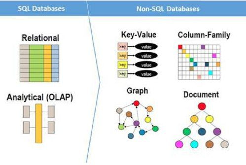
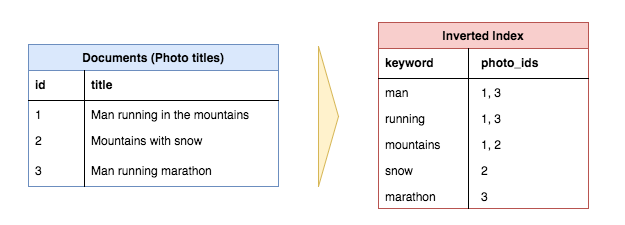

# WEB | Data Flow

 

### Data Flow

- **Data Flow** 란?
  - 흔히 `Client → Server → Data Storage → Server → Client` 로 이어지는 웹 서비스의 흐름을 **Data** 의 관점에서 바라보는 것
  - 사용자가 요청(Request)하면 NGiNX, APACHE와 같은 Web Server 를 거쳐서 서버로 전달된다. 서버에서는 요청에 알맞는 데이터를 미리 정해진 Data Storage 즉, DB에서 불러오고 이를 다시 사용자에 응답(Response)한다.
  - 이 과정에서 `http`, `socket.io` 와 같은 프로토콜이 사용되기도 하고, 서버는 `Docker` 로 컨테이너화할 수도 있다. `Jenkins`, `Kubernates` 툴을 사용하여 CI/CD 로 자동 운영되기도 한다. 
  - 각각의 서비스가 어떻게 구현되는지는 프로젝트에 따라, 개발자에 따라 다르지만 핵심적인 포인트는 **Security** **(보안)** 이다.
    - ex. 은행권에서 사용되는 데이터 - 계좌번호, 예금주성명 과 같은 데이터는 Data Flow를 거쳐서 다시 클라이언트에 응답될 때, 그대로 전달되어서는 안된다.
    - `홍*동`, `102-456789-\***`  와 같이 마스킹 처리를 하는 등 데이터를 있는 그대로 사용자에게 반환하지 않고, 적절한 보안처리를 해야 하는 것이다.

 

***

### Web Architecture 101

- 참고
  - https://scvgoe.github.io/2018-12-25-%EB%B2%88%EC%97%AD-Web-Architecture-101/

- Web Architecture란?
  - 클라이언트와 서버, DB 등 웹과 관련된 하나의 설계도를 의미한다.
  - 사용자가 요청(Request) 했을 때 어떻게 웹 서비스가 작동하는지를 한 눈에 파악할 수 있는 구조도로, 전반적인 큰 그림을 이해하고 있어야 프로젝트를 기획하고 개발할 때 도움이 될 수 있을 것이다.
- `1` ~ `11` 번까지 다양한 개념이 등장하는데 참고자료를 참고하여 아래에 간단히 정리해보겠다.

 

##### 1. DNS

- Domain Name System 의 약자. `www` 를 가능하게 하는 중요한 기술임
- Domain 이름과 IP 주소를 `key-value` 로 맵핑하는 것
  - www.google.com - 85.129.83.120
  - 전화번호부와 유사. "홍길동"에게 전화를 건다는 것은, "010-1234-5678" 번호로 거는 것

 

##### 2. Load Balancer

- `horizontal application scaling` vs. `vertical application scaling`
  - horizontal : resource pool에 기기를 추가하는 것
  - vertical : 기존 기기의 사양(CPU, RAM 등)을 높이는 것
- 웹 개발은 `horizontal` 을 선호함. 기기는 고장나기 때문에.
  - 서버가 고장나고, 네트워크 성능이 떨어지며, 데이터 센터가 종종 다운됨. 하나 이상의 서버를 둬서 비상 상황을 대비
  - 각기 다른 서버에서 구동함으로써 다른 backend 서비스들과의 coupling을 줄여줌
  - ex. Storyblocks 는 약 400여개의 AWS EC2 instance를 구동중. 이정도의 컴퓨팅 파워를 vertical scaling 으로 제공하는 것은 어려운 일
- **Load Balancer** 는 horizontal scaling 을 가능하게 해주는 것
  - 들어오는 많은 요청들을 여러 application servers 중 하나로 전달하고 클라이언트에 응답을 반환함
  - 요청을 적절히 분배하여 하나의 서버에서 과부하가 일어나지 않도록 하는 것

 

##### 3. Web Application Servers (WAS)

- 클라이언트의 요청을 받아서 비즈니스 로직을 실행하고 사용자 브라우저에 HTML을 반환
- `Node.js - Express`, `Ruby - Ruby on Rails`, `Java - Spring` 와 같이 특정 언어와 Web MVC 프레임워크가 필요하다. 

 

##### 4. Database Servers

- Database에서는 Data Structure(데이터 구조)를 정의하고, data의 삽입, 검색, 업데이트, 삭제 (CRUD) 등을 한다. Web APP Servers 는 DB와 직접적으로 통신하면서 사용자가 요청한 데이터를 다룬다.
- `SQL` vs. `NoSQL`
  - SQL - Structured Query Language
    - 관계형 data set을 검색하는 표준 방법을 제공
    - table에 정보를 저장하고, table들은 `common ids`를 통해 서로 연결됨.
  - NoSQL - Non-SQL
    - 거대한 규모의 data를 다루기 위해 새로 등장한 DB의 한 종류

 

##### 5. Caching Service

- 시간복잡도 `O(1)` 안에 빠르게 찾아볼 수 있는 `key-value` data store를 제공
- 같은 결과가 필요할 때, 재연산하는 것이 아닌 `cache`에서 빠르게 호출
- ex.
  - Google >  `dog`, `Taylor Swift` 와 같은 자주 발생하는 검색 결과를 매번 계산하지 않고 `cache` 해둠
  - Facebook > 포스트, 친구 목록 등 로그인 했을 때 보여주는 많은 정보들을 `cache` 한다.
  - Storyblocks > `Server-side React Rendering`의 결과 HTML, 검색 결과, 자동완성 결과 등을 `cache` 한다.
- 가장 많은 쓰이는 기술은 `Redis`, `Memcache`

 

##### 6. Job Queue & Servers

- 대부분 web application은 사용자 요청에 매번 즉가적으로 반응할 필요가 없는 **비동기적**인 일을 해야함
  - Google은 인터넷을 수집하고 저장하는데, 검색 요청이 생길때마다 이 작업이 이루어지는 것은 아님. 비동기적으로 수집하고, Index를 업데이트 함
- **비동기 작업을 가능하게 해주는 아키텍쳐 중 하나**
  - `Jobs` 가 들어가는 Queue 와 `Job` 을 수행하는 하나 혹은 그 이상의 Servers (Workers)
  - Job Queue
    - 비동기적으로 실행되어야 하는 job 목록을 저장
    - FIFO Queue 구조
    - Priority queing system 을 많이 사용
    - 정기적 or 사용자 요청인 비동기적인 job을 실행하고 싶을 때마다, Queue에 넣는다
    - ex. Storyblocks
      - 동영상/사진 인코딩
      - 메타데이터 태킹을 위한 csv 처리
      - 사용자 통계
      - 비밀번호 초기화 이메일 발송
      - 기본적으로 FIFO queue를 사용했으나, 민감한 작업 처리를 위해 priority queue 도입
  - job Servers
    - job 을 수행
    - job queue 를 폴링하고, 수행할 job이 있을 경우 queue에서 꺼내서 실행

 

##### 7. Full-text Search Service

- 사용자가 text input(query) 를 입력하면 가장 연관된 결과를 반환하는 검색기능
- `inverted index`를 활용하여 검색어를 포함하고 있는 문서를 빠르게 검색

- DB에서 직접 full-text search 하기도 하지만, 별도의 Search service를 분리
- ex
  - Sphinx
  - Apache Solr
  - **Elasticsearch** (가장 인기 있음)

 

##### 8. Services

- 서비스하는 app 이 일정 수준에 도달하면 이를 쪼개서 별도의 분리된 application으로 제공해야 하는 경우가 있음
- ex. Storyblocks
  - Account 서비스 - 사용자 정보 저장, 판매와 관련된 UX 제공
  - Content 서비스 - 동영상, 오디오, 이미지에 대한 metadata 저장. 컨텐츠 다운 및 다운로드 이력 조희 인터페이스 제공
  - Payment 서비스 - 신용카드 결제에 관한 Interface 제공
  - HTML → PDF 서비스 - HTML을 PDF 로 변환해 주는 Interface 제공

 

##### 9. Data

- 데이터는 모든 산업/회사에서 중요함. 서비스가 일정 수준에 도달하면 data를 수집하고 저장, 분석하기 위해 `data pipeline` 을 사용함
- **Data Pipeline**
  - 사용자 interaction에 관한 data를 `data firehose` 에 전송. data firehose에서는 data를 즉각 처리할 수 있는 `streaming interface` 를 제공. 
    - ex. **AWS Kinesis, Kafka**
  - raw data와 변형된 data는 `cloud storage`에 저장됨.
    - ex. **AWS S3**
  - data 분석을 위해 `data warehouse` 를 사용
    - ex. **AWS Redshift, Oracle, Hadoop(NoSQL MapReduce)**

 

##### 10. Cloud Storage

- 인터넷 상에서 data를 저장하고 접근, 공유하는 간단하고 scalable한 방법
- 클라우드 저장소를 활용하면 `HTTP` 위에서 `RESTful API` 를 통해 local 파일 시스템에 있는 파일을 저장하고 접근할 수 있음
- ex. **AWS S3**

 

##### 11. CDN

- Content Delivery Network
- HTML, CSS, Javascript 같은 정적 파일을 단일 origin server보다 빠르게 제공하는 기술
- content 들을 전세계에 있는 여러 `edge` 서버에 걸쳐 분산. 사용자들은 origin server 가 아닌, edge server 에서 정적 파일을 다운로드 받음

- ex
  - 스페인에 있는 사용자가 뉴욕에 있는 origin server에 요청을 보냄
  - → 정적 파일들을 대서양 HTTP request로 받으면 느림
  - → 영국에 있는 CDN edge server에서 빠르게 다운로드 받음